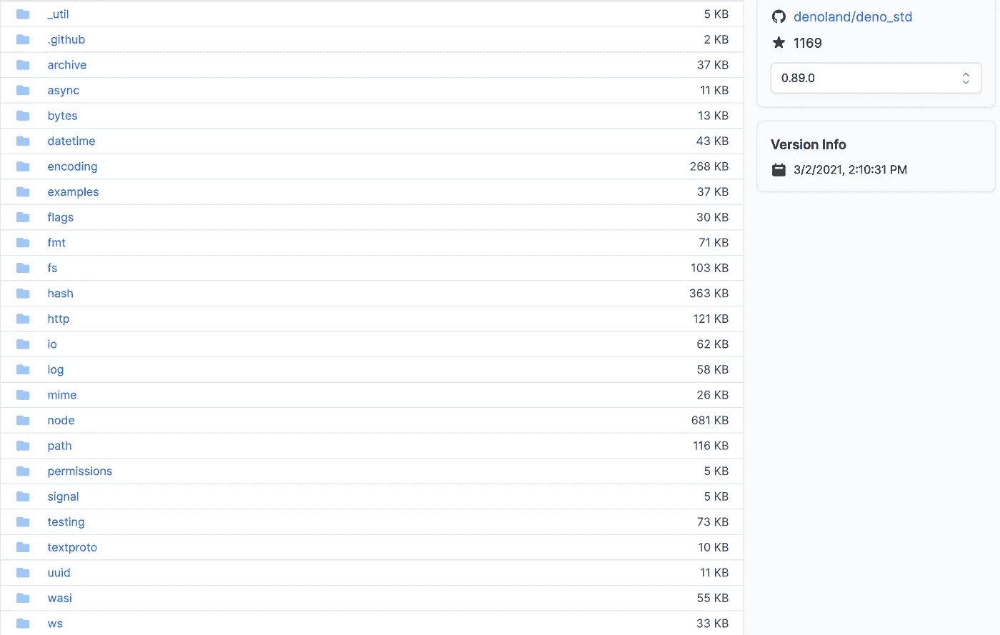

# 为什么 Deno 不愿取代 NodeJS

> 原文：<https://medium.com/geekculture/is-deno-meant-to-replace-nodejs-fcbb5f2a07bc?source=collection_archive---------8----------------------->

我非常清楚地记得我第一次通过 AngularJS 接触 JavaScript 的时候。几年前，在研究不同的 web 开发框架时，我选择了 AngularJS，因为它刚刚开始在行业中获得牵引力，并且社区正在增长。不久之后，NodeJS，这个允许 JavaScript 代码在浏览器之外运行的运行时，也开始受到关注。快进到今天，我们可以看到 NodeJS 在软件开发领域已经发展了多少，它不仅是前端开发的流行选择，而且现在在很多情况下，也是后端、服务器端开发的流行选择。

而现在，我们也有了现在可用的*【NodeJS】**Deno**。*

***Deno** 由 NodeJS 的同一个创建者(Ryan Dahl)创建，专注于增强 NodeJS 中错过的机会，如安全性，以及用于处理模块的中央存储系统 **npm** 。*

*在当前的 web 开发环境中，我们已经看到一些框架在构建服务器端应用程序方面开始变得流行，比如 Next.js、NestJS、Koa、Meteor、for NodeJS 等等。我个人在 NodeJS 中构建一些服务时，已经开始尝试使用 NestJS 框架，以便获得使用框架开发企业级服务器应用程序的感觉。但是我相信在我们看到更多完整的 Deno 应用程序开发框架之前，Deno 还有很长的路要走。总的来说，Deno 对于 web 开发世界来说还是相对较新的，所以我们不仅应该给它成长的时间，还应该给它成长的空间，而不仅仅是“NodeJS 的替代品”。下面讨论一下比较 Deno 和 Node 时应该考虑的几点。*

# ***到期日***

*最有可能的是，不马上和 Deno 一起工作的最大原因是它有多新鲜。最初于 2018 年 5 月发布，我自己直到 2019 年底/2020 年初才得到关于 Deno 的风声。最新的稳定版本是 v1.8.0(在撰写本文时)，主要是用编程语言 Rust 编写的，与 JavaScript、C++和 C 等其他语言相比，Rust 本身是一种相对较新的编程语言。*

*围绕当前 Deno 生态系统的这种新奇事物需要一些时间来发展，以便开发人员在编程时最有效率。例如，Deno 模块的愿景是拥有一组核心模块，由 Deno 团队自己开发和维护。然而，这个模块列表目前不是很长。*

**

*List of core Deno modules as of March 3rd, 2021*

*我们对这些模块未来的期望是，它们将得到 Deno 开发团队的明确支持，随着这些模块的更新和开发，Deno 开发团队会将 Deno 的最佳实践应用于这些模块。然而，这限制了开发人员如何与他们可能想要使用的第三方模块进行交互，这些模块是由核心 Deno 团队之外的社区开发的。现在有一些第三方模块可用，其中很多可能已经很熟悉了，因为它们本质上是移植到 Deno 中的 NodeJS 模块。其中有: **lodash，axiod(axios 的 Deno 版本)，**和**denon(node mon 的 Deno 版本)。**所有这些第三方模块都托管在 deno.land/x**域名**中，因此开发者很容易为所有第三方模块引用一个位置。*

*NodeJS 从 2009 年 5 月开始出现，大部分是用 JavaScript 编写的(大约 20 多年)，与它的现状相比，Deno 只是一个刚会爬的婴儿；在撰写本文时，它的版本是 v15.0.0。NodeJS 的默认包管理器 npm 有许多可用的库，由 NodeJS 社区的开发人员编写。正是这种开源社区支持真正推动了 NodeJS 在行业中的发展，今天，它甚至被大公司采用，如网飞、微软、AWS、沃尔玛等等。*

*今天，你可以找到大量的例子，或者你在 NodeJS 中遇到的任何问题的答案，正如你从 StackOverflow 返回的大量结果所示。对于 Deno，你很难找到相同的东西，因为一切都是新的，开发者仍然对 Deno 生态系统感到舒适。*

# *工具*

*另一个大的讨论主题是目前可用来帮助开发 Deno 应用程序的工具。由于 NodeJS 有 npm 作为它的包管理器，今天，并没有真正的 Deno 包管理器。它允许你将模块从 URL 直接导入到你的代码中，但是没有一个像 npm 这样的管理器来帮助，甚至没有一个文件来帮助描述依赖于项目的模块(像 package.json)，管理 Deno 中需要的任何模块似乎要多做一些工作。虽然，关于安全的 **npm** 的痛点是 Deno 试图通过引入这种新范式来解决的，但我确实认为随着您的导入列表的增长，这将变得很困难。目前有一个 Deno 模块可以帮助缓解这个问题([https://github.com/crewdevio/Trex](https://github.com/crewdevio/Trex))，这个问题目前还不稳定，但看起来这确实是管理 Deno 项目所需外部模块的一个非常理想的方式。*

*我们开始看到一些用于 Deno 的全栈框架被开发出来，比如运行在 Deno 中的 React 框架 [Aleph.js](https://alephjs.org/) 。Aleph.js 从 Next.js 中获得灵感，所以当我看到其他旨在用于 Deno 的框架开始出现时，我不会感到惊讶，这些框架从更成熟的 NodeJS 框架(NestJS、MeteorJS，仅举几个我个人感兴趣的例子)中获得了现有的想法。*

# *支持*

*对 Deno 的支持也相对较新。像 Visual Studio Code、Atom 和 WebStorm 这样的 ide 确实支持 Deno 运行时，但不是现成的。通常，为了支持使用 Deno，需要某种扩展或插件。*

*这是对 Visual Studio 代码的扩展(【https://marketplace.visualstudio.com/items? 】)itemName = deno land . vs code-Deno)，我用它来尝试在 Deno 中设置一个小项目。还有这个 JetBrains 插件可用。([https://blog . jetbrains . com/web storm/2020/06/deno-support-in-jetbrains-ides/](https://blog.jetbrains.com/webstorm/2020/06/deno-support-in-jetbrains-ides/))。当然，无论如何都不会阻止您在一些基本的文本编辑器中编写应用程序，并使用 ***deno run*** 来执行代码，但是在运行代码之前，有您最喜欢的 IDE 的支持来完成诸如自动完成和语法检查之类的事情将会节省您大量的精力和时间。*

# *结论*

*Deno 周围的社区正在快速发展，看看如何最好地走向未来。我确实看到 Deno 社区在未来会继续发展，但是可能不会像我们第一次看到它时所期望的那样。一种据称能弥补 NodeJS 缺点的新技术令人兴奋，可能最初让我们觉得 Deno 应该是 NodeJS 的替代品。然而，我不认为 Deno 会接管 NodeJS 的角色，至少短期内不会。即使根据 Ryan Dahl 的说法，NodeJS 在短期内也不会去任何地方。它现在已经在当前的 web 开发环境中根深蒂固，并得到了业内许多大公司的支持，以确保它在未来也能得到支持。但是我认为，许多有趣的项目将来自于如何最大限度地发挥 Deno 优于 NodeJS 的优点的实验，比如安全性。*