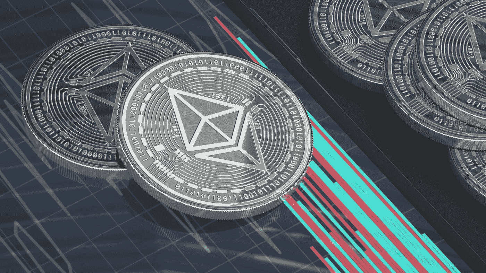

# ETH 2.0 真的更节能吗？

> 原文：<https://medium.com/geekculture/is-eth-2-0-really-more-energy-efficient-bdc9515d7dbc?source=collection_archive---------4----------------------->

Photo by [DrawKit Illustrations](https://unsplash.com/@drawkit?utm_source=medium&utm_medium=referral) on [Unsplash](https://unsplash.com?utm_source=medium&utm_medium=referral)

以太坊的能耗是市场上谈论的话题，尤其是现在切换到节能算法迫在眉睫。

气候辩论并不新鲜，但很激烈，而且势头明显。比特币被认为是杰出的气候杀手，因为最大的加密货币已被证明会损害气候。然而，有不同的计算和…