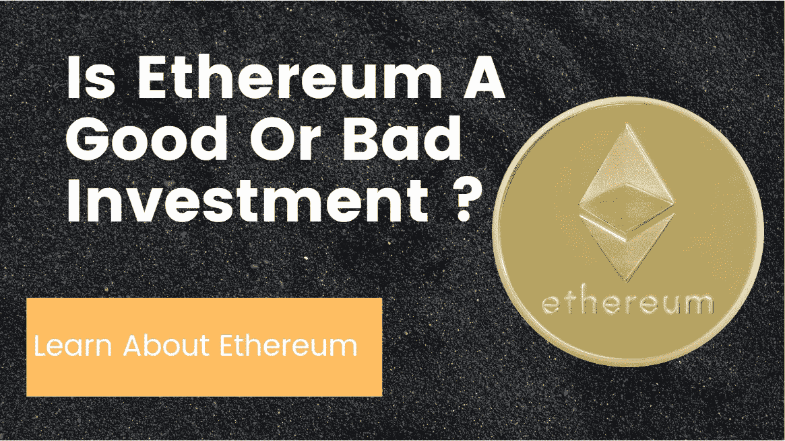

# 以太坊是好还是坏的投资？

> 原文：<https://medium.com/geekculture/is-ethereum-a-good-or-bad-investment-de3ce522b037?source=collection_archive---------29----------------------->

以太坊是什么及其可能的未来

# 以太坊是什么？

根据[以太坊网站](https://ethereum.org/en/),“**以太坊**是数字货币、全球支付和应用的发源地。”- [以太坊网站](https://ethereum.org/en/)

运行你的汽车需要燃料，在以太坊网络/平台上运行你的应用需要**以太坊气体。以太气**是…