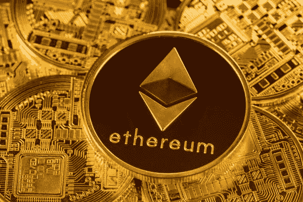

# 以太坊也是价值储存吗？

> 原文：<https://medium.com/geekculture/is-ethereum-also-a-store-of-value-a476905df0ed?source=collection_archive---------12----------------------->

根据高盛的说法，以太坊可能取代比特币成为占主导地位的价值储存手段

高盛(Goldman Sachs)认为，以太坊的流行可能会很快导致替代币取代比特币，成为市值最高的加密货币。

# 以太坊 vs 比特币:谁会是№1？