# 脸书的“先知”是时序弥赛亚，还是只是一个非常淘气的男孩？

> 原文：<https://medium.com/geekculture/is-facebooks-prophet-the-time-series-messiah-or-just-a-very-naughty-boy-8b71b136bc8c?source=collection_archive---------1----------------------->

脸书的 [**Prophet**](https://facebook.github.io/prophet/) 软件包旨在提供一种简单、自动化的方法来预测大量不同的时间序列。该软件包采用了一个易于解释的三分量加性模型，其贝叶斯后验概率使用 [**STAN**](https://mc-stan.org/) 进行采样。与其他一些方法相比，Prophet 的用户可能希望在不调整大量参数的情况下获得良好的性能。相反，超参数控制这些参数是先验的可能性，贝叶斯采样试图在数据到达时整理出事情。

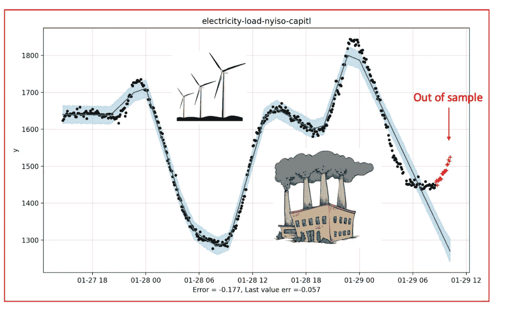

从受欢迎程度来看，这肯定是个好主意。根据 [**pepy**](https://pepy.tech/project/fbprophet) 统计，脸书的先知包已经被下载了 13698928 次。它在排行榜上名列前茅，或者至少是我编译的 [**这里的**](https://www.microprediction.com/blog/popular-timeseries-packages) 中，数百个 Python 时间系列包按月下载量进行了排名。下载数据很容易被欺骗，但尽管如此，Prophet**包无疑是最流行的用于自动时间序列分析的独立 Python 库。**

# **预言家的声明和不冷不热的评论**

**有趣的是，如果你稍微调查一下，你会很快得出结论，很少有人会不厌其烦地评估 Prophet 的准确性，并对它的性能赞不绝口。Hayashi Hideaki 的 [**文章**](https://blog.exploratory.io/is-prophet-better-than-arima-for-forecasting-time-series-fa9ae08a5851) 有些典型，因为它试图说好话，但却很挣扎。Yahashi 指出，与 auto.arima 不同的是，Prophet 显示了合理的季节性趋势，尽管绝对值与 2007 年的实际数据有些出入。然而，与此同时，作者观察到，告诉 ARIMA 包括一个年度周期会扭转局面。有了这个暗示，ARIMA 在准确性上轻而易举地击败了预言家——至少在他看的一个例子上。**

**Nikolaos Kourentzes 教授将 prophet 与其他几个 R 包进行了基准测试——即您可能使用过的 [**预测**](https://cran.r-project.org/web/packages/forecast/index.html) 包和 [**平滑**](https://cran.r-project.org/web/packages/smooth/index.html) 包，以及 [**mapa**](https://cran.r-project.org/web/packages/MAPA/index.html) 和 [**小偷**](https://cran.r-project.org/web/packages/MAPA/index.html) 。他的结果记录在这篇 [**文章**](https://kourentzes.com/forecasting/2017/07/29/benchmarking-facebooks-prophet/) 中，文章使用了 M3 数据集和平均绝对标度误差( [**链接**](https://kourentzes.com/forecasting/2017/07/29/benchmarking-facebooks-prophet/) )。他的语气更加毫不留情。*“Prophet 表现很差……我担心的不是它没有排名第一，而是它在最好的情况下比指数平滑法差了将近 16%(在最坏的情况下差了将近 44%！)."***

**老大怎么了？**

**这是脸书的品牌和营销让一个平庸的算法脱颖而出的例子吗？或者这可能是回音室效应(许多人在媒体上写指导性文章？).我们不要急于下判断。也许那些尚未被“预言家”打动的人并没有发挥出它的长处，这些已经在脸书的网站上列出了。该软件适用于“*我们在脸书遇到的商业预测任务”*，根据该网站的说法，这意味着每小时、每天或每周的观察，具有强烈的多重季节性。**

**此外，Prophet 旨在处理提前知道的假期、缺失的观察值和较大的异常值。它还被设计用于应对经历制度变化的系列，如产品发布，以及由于产品市场饱和而面临的自然限制。其他方法可能没有很好地捕捉到这些影响。那么，想象预言家能够在它被建造的领域中工作得很好，这似乎不是不合理的。据推测，在这些条件下，可以做出这样的断言，正如 2017 年脸书 [**的博客文章**](https://research.fb.com/blog/2017/02/prophet-forecasting-at-scale/) 中所说的那样，“*预言家的默认设置产生的预测往往与熟练的预测者产生的预测一样准确，而且要少得多。'***

**这一主张相当大胆——就像我们将看到的先知本身一样大胆。该软件不仅比基准测试(尽管没有明确提供)更好，而且比人类专家更好。据推测，这些人类专家除了用手画线之外，还能使用其他软件……但是他们用的是什么呢，有人可能会问。同一篇博文建议“*据我们所知，几乎没有用 Python 编写的开源预测软件包。*”**

**在这里，我很同情，意识到在大公司可能发生的对防火墙的多管闲事的监管。我认为，这一声明是在 2017 年发表的，尽管即使考虑到日期，客观基准的缺乏也让我觉得有点方便。我的 Python 时间序列包的 [**清单**](https://www.microprediction.com/blog/popular-timeseries-packages) 相当长，正如我所提到的，尽管在过去的三年中出现了许多。**

**不过，要找到测试先知的东西应该不会太难，不是吗？最近的一篇 [**注释**](https://arxiv.org/pdf/2005.07575.pdf) 表明 prophet 在商业环境中表现良好，但是——你猜对了——没有明确提供与其他 Python 包的比较。也不是这里的**。Navratil Kolkova 的一篇文章也挺有好感( [**pdf**](https://pdfs.semanticscholar.org/a479/651c20894eacd1ca7f61a5b60285832698f1.pdf?_ga=2.174668962.1419398647.1611872490-310772371.1611872490) )。作者指出，这些结果相对容易解释——这当然是真的。但是性能能和任何东西相比吗？我让你猜猜。****

****到现在为止，你应该已经猜到，最初的预言家论文，泰勒和雷森的规模预测，也是幸福的无比较的 *(* [**pdf**](https://peerj.com/preprints/3190.pdf) )。这篇文章出现在《美国统计学家》2018 年第 72 卷，略有修改，所以也许我的期望是不合理的( [**pdf**](http://lethalletham.com/ForecastingAtScale.pdf) )。必须要说，先知方法论是似是而非的，这篇文章被引用了 259 次。作者很好地解释了这种权衡，任何希望使用该软件的人都会理解，这本质上是一个低通滤波器。你得到了随之而来的东西。****

****客观测量的难以超越的准确性可能不是交易的一部分。如上所述，我不是唯一一个对世界上排名第一的 Python 时间序列预测库是否真的能预测事物感到好奇的人。一篇由 Jung，Kim，Kwak 和 Park 撰写的关于 Prophet 的论文的标题是*对销售预测的概率时间序列模型的令人担忧的分析*。正如剧透所说，事情看起来并不乐观。作者将脸书的先知列为所有测试算法中表现最差的。哦天啊。****

****啊，你反对，但是根据什么标准？也许使用的评分规则不公平，不太适合脸书门户网站的销售？也许是这样，但根据这些作者的说法，Prophet 在所有指标上都是最差的——每场比赛都是最后一名。正如你所料，这些标准包括 RMSE 和 MAPE，但也意味着标准化分位数损失，其中(人们可能希望)贝叶斯方法可以产生比其他方法更好的分布预测。我认为，作者的解释值得全文转载。****

*****时间序列的模式复杂且随时间动态变化，但 Prophet 仅在趋势发生变化时跟踪此类变化。季节性先验尺度无效，而趋势先验尺度越高，表现越好。欧共体数据集中存在一些季节性模式，但这些模式既不一致也不平滑。*由于 Prophet 不像其他模型那样直接考虑最近的数据点，当先前的假设不适合时，这会严重影响性能*。*****

****最近，人们的注意力已经转向新冠肺炎的预测，而不是产品周期。但是，Papanstefanopoulos、Lindardatos 和 Kotsiantis 发现先知的表现不如 ARIMA。坚持 [**TBATS**](https://pypi.org/project/tbats/) ，他们的结果劝。在他主人的 [**论文**](https://uwspace.uwaterloo.ca/bitstream/handle/10012/15488/Shah_Vishvesh.pdf?sequence=1&isAllowed=y) 中，也没有来自维什维什·沙阿的爱，比较萨里玛、霍尔特·温特斯、LSTM 和先知。其中，在任何给定的时间序列任务中，Prophet 是最不可能表现最好的。LSTM 赢了两倍，而且都被久经考验的萨里玛彻底打败了。****

****继续为预言家带来灾难的论文*现金流预测:* *MLP 和 LSTM 与 ARIMA 的比较*由 Weytjens、Lohmann 和 Kleinsteuber 撰写( [**下载**](https://www.researchgate.net/publication/334575706_Cash_flow_prediction_MLP_and_LSTM_compared_to_ARIMA_and_Prophet) )。我已经包括了他们的汇总表。与其他报纸相比是相对有利的——就与 ARIMA 的正面交锋而言。然而正如你所见，神经网络很容易胜过预言家和 ARIMA——至少在他们的设置中是这样。****

****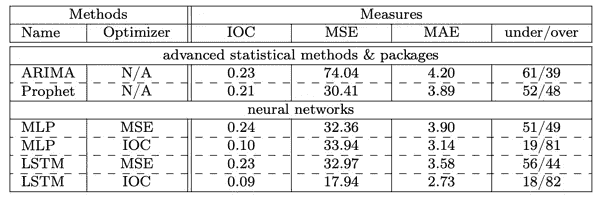****

****对于 Prophet 来说，是否存在一个最佳位置，在这个位置上，数据饥渴的方法无法击败它，而经典的时间序列方法又不那么强大？或者是像食品价格这样的季节性序列。根据 Menculini 等人在*将 Prophet 和 Deep Learning 与 ARIMA 在预测批发食品价格* ( [pdf](https://www.mdpi.com/2571-9394/3/3/40/pdf) 中的比较，情况并非如此。****

****决心找到一篇将 Prophet 比作任何东西的论文，我最终找到了 Samal、Babu、Das 和 Acharaya 的论文，题为*基于时间序列的空气污染预测，使用 SARIMA 和 Prophet 模型(* [**论文**](https://dl.acm.org/doi/10.1145/3355402.3355417) *)。我觉得空气污染是一个不错的选择，因为多重循环可能会混淆一些相互竞争的方法。作者发现先知赢了，万岁！但我不相信，因为这似乎是一个相对较小的样本，在时间序列的中间有一个绝对巨大的峰值——似乎使 RMSE 有点像彩票。*****

****这就是我担心先知的地方。零星的好评似乎都涉及一两个时间序列。我不知道食品和药物管理局会怎么想。唯一的胜利似乎发生在相对较弱的领域，通常是 ARIMA 和先知之间的两匹马的比赛。这似乎是先知有时可以赢得的比赛，正如 Cayir，Kozan 和 Yenidogan 在*比特币预测使用 ARIMA 和先知* ( [**下载**](https://www.researchgate.net/publication/329400738_Bitcoin_Forecasting_Using_ARIMA_and_PROPHET) )中所建议的那样。应该注意的是，作者执行手动预处理和特征选择，所以可以说这不是大规模预测，但我们称之为先知胜利。****

****同样，在 Almazrouee 等人研究的几乎完全季节性的科威特电力负荷时间序列中( [**论文**](https://www.mdpi.com/2076-3417/10/16/5627/htm) )，Prophet 的得分战胜了 Holt-Winters。然而，只有一个时间序列，我认为 auto-arima 会是一个更好的基准。Michael Grogan ( [**文章**](https://towardsdatascience.com/arima-vs-prophet-forecasting-air-passenger-numbers-4e01b2d93608) )的一篇文章研究了客流量，也有助于突出 Prophet 的一些优势——但再次强调，战胜 ARIMA 只是一个时间序列。一旦我们开始研究众多的时间序列，就像阿尔·亚兹达尼对弗雷德数据的使用( [**回购**](https://github.com/alirezayazdani21/facebook_prophet_eval/blob/main/TBATS) )或弗雷德·维奥莱对 2017 年 NNS-阿玛的比较( [**后**](https://htmlpreview.github.io/?https://github.com/OVVO-Financial/NNS/blob/NNS-Beta-Version/examples/prophet_NNS_comparison.html) )，预言家 get 被踩在脚下。****

# ****带着预言家出去兜兜风****

****我开始写这篇文章是因为我正在将 Prophet 集成到一个我称之为 [**时间机器**](https://github.com/microprediction/timemachines) 的 Python 包中，这是我试图从预测包的使用中去除一些仪式。这些为预测网络的一些机器人提供动力(如果你感兴趣，可以在[**www.microprediction.com**](https://www.microprediction.com/)了解)。我怎么能不包括最流行的时间序列包呢？****

****我希望你将这篇文章解释为只是试图理解测试的性能结果，而不是否认 Prophet 的可能效用或它的优势(如果没有别的，它可能被归类为一个变化点检测包)。我是认真的，先知真的有那么坏吗？至少，所有下载 Prophet 的人都在为可解释性、可伸缩性和良好的文档投下一票——但也许准确性也是一种难以量化的方式。****

****让我们明确一件事，没有人有权利抱怨开源、自由发布的软件不符合他们的期望。他们可以自由地提出改进它的拉式请求，我希望 Prophet 继续如此。此外，我在下面提供了一个简单、具体的方法来改进使用 Prophet 所做的预测。****

****今天我想确定是否有我们能用眼睛看到的东西来证明先知。让我们撇开反对者，以及某种程度上的误差指标，对数百个不同来源的不同时间序列进行一次真正的测试(你可以浏览实时的**，我也提到了)。我们也不要陷入在直观评估 Prophet 时查看样本外数据的陷阱——那将是不公平的。我想把它组织起来，这样你首先会像 Prophet 那样看到数据——只看到你用来训练它的数据。******

******我碰巧从医院的 [**等待时间**](https://www.microprediction.org/stream_dashboard.html?stream=hospital-er-wait-minutes-piedmont_fayette) 开始，所以我们先从那个开始。你可以点击这个链接来查看这个时间序列的本质，但是，正如你所想象的，它有很多可预测性。数据每 15 分钟采样一次，这在理论上符合 Prophet 的优势。对于不熟悉 Prophet 的人，采取以下步骤:******

*   ****我们将时间序列，包括时间戳和外部变量整理成一个 pd。DataFrame **df** 说。****
*   ****在*每个数据点*到达后，我们调用 **m.fit(df)** ，其中 **m** 是之前实例化的 Prophet 模型。除此之外别无选择，因为不改装就没有“推进”先知模型的概念。****
*   ****我们制作了一个叫做 **forecast** 的“未来数据框架”,比如说，它有 **k** 个额外的行，用来保存我们希望进行预测的时间以及预先已知的外生变量。****
*   ****我们称之为 **m.predict(预测)**来填充预测的期限结构和置信区间。****
*   ****我们称之为 **m.plot(预测)**瞧！****

****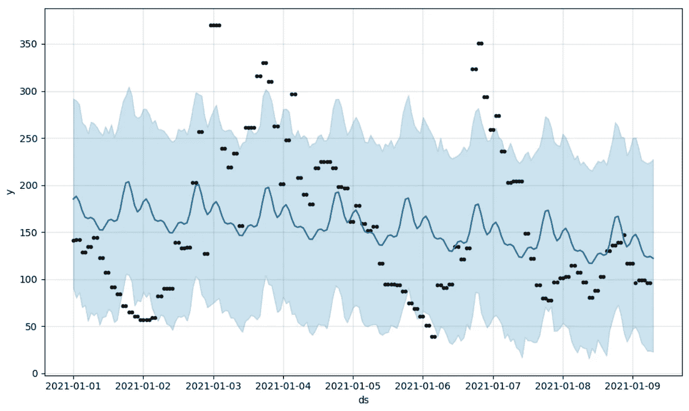****

****嗯，那是你应该做的，但是就我个人而言*，我宁愿每次都这么做。我在这里写了一个简单的函数接口**，如果你愿意，你可以用一行代码来代替(在 [**README.md**](https://github.com/microprediction/timemachines) 中有解释)。*******

*****然而，所提供的 Prophet 接口是有据可查的，并且易于使用。对 GitHub 问题的响应也非常出色——比我们正在绘制的 er 的等待时间要好得多。这种风格很容易理解——尽管它植根于离线的表格工作模式，这对于部署来说不是最方便的。大多数人对此都很熟悉，但并不是每个人都觉得有必要小声抱怨让熊猫扮演核心角色的明智之处。仪式还不错，真的。*****

*****对于一个开源项目来说，这些都是非常重要的。*****

*****那么我们对输出有什么看法呢？你看到的情节看起来很漂亮，虽然蓝色阴影有点诱人。想象所有其他的描绘方式，你会开始意识到其中一些可能会更有说服力。是的，你可以想象当 Prophet 被一个“采用最后一个值”的预测彻底击败时，我有多失望，但这可能有点不走运(即使这确实让我赶紧去谷歌，看看是否还有人有类似的经历)。*****

*****让我们试着不要太苛刻。首先，任何自动化方法迟早都会遇到没有免费午餐的定理，就你所相信的程度而言。此外，如前所述，提前一步预测并不是 Prophet 存在的理由。据推测，这更多的是用于中长期预测，在这种情况下，明显的模式将持续存在，人们必须防范连续相关的噪声和状态变化。当我增加前瞻( **k** > 1 步预测)时，开箱即用的脸书预言家确实开始增加价值——根据均方根误差判断。*****

*****所以脸书给世界留下了一些潜在的有用的东西。当然，这可能不是每个人对*自动*时间序列预测的想法，如果最后一个值缓存有时可以击败它，你必须在这种情况下陪伴它，但我最初只提供了 200 个数据点(~2 天)的滚动窗口，这可能不“公平”。你可以从上面的图片中看到它对日常效果有些害羞，两天后谁不会呢？当我们包括 400 个尾随数据点时，Bayes 牧师——机器中的幽灵——说“是的，我看到了更多。”然后，你会得到一个更好的跟踪预测。*****

*****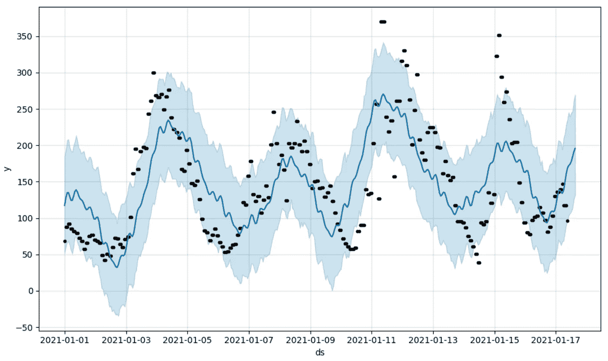*****

*****不幸的是，这张图片仍然没有对我尖叫说 Prophet 做得很好——这取决于你的目的。首先，看看模型残差中的序列相关性。这张图片真正做的是帮助我们理解为什么 Prophet 可能在预测*一些*真实世界时间序列时做得一贯*糟糕*(根据误差指标判断)。*****

*****先知的生成模型还表明，如果周期是有节奏的，但不完全如此，事情可能会出错。在这些例子中，在我看来，那个预言家——实际上是三个词的简单组合——会做出一些真正勇敢的预测。*****

# *****这是怎么回事？*****

*****也许我们从一些更大胆的先知预言开始。*****

*****在这个讨论中，我们需要重新定义“bold ”,如果你使用卡尔曼滤波器、dlm 或类似的工具，你可能已经习惯了。当然，对于任何时间序列模型，都会有我们认为推动上限或下限的预测——但对于 Prophet，我们走得更远。真的有很强的观点。例如，你认为这个序列中的下一个数字会是什么？*****

*******69** ， **55** ， **55** ， **53** ， **53** ， **41** ， **41** ， **28** ， **28** ， **35** ，…*****

*****第一个想到的数字是 **181** 吗？我也是，这就是人们开始怀疑从误差度量的角度来看，预言家方法是否还有救——尽管人们显然已经成功地用它来预测销售(你知道，与那些“专家”预测者相比)。*****

*****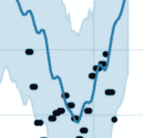*****

*****我想没有人能通过做出平凡的安全预测而成为著名的预言家，但至少，一个人应该知道一些预言家的技巧。例如，最后 20%的数据点不用于估计趋势分量。你知道吗？你料到了吗？我没有。让它深入人心。*****

*****当我们放大左侧时，我们看到数据发生了变化，但 Prophet 继续航行——也许是因为这个特殊的怪癖，但也因为马尔可夫链蒙特卡罗先生不一定有足够的可能性来探索。在一些现实世界的应用程序中，这些数据点正在进行真正的散步。这可能不是掩盖周期的噪音，而是医院等待时间的真实、可预测的下降。只是今天的衰减和昨天发生的时间不完全相同。*****

*****出于这个原因，我不敢断言这种方法在存在重叠周期的情况下是准确的，即使它有时会做得很好。相反，生成模型暗示了某种脆性。不用说，那些实际上很难预测的时间序列(比如金融价格时间序列)可能会给 Prophet 带来更严峻的挑战——我并不认为有人会根据 Prophet 的预测建立一个坚定的比特币双边市场。反正没有人读过这么多。*****

*****现在，试图忽略噪音并不是一件坏事。然而，问题是，稍微不同的生成模型也可能很好地忽略噪声，但会在某个点唤醒 Reverand Bayes(或者 Laplace ),此时*所有模型残差在扩展运行*的同一侧。先知不在乎。先知是一只蜜獾。先知继续前进。我认为，先知是指当你坐在会议室最远的座位上观看投影时，你是一个不耐烦的非技术型老板，你只想知道豆豆娃卖不卖。*****

*****但即使这样，我也有点怀疑 Prophet 在处理噪声方面是否会比其他一些滤波方法做得更好，因为 Prophet 假设了高斯测量误差，这相当于在开始之前就放弃了战斗。当你告诉 Bayes 离群值是高斯分布时，要求 Bayes 帮你避免追逐离群值就像要求一只狗不要追它的尾巴一样。*****

*****除非……你还用其他相当严厉的方式来约束它。这样做是有代价的。举例来说，y 轴显示了新泽西州收费公路某一路段的行驶时间。当你的模型跨越所有可能的时间序列的一小部分空间时，你可以明白我所说的应用贝叶斯规则的困难。没有人类专家会提供同样的推断，我想你会同意这是非常可怕的。*****

*****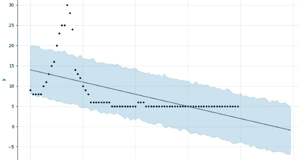*****

*****轨迹可以表现出循环模式，然而，总的来说，这可能通不过“六岁女儿测试”。同样，在下面的例子中，有记号笔的一年级学生在外推法方面做得更好。像 Prophet 一样，我让您看不到这些数据的来源，但是请放心，这些是真实的、经过测量的数据点。*****

*****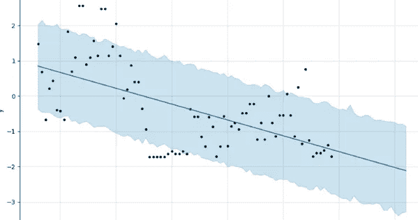*****

*****你真的赌多少，这会走向-2？如果这真的是你的中值，我会选择另一边的尺寸，因为我两个 6 岁女儿的平均尺寸大约是-1.2。在这里，我很抱歉不能更加精通网络，因为一个切换蓝色阴影的按钮可能会消除一些偏见。如果可以的话，试着把它从你的视觉计算中去掉。*****

*****类似地，虽然有些*可能*在下面的图中购买一致的趋势，但我认为更安全(并且从最小化许多相似时间序列的平方误差的角度来看)的是，在不久的将来，我们可能会在 1.5-2.0 附近，而不是 2.5。也许一些长期趋势可以进入画面，但向零收缩。*****

*****先知并不害羞。*****

*****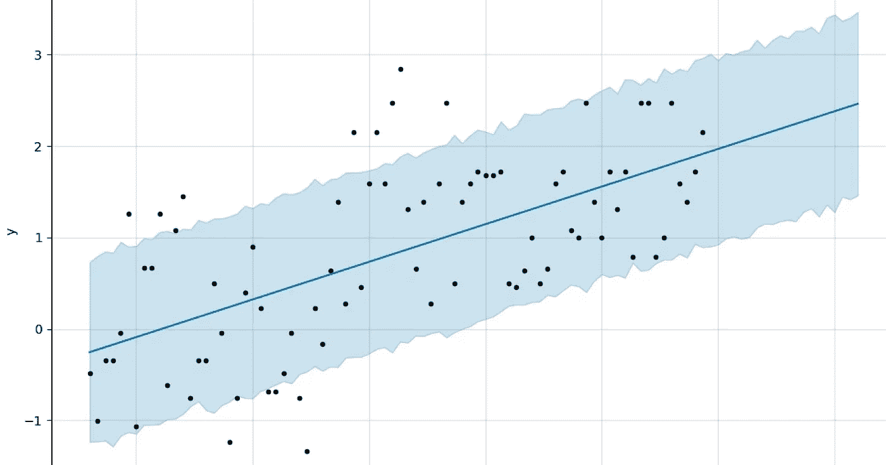*****

*****同样，你认为纽瓦克机场的等待时间会很快变成负数吗？现在，我们正在重新插入我们的广义智力，这似乎不公平，但即使如此，如果一个时间序列从来没有，从来没有低于某一水平，预测它将以很高的概率准确地做到这一点，是不是很厚颜无耻？这可能是稍微改进生成模型的简单方法。*****

*****请注意下面的情节，在先知的辩护中，它试图找到改变点。然而，缺乏灵活性的趋势是问题所在。在这里，我打赌它会被最后一个值缓存打败，更不用说更复杂的东西了。对数转换可能无法挽救它，更长的时间跨度也不行。*****

*****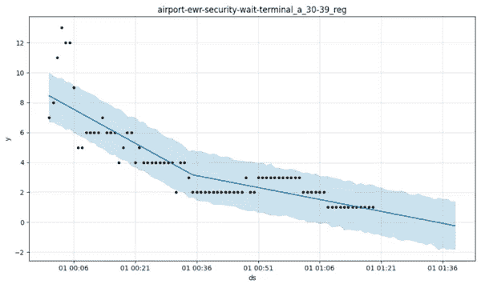*****

*****还是那句话，批评容易，执行难。如前所述，这些例子仅仅是我自己为了理解如何改进方法而进行的努力。在先知生成模型中，实际上没有太多的杠杆可以利用(如果没有其他方法可以求助于贝叶斯规则，那么现有的杠杆可能会过度识别实际上并不存在的结构)。*****

*****没有人想在改进 Prophet 的过程中毁掉它。相对快速的模型拟合是必不可少的，因为这必须在每次新数据点到达时发生(不存在将先知模型从一点向前推进到下一点的状态或概念)。相对简单的简约模型的好处之一是能够穿越噪音。在这里它做得很好，不是吗？*****

*****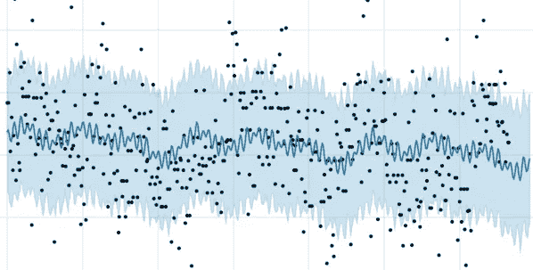*****

*****我似乎在吹毛求疵，但与更接近鞅的其他东西相比，你在上面看到的正弦结构的想象力将会削弱低均方根误差的机会。为了更积极地看待这一点，有人可能会说，如果你只关心整体情况，比如说淘洗，那么你可能会对导致最小二乘误差的波动漠不关心，但不会损害你的洞察力。然而，我不确定如何真正把对先知的模糊辩护变成一个更正式的辩护。*****

*****我还担心 Prophet 会以一种有助于预测“锚点”的方式处理时间序列，如果我们允许自己放松这种想法，即它试图通过某种评分规则来创建点估计值——这显然不是一项自然成功的任务。如果你在做市，你不会希望这样。但是，从理论上为 Prophet 辩护的一种方法——在这里我只是提出一些想法——是根据它对后续处理的帮助程度来判断它(也就是说，应用于 Prophet 的一些度量标准与一些其他方法结合使用，可能是一种修复串行相关错误的方法，等等，或者至少将其用于变化点检测)。*****

*****然而，我担心的不仅仅是这些波动的可预测性，还有它们的幅度。这是一个真实的市场时间序列，我们观察 30 年期债券的涨跌。我想把这些预测缩小到零，而时间序列过滤器正是为此目的而设计的。但是我承认这张图片并不能证明 Prophet 对于微观结构来说是天生不可行的——只是一个值得关注的原因。一个公正的分析应该使用完整的后验概率。*****

**********

*****抛开很少有人会尝试使用 Prophet 来做中间价的事实，你也可以看到为什么它可能不会在更容易预测的事情上名列前茅，无论采用什么指标。只有趋势可以玩，将会有大量的插值和外推来回避这个问题。在下面的时间序列中，Prophet 没有因为预测三个表面上的制度中的任何一个制度内的趋势而获奖——任何给定 100 个数据点或更多的模型都应该没问题。然而，正如你所看到的，它做了一个大胆的推断。*****

*****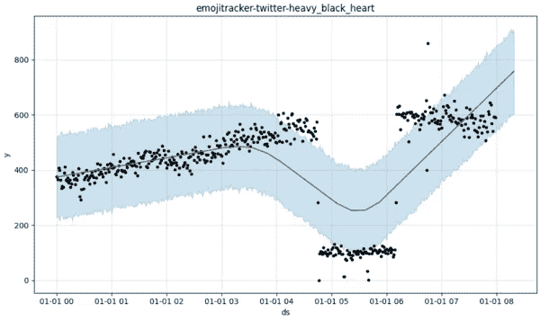*****

*****有时这些猜测是正确的，但我倾向于将 Prophet 视为一个信号发生器，也就是说我们可以将它作为一个功能来使用。开箱即用，我的直觉告诉我，这个模型将影响校准不良的估计(即，可以通过一些元模型分析其犯错误的倾向来容易地改进的估计)。例如，Prophet 似乎没有发现玉米价格在固定区间(波动性的一种度量)内的任何信号。但是有一个模式，除非我的眼睛欺骗了我。*****

*****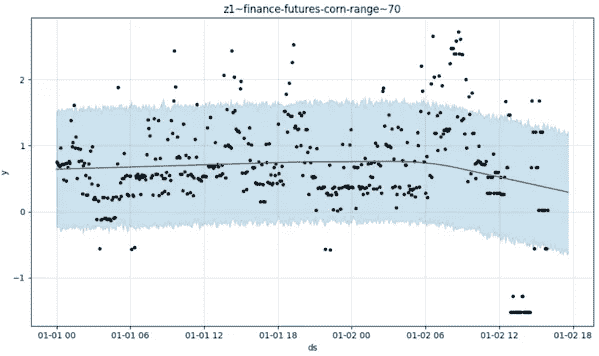*****

*****预言者需要规律性，有时它得到了。看起来，最好的可能情况是一个量遵循分段线性路径。在自然界中，人们不得不寻找它们，但这并不是不可能的。嘿，看看纽约的电力生产！*****

*****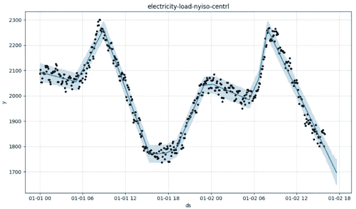*****

*****然而，即使在这里，我们看到了先知的缺陷。在这个例子中，它的基础设法跨越了空间——人们可能会认为这是偶然的——但与其他方法(如状态空间模型)相比，它在某些类型的路径上下了很大的赌注——如直线延续。类似故事的结尾，看一下这篇文章的封面图片。*****

*****相比之下，如果你用高斯过程、卡尔曼滤波器等建模，你也在进行贝叶斯计算，但是是在更大的可能性空间上进行的。这就是为什么，在进行更正式的分析之前，以我个人的拙见，Prophet 的数据不太可能给人留下深刻印象。*****

**********

*****在其他领域，我认为，生成模型的匮乏非常明显。例如，如果你想模拟交通流量，或者流行病的起起落落，只要模型需要，几乎任何合理的生成模型都能够追踪突发行为。*****

*****我完全接受这可能不是先知的动机。另一方面，也许有一种相对简单的方法来改进软件。如果到了紧要关头(纽约市的交通有时就是如此)，即使只有一个参数的家庭也能模拟出队列的长度。底层的 MCMC 可以处理任何事情(感谢 [**盖尔曼**](http://www.stat.columbia.edu/~gelman/) 教授)所以为什么不呢？*****

*****例如，您可能希望 Prophet 能够模拟 I-80 和亚历山大汉密尔顿桥之间的旅行时间，而目前 Prophet 无法处理这一问题——除非我的代码中有一些可怕的错误。生成模型不想辨别数据中看似明显的现象。想象一下，与带变点检测的 ARIMA 甚至卡尔曼滤波器相比，该模型的样本外性能会有多差。*****

*****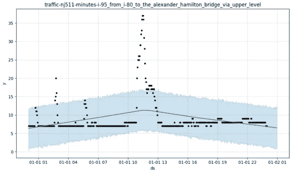*****

*****根据设计，Prophet 的生成模型可能会将所有形式的干扰视为噪声，无论它们持续多长时间，或者它们是否是数据的主要特征。我不会告诉你下面的例子代表了什么，除了说——就像我展示的所有系列一样——它是真实的。我想让你想象一下这可能代表多少真实世界的时间序列(Prophet 真的会激怒 Albert-Laszlo Barabas， [**突发**](https://barabasi.com/book/bursts) 的作者)。*****

*****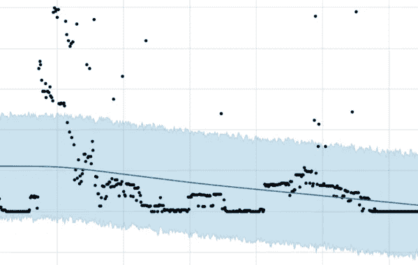*****

*****这一系列可能是 reddit 上对 GameStop 的提及，或者是太阳活动，或者是特朗普的推文数量(注意末尾的扁平线)。也许是化学反应的进展，或者是网络攻击的发生。关键是它可以代表任何数量的事物，而预言家梅，开箱即用，做了一个非常糟糕的工作来模拟所有的事物。更友好地说，我们会说它有时会像上帝一样，以神秘的方式移动。*****

*****哦，你可能会说，但 Prophet 试图抓住整体趋势——仅此而已。好吧，但是你怎么看待现在黑客新闻首页的评论数量？它的趋势是上升还是下降？*****

**********

*****在一个明显的转折点之后，我将在这里进行趋势分析，我认为，这应该与你在那些销售时间序列中看到的先知(我们被告知)擅长的产品变化非常相似。如果这是二手运动自行车的销售(也许在更长的时间范围内)，我会认为事情看起来很乐观。先知说不，他们在往下走，往下走，往下走。*****

*****在这里，一个更中性的预测肯定会有更低的均方差。我要重申的是，尽管 Prophet 使用了贝叶斯规则，但它仍然非常固执己见，因为生成模型代表了一个稀疏的可能性集。对我来说太稀疏了。回到开始这一切的例子，Prophet 可能会让你相信，由于某个特别糟糕的一天，亚特兰大皮德蒙特医院的等待时间将会无限上升。*****

*****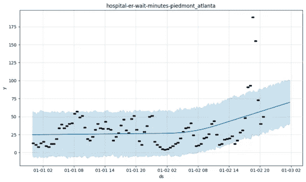*****

*****我想我们都知道这有点荒谬，我无法想象一个“专家预测者”会向董事会提出这样的观点。所以，不，脸书预言家没有解决自动预测的问题。但这是一个值得注意和有趣的尝试，希望贡献者将继续推进它。您也可以做一些简单的事情来提高自己对 Prophet 的使用。*****

# *****先知统治更好的准确性*****

*****现在，已经向您展示了样本数据，让我们看看一些揭示真相的例子。你会看到先知*下的一些赌注会有回报。例如，这里的 Prophet 预测了纽约市医院附近的自行车共享站的日常活动周期。它很好地预测了衰减，你不觉得吗？******

*****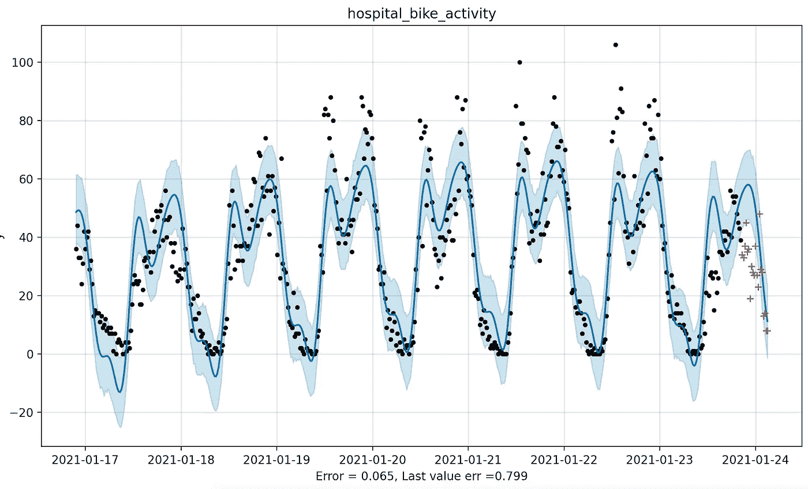*****

*****在下面的例子中，Prophet 预计取暖油期货的交易量会上升。从最近几个数据点来看，这一点并不明显，所以我们可能会相信这一点(尽管怀疑者可能会认为这是幸运的，只是因为之前的正弦曲线与直线拟合错误)。*****

*****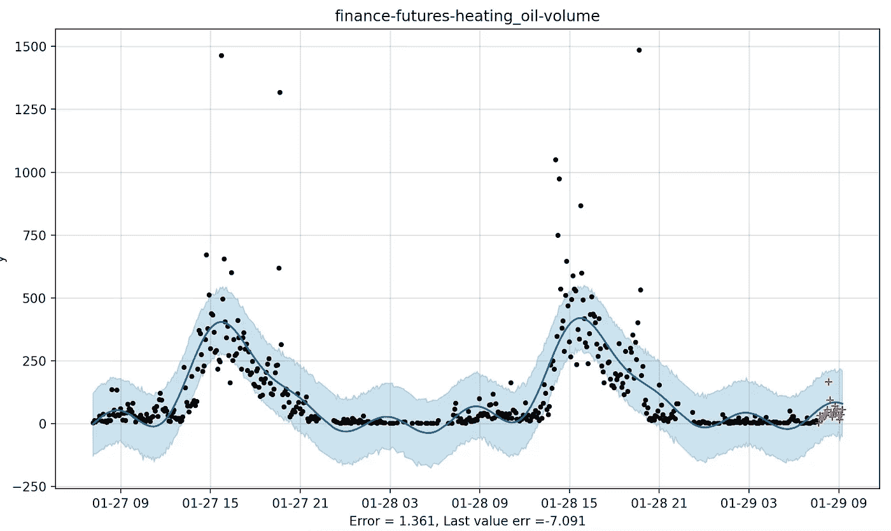*****

*****这些例子有助于先知在低均方误差的竞赛中。现在，这个指标确实有一点运气的成分。这里有一个 Prophet 比最后一个值更准确的例子，但是，嗯…*****

**********

*****是啊。*****

*****让我们继续前进！是的，这里出了很大的问题，我怀疑这与传染病的傅立叶变换有关。但是我又想为 Prophet 找借口(当然，我们可以通过使用 Lambert W 函数进行预处理来修复它！).同样，在下面的例子中，我怀疑但没有证实超参数的改变会有帮助。*****

*****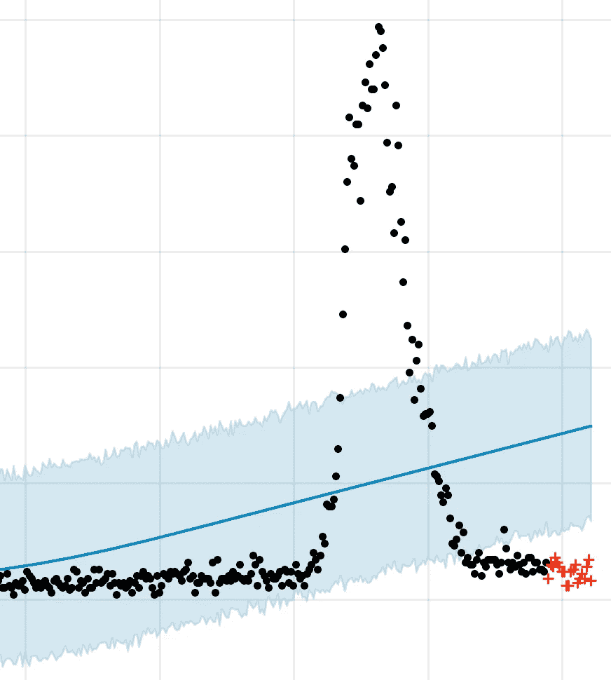*****

*****此外，在有些情况下，Prophet 不应该受到错误度量的惩罚。*****

*****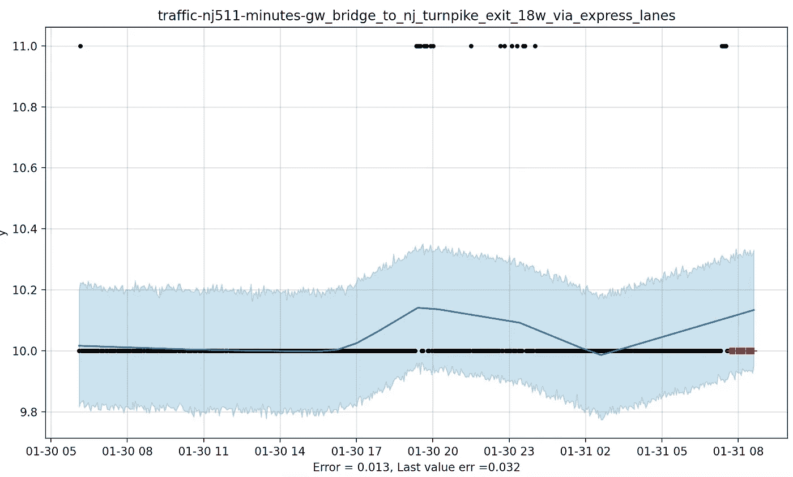*****

*****很无聊的时间序列，是吧？HOV 的交通很顺畅(至少在新冠肺炎期间),除了少数时候不顺畅。不是每个人都喜欢 Prophet 对这个问题的回答(反正不是最小二乘误差先生)，但是 Prophet 试图，高尚地，告诉我们一些事情。我觉得我们应该听听。*****

*****但问题是怎么听，什么时候听，听多少？例如，如果最后几个数据点表明下降周期的开始，正如你在下面看到的纽瓦克机场的停车占用率，但 Prophet 认为这一趋势将继续，我倾向于将 Prophet 的预测缩小到最后几个数据点的平均值。当你看到红色的样本外点时，我想这很容易说。*****

*****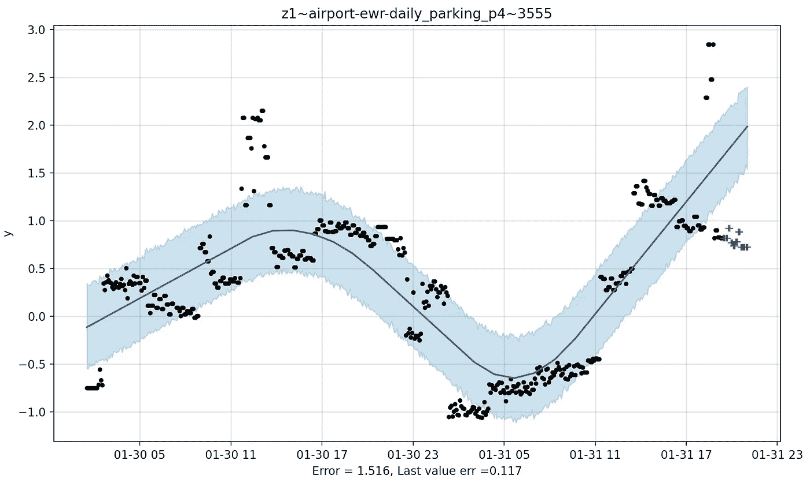*****

*****受这些例子的启发，这里有一个看起来能改善 prophet 的非常简单的方法*****

1.  *****查看最后五个数据点，并计算它们的标准偏差。*****
2.  *****通过将最高数据点加上 **m** 标准差，再加上一个常数，构建一个上界。对于下限也是如此。*****
3.  *****如果 Prophet 的预测超出这些界限，则使用最后三个数据点的平均值。*****

*****虽然这听起来很简单，但它确实有效——即使是在预测未来的时候。例如，当从 [**这个列表**](https://www.microprediction.org/browse_streams.html) 中选择随机时间序列，给 Prophet 500 点进行训练，并要求提前 50 步进行预测时，这个简单的启发式方法 **m=3** 将均方根误差降低了 25%(在适用的情况下，不是全部)。看起来，当使用 **m=1.5** 预测未来 20 步时，这种方法大致同样有效。*****

*****我并不认为这个启发法在任何意义上都是最佳的——我只是注意到这个特殊的规则，因为它是我尝试的第一件事。任何合理的收缩都可能达到类似的目的，甚至可能产生更好的效果。当然，人们可以做各种相关的事情，比如将预言者和其他预言结合起来使用。*****

*****即使只是差分序列的可能性也会消除 Prophet 在趋势是线性的情况下从最后一个值缓存中获得的收益，并且它会充分利用这些收益。这是因为有大量的例子，在这些例子中，你只需要差分就可以*增加*最后一个价值估计者相对于预言者已经存在的优势。例如，在这里，预言家拒绝进一步追逐尼斯湖水怪，而任何中途合理的推断都会这样做。*****

*****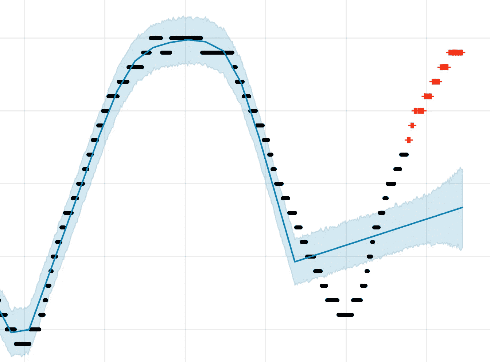*****

*****我不知道尼西这次是怎么逃脱的，但可以认为这是先知的神秘魅力的一部分。*****

*****公平地说，差分也可以很好地为 Prophet 服务，人们肯定可以以许多有趣的方式使用它，要么作为信号发生器，要么作为更全面的管道的一部分。我提到的文章中报告的看似糟糕的性能并没有排除这一点，在存在序列相关误差的情况下，时间序列建模的评估肯定存在微妙之处。有人可能会说，这完全是一个巨大的逆问题，没有明确的评估——尽管如果统计唯我论是唯一的防御手段，我们可能会有更大的问题。*****

*****另一个很可能提高 Prophet 性能的方法在我的文章 [Smooth Move 中提到——摆动会降低时间序列模型的准确性吗？](https://microprediction.medium.com/smooth-move-does-wiggling-make-time-series-models-less-accurate-8544e675873)。要了解原因，请观察 Prophet 所做的提前一步预测，以及当我们移动倒数第五个观察值时它是如何变化的。“预言者”突然跳到空间中的一个新的点，预测彻底改变了。我的文章向您展示了如何通过一行代码来减少这种行为。*****

*****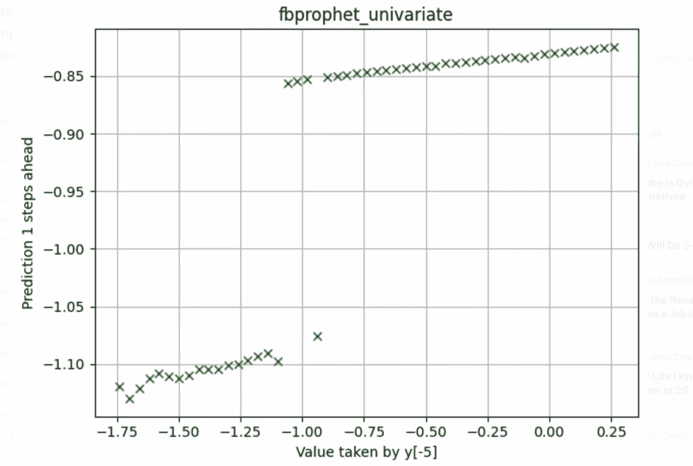*****

*****Sensitivity of a 1-step ahead forecast to changes in the 5th-to-last observation*****

*****最后，让我说这篇文章比我预期的更负面，就像尼西一样，当我更好地理解先知生成模型的含义，并修改它或找到更好的方法来确定它的优势时，我的观点可能会在未来上升。这里没有回答的问题是*为什么*先知如此受欢迎，这肯定值得一个比我给出的更好的解释。我想可能有我没有看到的统计角度——这反映了人们在使用 Prophet 时用眼球投票的事实。*****

*****不应该低估能够以某种程度的准确性预测许多不同的时间序列而无需调整的实际优势。毫无疑问，这是《预言家日报》受欢迎的原因，也证明了它的成就。就我个人而言，我会继续和 Prophet 一起玩，我也鼓励你这样做。也就是说，我确实认为，那些为你的数据科学家同事撰写“预测简介”文章的人可能会想进一步浏览一下我提供的 [**列表**](https://www.microprediction.com/blog/popular-timeseries-packages) ，并给小家伙们一个好机会。例如 [**auto_ts**](https://github.com/AutoViML/Auto_TS) 试图告诉你什么时候 Prophet 被替代者超越，只是为了挑选一个。*****

# *****持续评估和 Elo 评级*****

*****我已经开始对 Prophet 进行更系统的评估，并对其进行调整。和这篇文章一样，我使用了许多不同的现实世界时间序列，并分析了不同的预测范围。 [**Elo 评分**](https://github.com/microprediction/timemachines-testing/tree/main/skater_elo_ratings/leaderboards/univariate_002) 似乎预示着 Prophet 的糟糕表现——尽管我会给他们更多的时间来烘烤。然而，除非情况有所改变，否则我的结论是:*****

*   *****用简单的黑客技术来改进脸书先知实在是太容易了*。请注意，在一步预测的排行榜上( [**此处为**](https://github.com/microprediction/timemachines-testing/tree/main/skater_elo_ratings/leaderboards/univariate_001) )和大多数其他排行榜上，**fbprophet _ 谨慎**算法的表现优于 **fbprophet_univariate 算法。**前者减少了 Prophet 的“疯狂”预测，而后者运行工厂默认设置。******
*   *****与一些引用的工作一致，我发现到目前为止，Prophet 在每个地平线上都被指数移动平均线打败(在 400 个历史数据点上训练时，从领先 1 步到领先 34 步)。更令人担忧的是，移动平均线模型无法校准。我简单地硬连接了两个参数选择。*****

*****我认为*你*可以创造出比 Prophet 好得多的时间序列方法，创造 Prophet [的人可能会同意](https://www.microprediction.com/blog/prophet)。如果你有想法，并且可以用一个简单的“溜冰者”签名(在 [**README.md**](https://github.com/microprediction/timemachines) 中解释)来表达它们，我很乐意把它们包括进来。有一个新的[贡献者指南](https://github.com/microprediction/timemachines/blob/main/CONTRIBUTE.md)。也可以直接给[先知](https://github.com/facebook/prophet)投稿，见[投稿指南](https://facebook.github.io/prophet/docs/contributing.html)。*****

*****为了确保这样的文章在你的帖子里，考虑在这里或 LinkedIn 上关注 [**微预测**](https://www.linkedin.com/company/65109690) (因为你可能不会在媒体上看到它们，除非有更多的人签署这个[请愿书](https://www.change.org/p/towards-data-science-have-towards-data-science-publish-an-article-critical-of-facebook-software)。)我们正试图让强大的定制人工智能变得免费和方便。如果有建议，请提出 [**问题。**](https://github.com/microprediction/timemachines/issues) 最后，我注意到这里有一个关于这篇文章[的非常活跃的讨论。](https://news.ycombinator.com/item?id=27695574#27699255)*****