# 性别容易确定吗？

> 原文：<https://medium.com/geekculture/is-gender-easy-to-determine-44ff0647d3f6?source=collection_archive---------35----------------------->

## 了解你的用户


Photo by [Paul Zoetemeijer](https://unsplash.com/@paul_1865?utm_source=unsplash&utm_medium=referral&utm_content=creditCopyText) on [Unsplash](https://unsplash.com/s/photos/anonymous?utm_source=unsplash&utm_medium=referral&utm_content=creditCopyText)

# 介绍

这个故事是[修补移动应用数据集](https://towardsdatascience.com/tinkering-with-the-mobile-apps-dataset-4286d2c6125b)的续集。我开发了一个有趣的[数据集](https://www.kaggle.com/sagol79/stemmed-description-tokens-and-application-genres/metadata)——一个用户、已安装应用程序、用户性别以及应用程序性别分布统计的列表。

```
DOI: 10.34740/KAGGLE/DSV/2309388
```

对于一个成功的广告活动来说，与一个细分市场合作是至关重要的，而用户的性别有时会简化选择细分市场的工作。

我将告诉你在应用程序上收集统计数据如何让 ML 预测用户的性别。

除非另有说明，所有图片均为作者所有。

# 数据

数据集中添加了两个新文件:

*   ***users.csv*** —最有可能是性别的用户列表和几个已安装应用程序的列表。

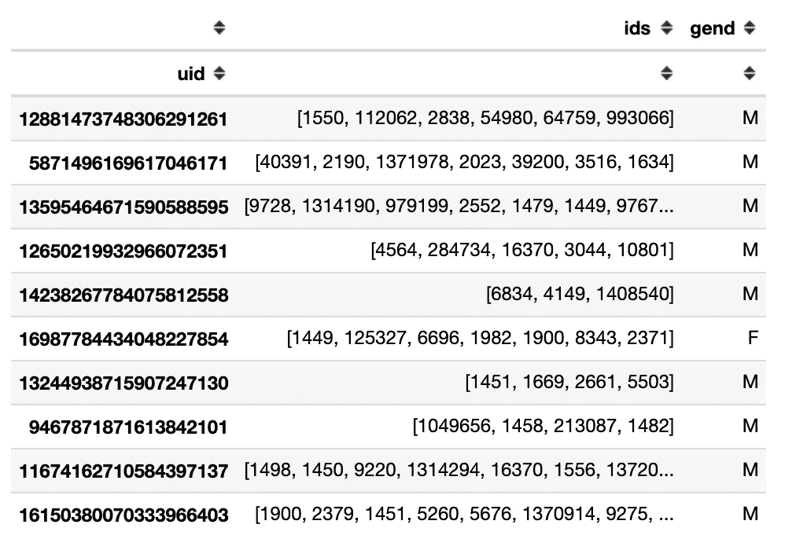

*   ***bundles _ Gender . CSV***—应用中用户的性别分布。

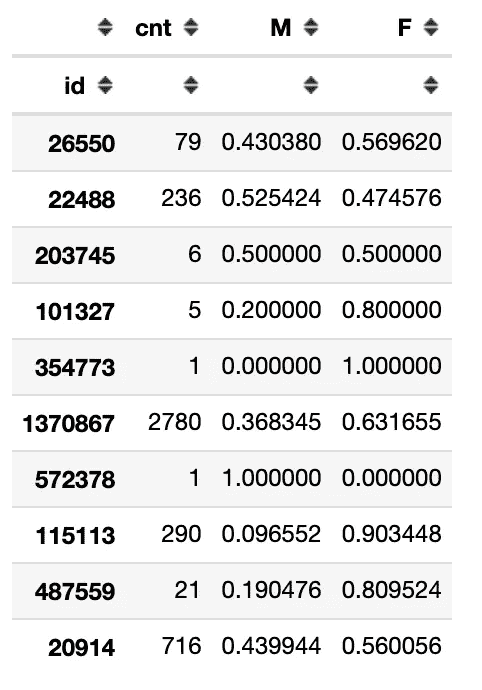

请注意 *cnt* 字段——它显示安装了该应用程序的用户数量，我们知道他们的性别，因此，我们可以收集关于该应用程序的统计数据。此字段也可用于衡量此应用程序相关信息的可信度。

# 电子设计自动化(Electronic Design Automation)

首先，观察设备之间的性别分布是很有趣的。

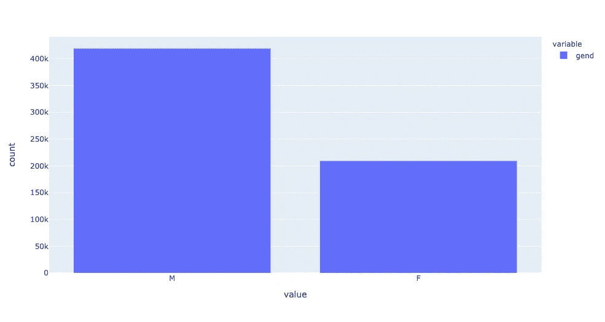

人们可能会期望这些设备大致平分秋色，但这并没有发生。因此，我假设女性不太可能在应用程序的设置中表明自己的性别。

也许这是因为专门针对女性观众的申请数量少于男性观众。下图间接证实了这一点。

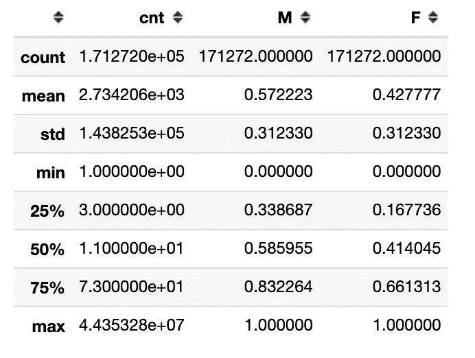

我们来看看直方图。第一个将没有额外的过滤器。

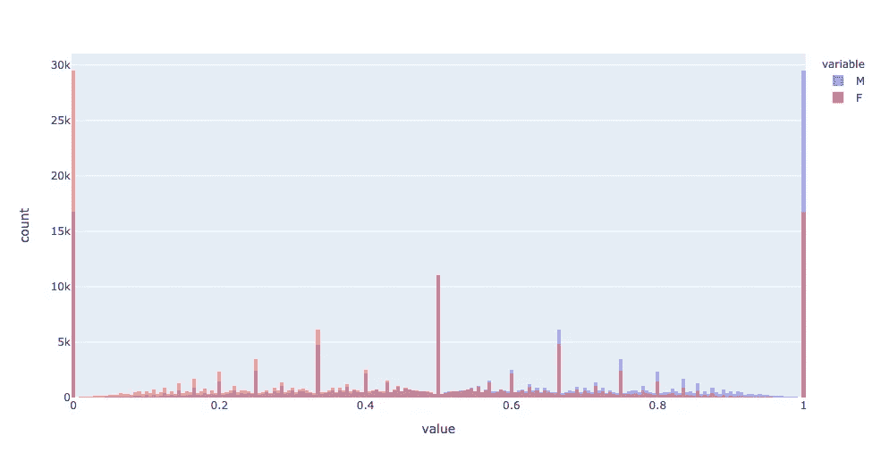

除了对称和明显的峰，几乎什么也看不见。让我们仔细看看其中的一座山峰。

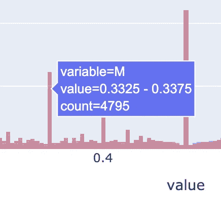

```
genders_df[
    (genders_df['F']>=0.3325) & 
    (genders_df['F']<=0.3375)
].describe()
```

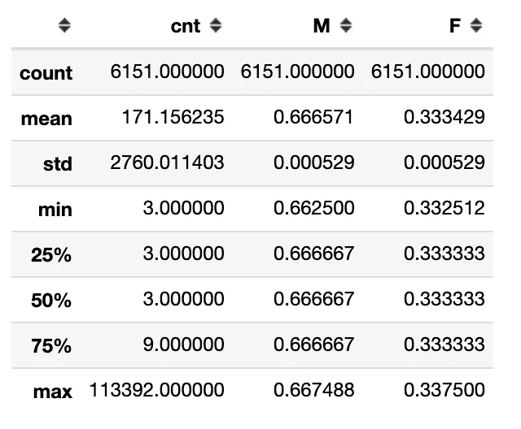

如果忽略异常值，您会发现该子样本中的大多数应用程序极其罕见，这导致了大量相同的值。

我们尽量只保留那些遇到 10 次以上的应用。

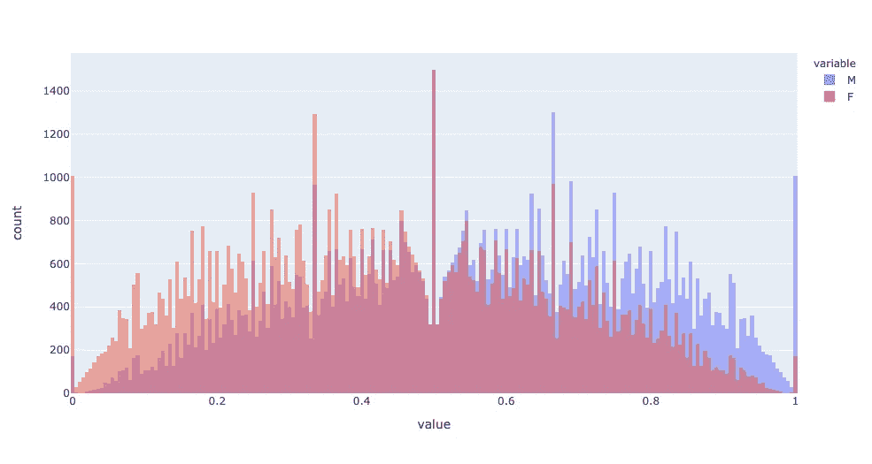

峰值仍然可见，但不那么清晰。将阈值增加到 50 几乎可以消除峰值。

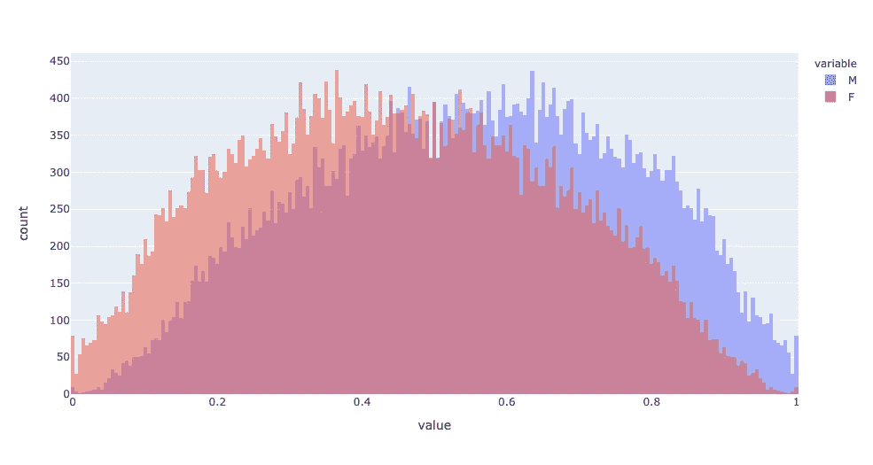

图表清楚地显示了女性用户较少的应用程序。

# 新功能

让我们再创建几个显示附加信息的附加功能。

可以假设安装的应用程序的数量会有所帮助。

```
users_df['apps_count'] = users_df['ids'].apply(len)
users_df.groupby('gend')['apps_count'].describe()
```

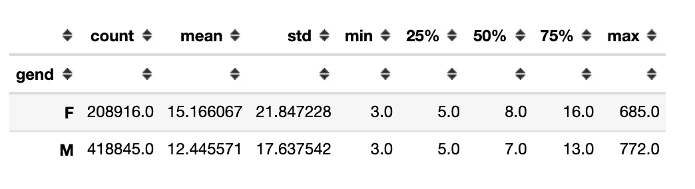

你可以看到，平均来说，女性在她们的设备上安装了更多的应用程序。

我有关于用户的数据，他们的性别和安装的应用程序，以及这些应用程序的性别分布信息。这些数据之间有关联吗？假设有是符合逻辑的，但是这种相关性有多强呢？

```
g_dict = genders_df['F'].to_dict()
users_df['F_prob'] = users_df['ids'].apply(
    lambda x: np.mean(
        list(filter(None.__ne__, list(map(g_dict.get, x))))
    )
)
```

代替平均值，你可以使用更复杂的方法，但是对于最初的分析，这已经足够了。

```
np.corrcoef(
    users_df['F_prob'],
    users_df['gend'].astype('category').cat.codes
)[0,1]
```

这种相关性被证明是非常显著的。

```
-0.46602945129982887
```

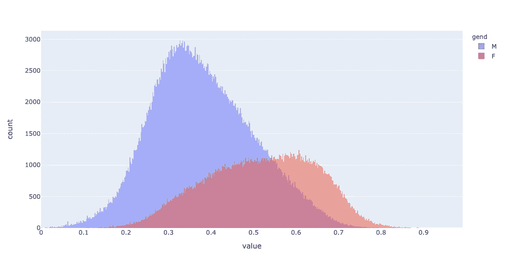

直方图显示用户被很好地分为两组。

# 基线

对于结论和评估，我需要一个基线模型。因此，我选择最简单的方法。

```
print(f"Accuracy: \
    {accuracy_score(users_df['gend'].astype('category').cat.codes, users_df['F_prob']<0.5)}")
print(f"AUC: \
    {1 - roc_auc_score(users_df['gend'].astype('category').cat.codes, users_df['F_prob'])}")
```

即使这样幼稚的方法也给出了一个好的结果，但是让我们试着进一步改进它。

```
Accuracy:     0.740925288445762
AUC     :     0.7793767183917958
```

# 培训和测试

因为包含用户的数据集很大，所以我可以选择一个子集来检查和比较模型。

```
train, test = train_test_split(
    users_df, train_size=0.7,
    random_state=0, stratify=users_df['gend'])
```

# 逻辑回归

首先，我将尝试最简单和最常见的方法—逻辑回归。但是为此，我们需要数字特征，而不是 id 列表。同样，我可以使用最简单的方法—二值化。

```
import itertoolslen(set(itertools.chain.from_iterable(users_df['ids'])))
```

但是有一个明显的问题——唯一 id 的数量。

```
109186
```

但是产生的二进制数据将是稀疏的这一事实允许使用[稀疏矩阵](https://docs.scipy.org/doc/scipy/reference/sparse.html)。

```
mlb = MultiLabelBinarizer(sparse_output=True)
mlb.fit(users_df['ids'])
train_mlb = mlb.transform(train['ids'])
test_mlb = mlb.transform(test['ids'])
```

我使用 OOF(Out-of-Fold)方法来获得可靠的结果，并在划分为训练和验证子样本时减少随机性的影响。我不使用第三方库，写了一个简单的函数。请注意，将数据集分割成折叠必须分层。

```
def get_oof_lr(n_folds, x_train, y, x_test, seeds):

    ntrain = x_train.shape[0]
    ntest = x_test.shape[0]  

    oof_train = np.zeros((len(seeds), ntrain, 2))
    oof_test = np.zeros((ntest, 2))
    oof_test_skf = np.empty((len(seeds), n_folds, ntest, 2))
    models = {}
    for iseed, seed in enumerate(seeds):
        kf = StratifiedKFold(
            n_splits=n_folds,
            shuffle=True,
            random_state=seed)          
        for i, (tr_i, t_i) in enumerate(kf.split(x_train, y)):
            print(f'\nSeed {seed}, Fold {i}')
            x_tr = x_train[tr_i, :]
            y_tr = y[tr_i]
            x_te = x_train[t_i, :]
            y_te = y[t_i]
            model = LogisticRegression(
                random_state=seed,
                max_iter = 10000,
                verbose=1,
                n_jobs=20
            )
            model.fit(x_tr, y_tr)
            oof_train[iseed, t_i, :] = \
                model.predict_proba(x_te)
            print(f"AUC: {roc_auc_score(y_te, oof_train[iseed, t_i, :][:,1])}")
            oof_test_skf[iseed, i, :, :] = \
                model.predict_proba(x_test)
            models[(seed, i)] = model
    oof_test[:, :] = oof_test_skf.mean(axis=1).mean(axis=0)
    oof_train = oof_train.mean(axis=0)
    return oof_train, oof_test, models
```

AUC:

```
Seed 0, Fold 0: 0.8752592302937795
Seed 0, Fold 1: 0.8741272807694727
Seed 0, Fold 2: 0.8754404425783484
Seed 0, Fold 3: 0.8750862228494931
Seed 0, Fold 4: 0.8767777821454008
Seed 42, Fold 0: 0.876839970445301
Seed 42, Fold 1: 0.8771914077769174
Seed 42, Fold 2: 0.8762049208242458
Seed 42, Fold 3: 0.8725705419477277
Seed 42, Fold 4: 0.8731672122759209
Seed 888, Fold 0: 0.8752996641300741
Seed 888, Fold 1: 0.8749304780764804
Seed 888, Fold 2: 0.8762614986655877
Seed 888, Fold 3: 0.8765240184267109
Seed 888, Fold 4: 0.8725618258459555
```

让我们检查测试子样本的预测。

```
Accuracy:     0.8208932240918818
AUC     :     0.8798990678456793
```

我要说的是，与基线相比，差异很大。我将假设质量可以通过调整超参数来提高，让它成为读者的家庭作业。

# 催化增强#1

当我查看 *ids* 功能时，我看到了一个令牌列表。为什么不尝试以纯文本的方式处理这些数据呢？

我选择了 [CatBoost](https://catboost.ai/) 作为模型的免费库。CatBoost 是一个高性能的开源库，用于决策树的梯度提升。从版本 0.19.1 开始，它支持在 GPU 上开箱即用的分类文本功能。主要优点是 CatBoost 可以在数据中包含分类函数和文本函数，而无需额外的预处理。

我在文章 [*修补移动应用数据集*](https://towardsdatascience.com/tinkering-with-the-mobile-apps-dataset-4286d2c6125b) 中写了更多关于文本特性的细节。

```
!pip install catboost
```

让我们写一个函数来初始化和训练模型。

```
def fit_model(train_pool, test_pool, **kwargs):
    model = CatBoostClassifier(
        task_type='GPU',
        iterations=10000,
        eval_metric='AUC',
        od_type='Iter',
        od_wait=1000,
        learning_rate=0.1,
        **kwargs
    )return model.fit(
        train_pool,
        eval_set=test_pool,
        verbose=1000,
        plot=False,
        use_best_model=True
    )
```

不幸的是，在当前版本的 CatBoost 中，不可能使用已经准备好的令牌列表。因此，让我们来做一个小技巧—将特征转换为文本，并使用它来创建模型。

```
users_df['ids_txt'] = \
    users_df['ids'].apply(
        lambda x: " ".join([str(i) for i in x ]))
```

和逻辑回归一样，我做了一个 OOF 预测。

```
columns = ['ids_txt', 'apps_count']
oof_train_cb, oof_test_cb, models_cb = get_oof_cb(
    n_folds=5,
    x_train=train[columns],
    y=train['gend'].values,
    x_test=test[columns],
    text_features=['ids_txt'],
    seeds=[0, 42, 888]
)
```

测试子样本中的模型质量度量显示出比使用逻辑回归时更好的质量。

```
Accuracy:     0.8218224490121011
AUC     :     0.8856101448105046
```

有趣的是，两种完全不同的方法给出了非常相似的结果。在这种情况下，合乎逻辑的假设是，将各种方法结合起来会产生协同效应。

# 催化增强#2

作为一项新功能，我添加了来自逻辑回归模型的 OOF 预测。此外，不要忘记 *F_prob* 特性，它在基本模型中运行良好。

```
columns = ['ids_txt', 'F_prob', 'lr', 'apps_count']oof_train_cb_2, oof_test_cb_2, models_cb_2 = get_oof(
    n_folds=5,
    x_train=train_2[columns],
    y=train_2['gend'].values,
    x_test=test_2[columns],
    text_features=['ids_txt'],
    seeds=[0, 42, 888]
)
```

我可以说，该模型仅使用关于设备上安装的应用程序的信息，几乎理想地预测了用户的性别。

```
Accuracy:     0.836950230713273
AUC     :     0.9010077023800467
```

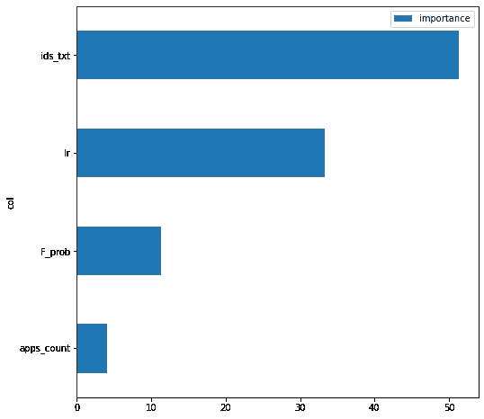

# 摘要

在这个故事中，我:

*   引入了新的免费数据集；
*   做了探索性数据分析；
*   创造了几个新功能；
*   创建了几个预测移动设备用户性别的模型。

所有这些都需要积累关于用户使用哪些应用程序的某些统计信息，以及关于应用程序本身的用户性别分布的信息。

文章的代码可以在[这里](https://github.com/sagol/bundles_desc_tokens/blob/main/model_genders.ipynb)查看。