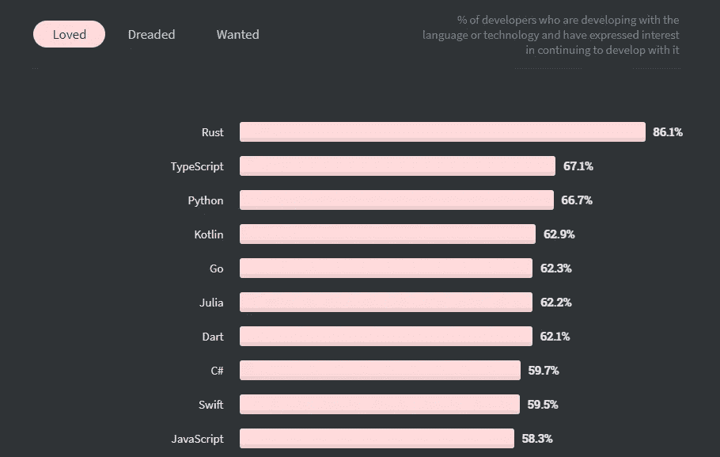
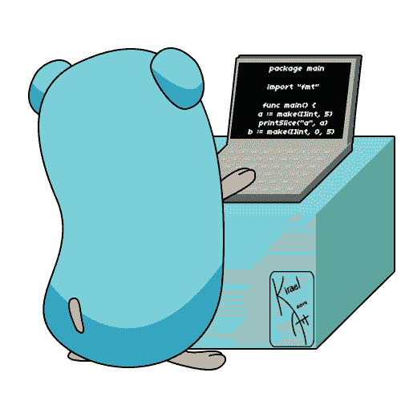
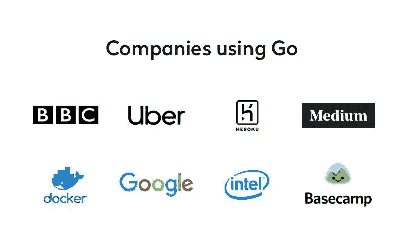
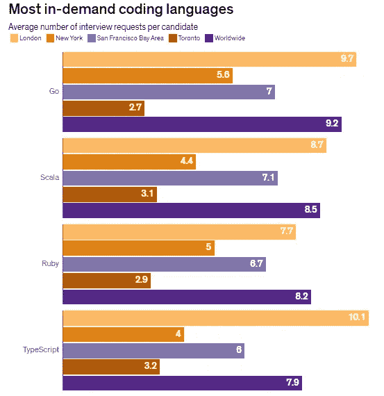
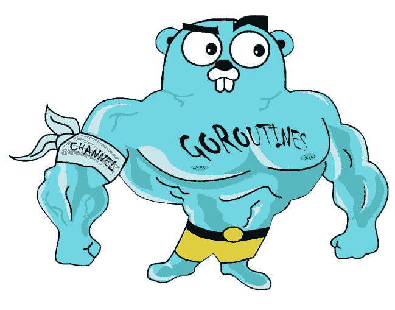

# 2021 初学 Golang 值得学吗？

> 原文：<https://medium.com/geekculture/is-golang-worth-learning-for-beginners-in-2021-2d189ea3419e?source=collection_archive---------4----------------------->

你应该试一试的 6 个重要理由！


GIF by [Egon Elbre](/@egonelbre)

在过去的几年里，围棋的受欢迎程度大幅提高。Stack Overflow 的 [2020 年开发者调查](https://insights.stackoverflow.com/survey/2020#technology-most-loved-dreaded-and-wanted-language)报告显示，在最受欢迎语言排行榜中，stack Overflow 从去年的第十位上升到第五位。67%的调查受访者喜欢用 Go 编写代码，另外 18%的人希望尝试用它工作(这使它排在 Python 和 JavaScript 之后的第三位)。最重要的是，围棋程序员的工资非常高。根据[栈溢出调查](https://insights.stackoverflow.com/survey/2020#technology-most-loved-dreaded-and-wanted-language)，2020 年，Go 程序员拥有第三高的工资中位数，仅次于 Perl 和 Scala 程序员。



Top 10 most loved languages in 2020\. Source: [StackOverflow Technology Survey 2020](https://insights.stackoverflow.com/survey/2020#technology-most-loved-dreaded-and-wanted-languages-loved).

Go 是由谷歌工程师创造的，目的是让他们的软件开发过程[简单、可靠、高效](https://golang.org/)，这就是为什么越来越多的程序员转向 Go 来提高他们的生产力。根据 2020 年 Go 开发者调查，压倒性的 81%的受访者认为 Go 工作效率非常高或非常高。即使你只是计算机科学的初学者，Go 也是开始积累编程知识的好语言。语法**简单易读**。与 Java 或 C#不同，Go **没有强加面向对象的设计**风格，这种风格对于任何刚刚起步的人来说都有一点陡峭的学习曲线。Go 还有一个**专用的垃圾收集器**，它负责从程序中释放未使用的数据，与 C 和 C++相比，它使编码变得不那么痛苦。

现在让我们更深入地了解一下 2021 年学习围棋的 6 大重要原因

# 1.语法对初学者来说非常简单



Image Source: [http://kirael-art.deviantart.com/art/Go-lang-Mascot-458285682](http://kirael-art.deviantart.com/art/Go-lang-Mascot-458285682)

当我学习编码时，我很难掌握 Java 语法。回想起来，如果我从像围棋这样简单的东西开始，所有的压力、挫折和长时间呆在电脑前都是可以避免的。不相信我？查看来自 Go 和 Java 的“Hello World”代码示例，然后自己做出决定。

```
**HELLO WORLD IN JAVA**class HelloWorldApp {
    public static void main(String[] args) {
        System.out.println("Hello World!"); // Prints the string to the console.
    }
}**HELLO WORLD IN GO**package main

import "fmt"

func main() {
    fmt.Println("Hello, World")
}
```

Go 没有强加任何严格的面向对象的设计结构。这种语言没有类别。相反，在 Go 中，所有东西都被分成易于管理的包。此外，Go **不支持继承**，这意味着代码可以很容易地修改，而不用担心孩子从父类继承的多米诺骨牌效应。此外，不需要担心构造函数、泛型、异常和注释。所有这些都使得 Go 代码简洁、干净、可读性更强。

虽然像 Python 和 JavaScript 这样的动态语言也比 Java 和 C++简单，但它们对用户抽象太多，并且通常是为高度专业化的领域开发的(例如，JavaScript 用于 web 开发，Python 用于数据科学应用)。如果你有兴趣从第一原理开始学习软件工程，Go 正是正确的选择。你可以随时在以后学习其他语言，围棋之后学习其他语言会容易得多。

Go 的独特之处还在于允许用户开发复杂的程序，而不必依赖复杂的二级库。Go 附带的标准库很全面，但并不太复杂，它将由于命名冲突而导致的代码不兼容和错误的风险降到了最低。由于强大的标准库和灵活方便的数据结构(如 slices ), Go 使得许多在其他语言中需要复杂工作区的任务可以用几行代码完成。

# 2.Go 是一门新兴的语言，有很大的机会



Companies using Go. Image Source: [https://hackernoon.com/should-i-go-the-pros-and-cons-of-using-go-programming-language-8c1daf711e46](https://hackernoon.com/should-i-go-the-pros-and-cons-of-using-go-programming-language-8c1daf711e46)

尽管 Go 是一种相对较新的语言，但它已经吸引了包括 [BBC、优步、Docker、英特尔、Medium、百度和阿里巴巴](https://nix-united.com/blog/why-use-the-go-language-for-your-project/#:~:text=Companies%20Successfully%20Used%20Go&text=Among%20them%20include%20such%20giants,examples%20of%20success%20using%20Go.)在内的大型国际企业的关注。越来越多的公司正在采用这种语言，因为它简单、可维护、出色的支持和强大的安全性。根据 IEE Spectrum 的数据，围棋是每位候选人面试中最常用的语言，这再次表明了围棋技能在当前科技领域的价值。



Most in demand programming languages. Source: [IEE Spectrum.](https://spectrum.ieee.org/view-from-the-valley/at-work/tech-careers/go-language-tops-list-of-indemand-software-skills)

# 3.Go 语法是稳定的

尽管它的使用呈指数增长，但 Go 的语法一直保持相对稳定。自 2012 年 1.0 版公开发布以来，几乎没有引入什么变化。这意味着即使是 Go 中最新的代码也是向后兼容的。因此，与 JavaScript 和 Kotlin 开发中的同行不同，Go 程序员在保持更新方面压力较小。虽然 YouTube 上的 Go 教程可能没有 JavaScript 或 Java 那么多，但确实存在的教程很可能没有遗留的代码和语法结构。这使得刚开始软件开发的初学者更容易学习 Go。

# 4.Go 是一种带有 Goroutines 的强大并发语言



Goroutines. Source: Goroutines — A Tour of Gotour.golang.org

围棋有 Goroutines，它负责围棋的速度和效率。在 Java 上，你可以运行 [1000 个或者可能是几十个 1000 个线程](http://tleyden.github.io/blog/2014/10/30/goroutines-vs-threads/)，然而 Go 允许你运行[几十万或者几百万个 goroutines。](http://tleyden.github.io/blog/2014/10/30/goroutines-vs-threads/) Goroutines 的启动时间比线程快。这一切赋予 Go 无缝处理并发的能力，就像更冗长的 Java、C 和 C++一样，同时保持代码整洁、清晰和简洁。

并发是一个很难理解的概念，但是如果你感兴趣的话，可以看看这篇关于 Authentic 的[文章](https://www.golangprograms.com/go-language/concurrency.html#:~:text=Concurrency%20is%20an%20ability%20of,things%20at%20the%20same%20time.&text=Concurrency%20in%20Golang%20is%20the,running%20concurrently%20with%20other%20functions.)。GeeksforGeeks 也很好地强调了线程和 goroutines 之间的[主要差异。](https://www.geeksforgeeks.org/golang-goroutine-vs-thread/)

# 5.Go 得到了谷歌的支持(也可能帮助你在谷歌找到工作)

Google 设计 Go 是为了简化软件开发过程，解决他们在支持可伸缩性、安全性和代码维护方面的问题。谷歌云是全球最大的云基础设施之一，构建于 Go 之上。据[谷歌](https://cloud.google.com/go/home)称，“ **Go 提供强大的开箱即用性能、包管理以及简单的格式和语法，可以快速构建并缩短上市时间。**“多年来，Google Cloud 的巨大成功证明了 Go 作为构建庞大、可扩展且高效的云架构的主流语言的价值。在最近接受 [Evrone](https://evrone.com/rob-pike-interview) 的采访中，Go 的创造者 Rob Pike 也评论道“ **Go 确实已经成为云基础设施的语言**”。

成千上万的工程师保持着谷歌云的平稳运行，谷歌也在不断为其快速扩张的业务雇佣新的工程师。了解围棋可能会让你从其他候选人中脱颖而出，这些候选人的知识仅限于 Java 或 Python 等通用计算机语言。

# 6.Go 提供了最高的每小时自由职业率

Go 之所以伟大的最后一个原因是 Go 开发为初级自由职业者提供了丰厚的时薪。如果你已经编码几个月了，你可能还没有完全准备好放弃朝九晚五的工作。直接开始申请编程工作也有点吓人，尤其是当你没有任何经验的时候。如果你学过围棋，你有一个很好的机会做自由职业赚真金白银，同时也获得宝贵的经验，为你以后的简历做些铺垫。

与初学的自由职业者每小时仅获得 5 美元报酬的 web 开发不同，Go 开发人员的报酬相当可观。Upwork 统计数据显示，围棋开发人员的平均时薪为 44 美元/小时，然而，快速浏览帖子显示，有相当多的客户愿意支付高于 150 美元/小时的费用。如果你正在考虑是否应该学习围棋，请考虑这样一个事实:即使你还没有完全准备好换工作，你也可以获得可观的收入并增加知识。

与 Python 或 JavaScript 程序员相比，Go 程序员的数量要少得多。自由职业者市场还没有饱和，因此，有很大的空间来发展和建立自己的名字。

# 结果

对于任何初学者来说，大量的选项常常会使选择编程语言成为一项令人望而生畏的任务。但是，如果你是 2021 年才刚刚起步，那么 Go 绝对是最实用的语言选择之一。它易于学习，有针对性，发展迅速，有谷歌支持，并被 Docker、优步和阿里巴巴等大公司采用。此外，它为自由职业者和固定工作提供了极好的前景。所有这些因素结合在一起，使 Go 成为 2021 年学习的理想语言。

你还在等什么？

# 我们走吧！