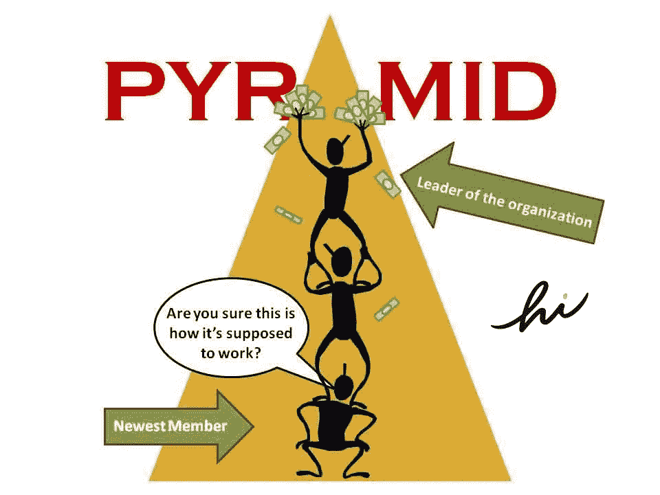

# Hi.com 是传销吗？

> 原文：<https://medium.com/geekculture/is-hi-com-a-pyramid-scheme-2602a851511?source=collection_archive---------10----------------------->

不投资你辛辛苦苦挣来的美元，就能得到加密货币，这听起来异想天开，对吗？当某样东西被归类为**免费**时，总会有一个陷阱。加密热开始升温，随之而来的是 **FOMO** 因为这个市场风险很大(被认为是股票🏛服用类固醇的️💉)因此有机会用广告抓住它。

## 那么什么是传销呢？