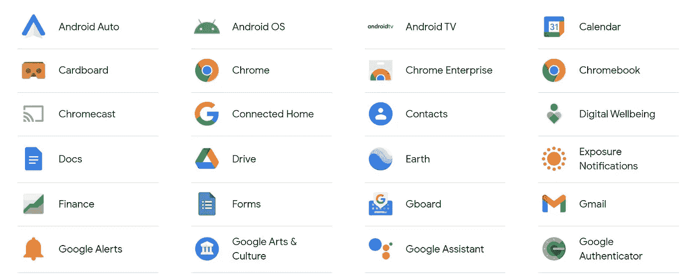

# 有没有可能让你的生活摆脱谷歌而仍然保持高效

> 原文：<https://medium.com/geekculture/is-it-possible-to-rid-your-life-of-google-and-still-be-productive-a92343573853?source=collection_archive---------14----------------------->

## 可能吧，但我不确定我们是否需要

Some of Google’s services (Courtesy [Google.com](https://about.google/products/))

## 我对谷歌服务的使用

我的谷歌之旅是从 Gmail 开始的。自从 2004 年这项服务推出以来，我一直在使用它。谷歌的电子邮件服务可以说是市场上最好的服务之一，对消费者来说，它是免费的——类似于***。***