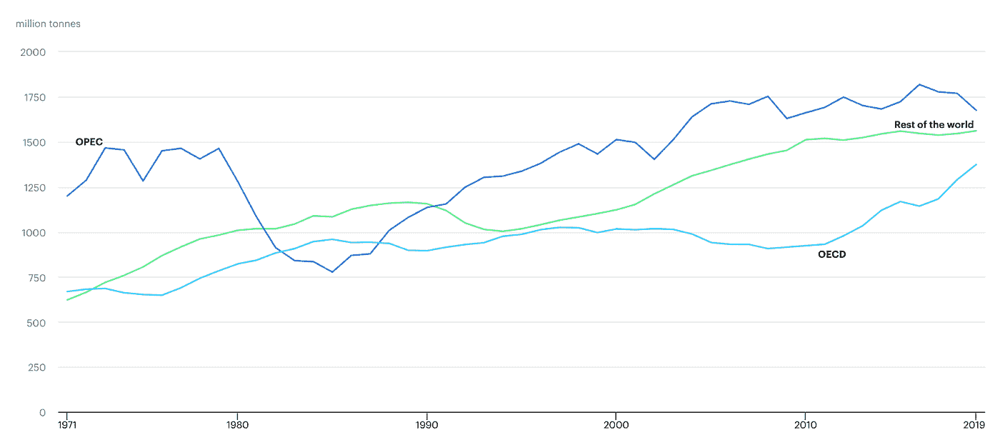
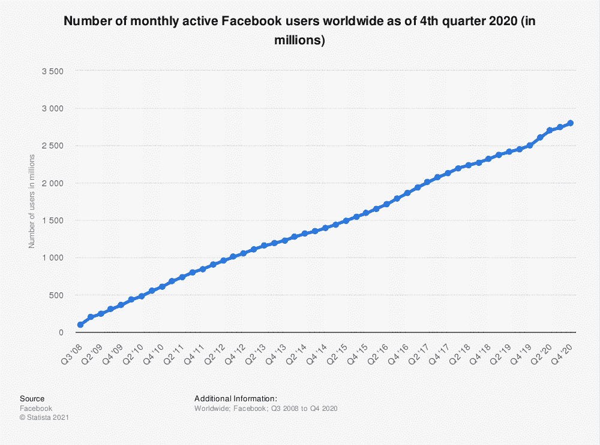

# 是时候重新思考……“数据是新的石油”了吗？

> 原文：<https://medium.com/geekculture/is-it-time-to-rethink-data-is-the-new-oil-6a7aa32dbeb9?source=collection_archive---------46----------------------->

Photo by [Zbynek Burival](https://unsplash.com/@zburival?utm_source=medium&utm_medium=referral) on [Unsplash](https://unsplash.com?utm_source=medium&utm_medium=referral)

在这个由三部分组成的系列中，我将重新审视一些在商业和管理中最常用的隐喻，看看它们是否仍然有用。如果是的话，我会概述如何和为什么，如果不是，我会尝试找到更好的替代方案。

第一个比喻是“数据是新的石油”，在我看来，这个比喻应该谨慎使用，尤其是那些希望从正面描述数据的人。也就是说，尽管数据和石油有许多相似之处，但大多数都不讨人喜欢。我相信，通过直面这些负面含义，我们可以就我们在数据时代的责任进行正确的对话，同时使用更好的隐喻来描述它们。

最开始是英国数据科学家克莱夫·亨比，他在 2006 年创造了“数据是新的石油”这个短语。从那以后，它已经成为商业和管理词汇的一部分，被记者、[决策者和世界领导人反复提及。一般来说，这个比喻强调了一个事实，即石油和数据是现代全球经济的重要组成部分，后者将逐渐取代前者。亨比还认识到，数据就像石油一样，没有内在价值，在变得有价值之前，必须经过昂贵的提炼过程。](https://www.europarl.europa.eu/RegData/etudes/BRIE/2020/646117/EPRS_BRI(2020)646117_EN.pdf)

当然，数据为经济的大部分提供动力，就像石油为我们的引擎提供动力一样。我们在网上做的很多事情都是[浮士德协定](https://www.gutenberg.org/files/779/779-h/779-h.htm)的一部分，在该协定中，我们允许科技巨头收集我们的数据，以换取有用的免费工具，如电子邮件。技术传播者在强调数据在我们生活中的好处的同时，将成本降至最低。但是如果我们真的停下来想一想我们每天泄露了多少个人信息，我们会把笔记本电脑放在冰箱里。将数据比作石油有其黑暗的一面。石油是一个肮脏的行业。石油产品——汽油、塑料、化学品——正在危害地球。简而言之，这不是那种应该保留的公司数据。

让我们来看看数据和石油之间最令人遗憾的相似之处。

随着石油在全球流动，泄漏发生了([在过去的 50 年里有 466 次大规模的石油泄漏](https://www.statista.com/statistics/671539/average-number-of-oil-spills-per-decade/#:~:text=There%20were%20an%20average%20of,spills%20has%20been%20notably%20reduced))。关于这些灾难及其造成的环境破坏，人们已经说了很多，也写了很多[。随着对石油在全球气候危机中所扮演角色的日益担忧，你可能会认为对石油的需求会像石头一样下降。你错了。](https://www.retroreport.org/transcript/exxon-valdez-in-the-wake-of-disaster/)

*Figure 1:* [*Global Oil Production 1999–2020*](https://www.iea.org/data-and-statistics/charts/world-oil-production-by-region-1971-2019)

如果这个图表让你吃惊，考虑一下这个:

*Figure 2:* [*Number of monthly active Facebook users worldwide*](https://www.statista.com/statistics/264810/number-of-monthly-active-facebook-users-worldwide/)

如果你想在脸书的埃克森·瓦尔迪兹事件之后寻找衰落的迹象，你不会找到的。别忘了，剑桥分析公司在未经脸书用户同意的情况下，收集了他们超过 8700 万的个人数据，然后将这些数据出售给政治咨询公司。这种可疑的做法很可能影响了 2016 年美国总统大选的结果，以及同年英国的英国退出欧盟投票。但是尽管当时#deletefacebook 和一些社会和政治上的不满，这个丑闻并没有对脸书的财富产生影响。

因此，科技巨头和石油大亨是相似的，因为他们泄漏和污染，无视更广泛的社区，没有太大的后果。

那么问题就变成了，有没有更好的比喻？在我的研究过程中，我遇到了支持灾难性比较的貌似合理的论点——也就是说，[数据是新的核能](https://ideas.ted.com/opinion-data-isnt-the-new-oil-its-the-new-nuclear-power/)(惊人的强大，但也有能力造成可怕的污染和破坏)。在与一位领先的从业者讨论这一块时，他提醒我，数据从一个地方‘流动’到另一个地方，并建议它就像水一样(它是滋养和必要的——但需要过滤和处理才能安全；它可能会泄漏)，或者稍微不那么令人感兴趣的是，数据就像血液一样。

所有这些都是不错的比喻(我特别喜欢“水”的替代物)。然而，水(像铀或血液)是物理的——如果我买了一升水并喝了，没有人能喝同样的升——而数据可以在不同的地方以多种方式在多个时间同时使用。数据是独一无二的，而一杯水和其他任何一杯水本质上都是一样的。

如果我们坚持数据就像石油一样，留给我们的是生病的海鸟和漂白的珊瑚礁的悲惨图像。这让我不禁要问:用同样的油漆刷涂抹数据，我们会有失去有价值的东西的危险吗？

去年，牛津大学的学者们研究了一个大规模数据集，以评估一系列潜在的新冠肺炎治疗方法的有效性。[利用先进的数据科学技术](https://digital.nhs.uk/news-and-events/latest-news/lifesaving-coronavirus-treatment-discovered-by-study-using-data-from-nhs-digital)，他们发现了一种意想不到的模式——即，一种用于治疗类风湿性关节炎的药物可以挽救生命，减少对呼吸机的需求，并缩短患者的住院时间。对于所有参与者来说，这样的突破应该被视为一个纯粹的成功故事，同时也包含了一些关于我们如何对待数据的宝贵经验。

从我的角度来看，最重要的是，在获得相关人员的完全同意后，数据集由 NHS Digital 安全保存。没有一项数据是在没有明确许可的情况下被取走的，也没有一项数据被用于最初寻找数据之外的任何其他目的。换句话说，这些数据是出于特定和透明的目的而自愿和故意提供的。保障措施到位，得到遵守，所有各方自始至终负责任地行动。为什么不是所有的数据都可以这样使用？

最终，NHS 数字故事，以及其他类似的故事，强化了“数据监护”概念的重要性。也就是说，我们数据丰富的经济中的所有参与者都需要承担责任，将他们的行为在当前造成的损害降至最低，同时尽一切合理的努力保护未来。数据监护的三大支柱是:

1.  无论是现在还是将来，组织都不应该收集任何可能使主题暴露于过度隐私风险的数据
2.  数据不应该“以防万一”地储存起来——组织应该拒绝保留任何他们不需要的东西
3.  组织应该主动解释他们正在收集哪些数据、他们打算如何使用这些数据，以及数据主体拥有哪些权利，以便能够围绕同意做出更好的决策

最终，我们必须确保数据*不会成为新的石油*，而是找到一个强调支撑这些支柱的积极价值观的隐喻，而不是与之相矛盾。我们不能简单地希望未来的一些现象会使我们的数据免受滥用——我们都需要教育自己，然后今天就采取相应的行动。如果我们不能相信公司会负责任地行事，我们就不应该把我们的数据交给他们。

也许我们应该把我们的数据看作是我们为那些在基于数据的经济中表现最佳的组织投下的一票。事实上，也许这就是我一直在寻找的新比喻:数据是新的民主。

大卫·考克斯是平等专家公司的首席顾问