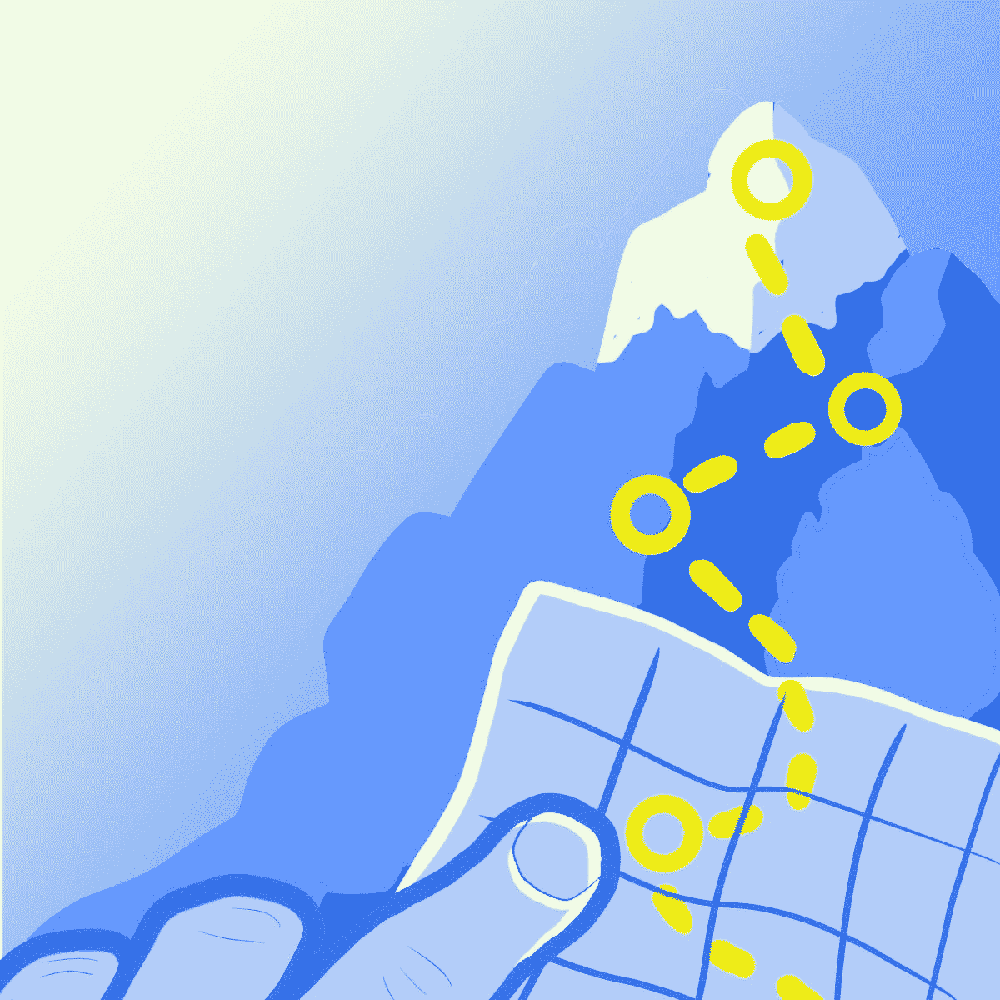
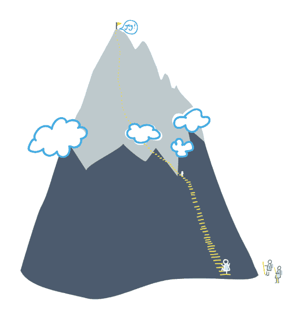
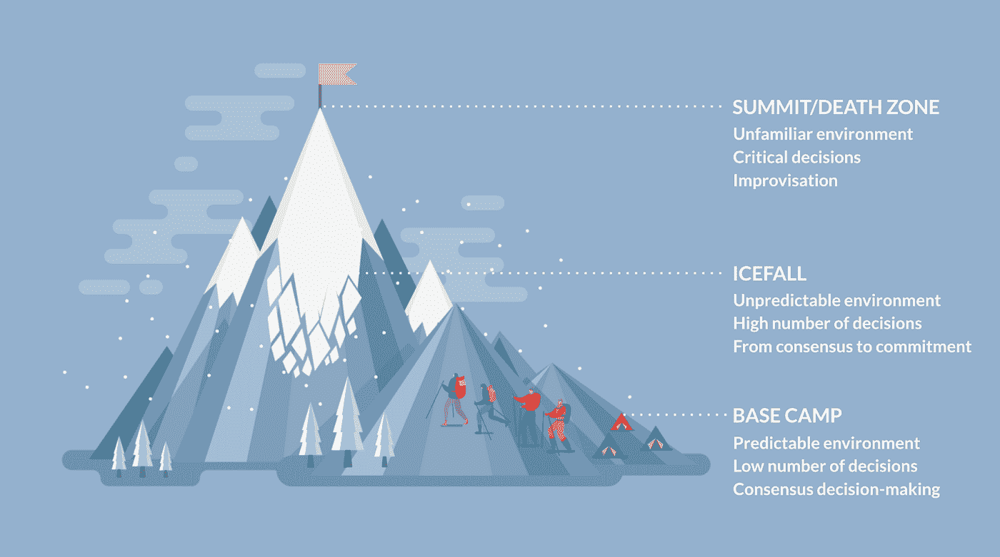

# 是时候重新思考…登山战略了吗？

> 原文：<https://medium.com/geekculture/is-it-time-to-rethink-strategy-as-mountaineering-99fb3999159d?source=collection_archive---------42----------------------->

Should we continue to compare corporate decision-making in air-conditioned boardrooms to the deadly sport of mountain climbing? (Illustration by Ben Piggott at @apt_pseudonym)

在畅销教科书、主题演讲和在线图像库中，战略通常被比作登山运动。在这篇文章中——我的系列文章[中的第三篇——重新审视商业中的隐喻](/geekculture/is-it-time-to-rethink-low-hanging-fruit-4742bb429ff) —我将认为制定成功的战略*就像爬山一样*,只是以我以前从未欣赏或理解的方式。

# 消失在空气中

过去，我一直对战略转型就像爬山的观点持怀疑态度，尤其是当进展显示为从底部到顶峰的直线攀登时。

*Figure 1: A classical depiction of transformation as mountain climbing*

自从阅读了[关于爬山的各种](https://www.jonkrakauer.com/books/into-thin-air-tr) [书籍](https://www.penguin.co.uk/books/103/1035723/touching-the-void/9781784875374.html)后，我开始意识到问题不在于这个比喻本身，而在于对如何爬山缺乏基本的理解。首先，没有直达顶峰的路线或捷径——正如最成功的转型充满了意想不到的挫折、障碍、死胡同和即兴创作。

当考虑重大战略转型时，有一个方面肯定会再次出现:它们是关于实现新的东西。因此，历史上最相似的攀登是 1924 年乔治·马洛里第一次尝试登上珠穆朗玛峰。

当马洛里的团队最初到达喜马拉雅山时，西方世界对这座山及其周边几乎一无所知。然而，正如战略转型需要[敏捷思维](https://www.forbes.com/sites/stevedenning/2019/08/13/understanding-the-agile-mindset/)才能成功一样，马洛里的团队凭直觉掌握了“测试和学习”的概念。在试图登顶之前，探险队已经进行了两次漫长的侦察任务。从这些困难的([甚至致命的](https://www.nationalgeographic.com/adventure/article/140418-everest-avalanche-sherpa-killed-mountain))排练中吸取的教训使他们设计出新的原则，这些原则至今仍被登山者们遵循。例如，团队[率先使用瓶装氧气来减轻海拔](https://pubmed.ncbi.nlm.nih.gov/17394420/)的影响，帮助开发[新的服装面料](https://www.alpinejournal.org.uk/Contents/Contents_2007_files/AJ%202007%20243-246%20Hoyland%20Clothing.pdf)，并在山腰建立[一系列高营地](https://alpenglowexpeditions.com/blog/mount-everest-routes/)以适应气候。

马洛里攀登珠穆朗玛峰的尝试与绝大多数转变有另一个更不幸的相似之处——失败了。或者我应该说，它*可能*已经失败了。他是否是第一个登上珠穆朗玛峰的人，这是一个未解之谜。在最后一次攀登的早晨，当云层短暂散开时，有人发现马洛里和他的登山伙伴在离峰顶不到 800 英尺的地方自信地攀登。然后乌云滚滚而来，他们[再也没有活着出现过](https://www.abebooks.co.uk/9780224023627/Mystery-Mallory-Irvine-Holzel-Tom-0224023624/plp)。

# **珠峰三大决策区**

如果爬山是描述迭代的、实验性的方法如何帮助组织实现变革性的、长期的目标的恰当比喻，那么这篇文章向我揭示了它的真正力量，这篇文章是由一组自己攀登过珠穆朗玛峰的学者撰写的。

作者在《哈佛商业评论》上撰文指出，珠穆朗玛峰上的三个不同的物理区域与成功企业的最佳决策模式有关。

*Figure 2: The Three Decision-Making Zones of Everest* (Design by studioleeroy.com)

# 到达大本营

大多数决策属于第一类，即[大本营](https://www.kimkim.com/c/unique-ways-to-trek-to-everest-base-camp)，这是一个可预测且稳定的环境，以大量基础设施为特色，需要做出的决策相对较少。因此，可以放心地应用屡试不爽的规则，并通过协商一致做出决定。

**当你在大本营时……**你会像往常一样(BAU)进行决策，在大多数组织中，这是由委员会完成的。你的决定的影响是广泛的，但也是渐进的，一个决定可能会持续几个月甚至几年。你的最佳决策会逐步改善事情。

# **在冰瀑中航行**

当挑战不能被大本营思维充分解决时，它们会级联成第二类——冰瀑。

珠穆朗玛峰上的冰瀑实际上是以每天 3-4 英尺的速度向山下移动的冰川。巨大的缺口(或称*裂缝*)可能会在脚下迅速而出乎意料地裂开，而上方的冰塔(或称*冰窟*)可能会在毫无预兆的情况下坍塌。环境如此不稳定，只有“经验法则”适用。需要做出的决策数量急剧增加，这使得决策过程从达成共识转变为做出承诺。换句话说，当穿过冰瀑时，“第一个爬上绳索的人说了算”。

**当你处于“冰瀑”时…** 你在使用“模式匹配”决策来保持战略前进。你会使用这样的陈述:“我们只追求能给我们带来 15%或更多利润的市场”，或者更简单地说，“我们在这里不这么做”。这些生硬的规则帮助你减少无限选项的噪音，专注于重要的事情。“第一个爬上绳索的人”的概念在组织试图建立一种新的产品或能力时最有效。也就是说，你必须信任那些负责发掘机会价值的人。如果你通过强力治理强迫他们遵守，并且/或者在每一步都寻求更广泛的业务的共识，他们将会失败。

# **峰会**

在某些情况下，该组织将需要求助于第三类——顶峰(或“死亡地带”)——如此陌生和令人困惑的领域，正常规则不再适用。

此次峰会之所以危险，主要有两个原因。首先是来自 T2 的威胁，突如其来的致命雪崩会将登山者从山上带走。在商业世界中，最接近的类比是突然对品牌产生重大影响。BrewDog 最近揭露的[“恐惧文化”](https://www.theguardian.com/business/2021/jun/10/brewdog-staff-craft-beer-firm-letter)跃入脑海，正如[在恰当命名的大本营对言论自由的争议性攻击](https://www.theverge.com/2021/4/27/22406673/basecamp-political-speech-policy-controversy)一样。

登顶危险的第二个原因是，在 8000 米以上(珠穆朗玛峰高 8849 米)，空气中的氧气非常稀少，人体开始死亡。登山者变得缺氧、睡眠不足、脱水、营养不良。这导致思维混乱，即使最简单的动作也很难完成。在这些极端的情况下，所有的决定都是关键的，就在这个时候，你做出决定的能力受到了损害。

**当……**你组织内的人[筋疲力尽](https://www.equalexperts.com/blog/ee-life/avoiding-burnout/)时，你就在死亡地带。当组织内的个人和团队遭受持续、慢性工作相关压力的不良影响时，他们会耗尽精力，削弱他们做出正确决策的能力。当倦怠成为一种普遍现象时，首要任务是尽快带领组织走出死亡地带。否则，公司就有被大量员工流失掏空[的风险。在死亡地带，最好的结果是通过创建和维护非常简单的规则来实现的:例如，](https://www.techrepublic.com/article/the-great-resignation-of-2021-are-30-of-workers-really-going-to-quit/)[把你的人民的福祉放在第一位](https://www.theceomagazine.com/business/health-wellbeing/bumble-news-employees-week-off/)。

# **下山**

在写这篇文章的时候，我改变了对爬山和策略之间联系的看法。如果应用正确，这个比喻可以成为描述战略转型的迭代、敏捷方法的有效方式——并且在对组织内不同的决策方法进行分类时也非常有用。

从这些方面来看，爬山是对战略思维的一个很好的比喻，也是对共同努力登顶的重要性的一个很好的比喻。然而，在经历了这艰难的一年之后，我预测，在我们的职业生活中，将会有一个关于“顶端”是什么意思的清算。在晚上和周末长时间工作可以获得最好的职业发展，这一观点正受到公开的嘲笑。相反，许多领先的组织致力于[重新思考他们的员工如何工作、在哪里工作以及何时工作](https://www.bbc.com/worklife/article/20200824-why-the-future-of-work-might-be-hybrid)，因为他们知道，否则他们可能会失去最优秀的员工。

简而言之，积极帮助同事创造并维持健康的工作/生活平衡的组织，将在后流感时代的竞争中脱颖而出。毕竟，人才是维系任何成功组织的氧气。信任并授权给你最优秀的员工将帮助你的组织自信地应对波动性、不确定性、复杂性和模糊性。当我们进入新的和不熟悉的领域时，如果我们要到达世界屋脊，我们就需要这些能力。

*大卫·考克斯是平等专家公司的首席顾问*