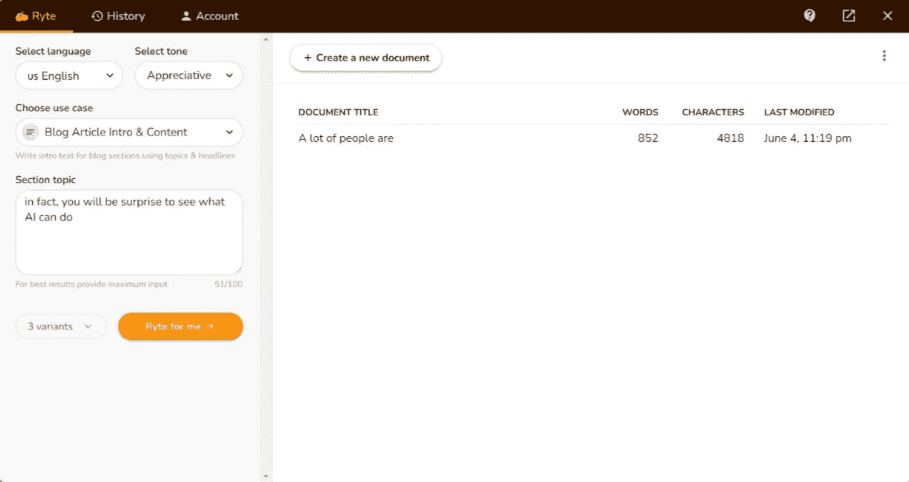
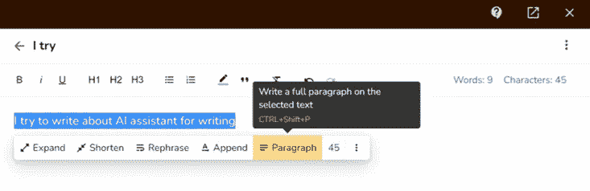

# 让 AI 来处理我们的内容，值得我们花钱吗？

> 原文：<https://medium.com/geekculture/is-it-worth-our-money-for-asking-ai-to-handle-our-content-3de1ce9148d3?source=collection_archive---------31----------------------->

## 也许会，也许不会

Photo by [Fabian Blank](https://unsplash.com/@blankerwahnsinn?utm_source=medium&utm_medium=referral) on [Unsplash](https://unsplash.com?utm_source=medium&utm_medium=referral)

很多人都在想，请 AI 为我们写作值得吗？答案是视情况而定。如果你的目标是生产高质量的内容，让广大观众阅读，那么 AI 可能不是你的最佳选择。然而，如果你的目标只是快速廉价地生产大量内容，那么这是值得考虑的。

这种说法很有争议。人工智能生成内容的主要问题是，它缺乏对内容创作不可或缺的人类元素。您的客户可能很难接触到这些内容。然而，如果你正在寻找一种快速的方法来创建大量不需要任何人工输入的内容，人工智能生成的内容可能是一个不错的选择。

人工智能生成的文本有许多优势。一个主要的好处是，人类读者将更难发现抄袭，因为文本将由机器生成。然后，用户可以按照他们认为合适的方式编辑和改进文本，而不必担心收到其他人的抄袭投诉。

人工智能生成的文本的缺点是，我们不能指望它在某些写作体裁(如报道或诗歌)中表现得像人类作家一样好。这些文本也很难考虑到上下文中微妙的细微差别，这可能导致潜在的幽默或误导性错误。

许多公司现在开始使用人工智能(AI)来代表他们“写”文章。这些文章由 AI 程序编写，然后代表公司“发表”。人工智能程序可能会花费大量时间和精力来撰写高质量的文章，因此问题仍然存在:让人工智能为我们写作值得我们花钱吗？

一些公司认为，雇用人类比仅仅使用人工智能更昂贵。但这并不总是正确的，因为有时雇佣人类会导致错误，这会导致公司的声誉问题。因此，如果人类的质量高于人工智能程序，我们还是应该雇佣他们。

总之，我们应该雇用人类作家，而不是问人工智能程序，因为许多人发现，虽然它能够产生像样的内容，但它很难处理需要创造力和情商的主题。

# 你怎么想呢?

上面的 400 字都是 AI 生成的。它的名字叫 Ryte。

我有两个问题要问:

*   作为读者，你对 AI 写的内容有什么感受？
*   作为一个作家，你怎么看待这个 AI 的表现？

根据 G2 Grid，Ryte 与其他写作辅助软件相比，性能排名第四。最好的是 Conversion.ai，我在以前的帖子中测试过。

 [## 我想开发一个人工智能成为我的大脑和写作的手，然后我必须偷看现有的…

### 如果你有更容易成功的方法，为什么要选择更难的呢？但是真的管用吗？

medium.com](/geekculture/i-want-to-develop-an-ai-to-be-my-brain-and-hands-in-writing-then-i-have-to-peek-at-the-existing-b7afbca7b8e7)  [## 我想创造我自己的人工智能写得比我的手更好，然后我偷看最好的一个，但它不是…

### 它可能很长，但如果你读了它，你会很高兴的

medium.com](/geekculture/i-want-to-create-my-own-ai-to-write-better-than-my-hand-then-i-peek-at-the-best-one-but-it-is-not-22af7bebd5f3) 

然而 Conversion.ai 总是误解我的意图。也许，为了销售产品，开发人员可能已经对它建立了固定的思维模式。因此，它无法预测与 vend 无关的任何事情。它的大部分工具和我得到的输出都明显支持这个事实。

Ryte 不一样。它理解我的意图，给我更好的输出。有了一个简单的用户界面和您在主题部分的输入，它已经准备好用我在本文开头向您展示的结果让您吃惊了。

Ryte’s user interface

所以人们打算用它来代笔一整篇博文？我不知道。有人可能能够做到这一点，或者只编写关键的部分，让 Ryte 处理剩下的部分。

You can ask Ryte to edit any part of your contents

你可以自己写，并请 Ryte 在你内容的某个部分协助你。但是，内容不得少于 30 个字符，并且最多 300 个字符才能使用这些功能。

对于价格，Ryte 为我们提供每月 29 美元的无限制使用，而 Conversion.ai 为我们的 29 美元每月提供 20，000 个信用点。如果你想要 Conversion.ai 的无限版本，你需要支付 109 美元的订阅费。因此，如果我想让一个人工智能做我的助手，但不是现在，Ryte 是我最好的选择。

如果你写了很多或者经常雇佣文案，那么让 AI 作为你的助手应该是一个不错的投资。