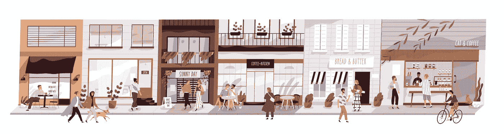

# 市场篮子分析仍然有效吗

> 原文：<https://medium.com/geekculture/is-market-basket-analysis-still-valid-dcd122e081ac?source=collection_archive---------60----------------------->

## 数据挖掘

## 发现项目之间的关联

Image by Nabler.com

几十年来，市场购物篮分析(MBA)一直是公司通过促销相关商品来提高单价的工具。问题是:它是否是一个过时的概念，被更现代的检查客户行为的方式所忽略？

MBA 是数据挖掘的一个方面，即获取大量数据并寻找有用的相关性。它与客户购买特别相关[，以及通过提供产品来影响他们购买更多的方法，这些产品在逻辑上可以通过追加销售或交叉销售一起购买。](https://www.nabler.com/customer-success-story/building-a-product-recommendation-engine-for-an-e-commerce-store/)

一个无处不在的例子是，“你想要薯条吗？”这是快餐汉堡行业的主要产品。几十年的消费者数据表明，是的，一个人买了一个汉堡，确实会喜欢配薯条，而且很可能还会喝一杯。认识并量化这些联系，以及它们出现的可能性，是 MBA 的基础。

MBA 是一个统计模型，有多种应用。例如，用快餐做类比，所有以汉堡为核心产品的地方都知道炸薯条和饮料是购买汉堡最有可能的附加品。但是，这种联系也以相反的方式流动——买薯条的人可能会被诱导去买汉堡或饮料。

反过来看，统计上的可能性可能要小得多，但这正是 MBA 的意义所在:将这种可能性分解成可用的数字，企业可以用这些数字来推广自己的产品，并将它们一起展示在菜单上。

另一个不同的例子是，购买电子玩具的人很可能还会购买电池，或者，如果内置可充电电池，还会购买额外的家用充电器或可以插入汽车 12 伏插座的充电器。甚至有可能顾客会买两个，这样新用户就可以和其他人一起玩了。

MBA 还让企业意识到购物时可能从未考虑过的联系，比如时尚和趋势。例如，我个人喜欢鸡尾酒酱和我的虾有明显的联系。但是，我很少喜欢市售的鸡尾酒酱，所以我用番茄酱、切碎的山葵、香料和柠檬自制。我敢肯定，这在统计上微不足道到不存在的程度，但 MBA 可以抓住人们自己制作鸡尾酒酱的新时尚，通过展示与虾相关的产品在 T2 的销量上升。这可能会让杂货店出售虾，并将其他产品放在附近，以便购物者将它们联系起来。

也有在仔细考虑之前没有逻辑意义的连接的可能性。有一个商业城市的传说，在星期五晚上，啤酒和尿布经常一起出售，因为年轻男子为周末买啤酒，他们的妻子提醒他们买尿布，周末可以去商店不受干扰地享受。这实际上不是真的，但它构成了一个伟大的故事，并指出这种产品购买的交织可能会发生。

所有这些过程和例子都可以归结为人类互动的基础。当展示给人们的产品有明显的逻辑联系时，人们更有可能购买更多。相比之下，他们做出的联想乍一看毫无意义，但却有自己的潜在逻辑，对他们来说是有意义的。如果有足够多的人遵循这一点，它在统计上就变得足够相关，对公司的营销非常有用。

因为人类的行为已经几个世纪没有改变，如果不是几千年的话，很有可能市场篮子分析也将存在很长一段时间。

*最初发表于*[T5【https://www.nabler.com】](https://www.nabler.com/articles/is-market-basket-analysis-still-valid/)*。*