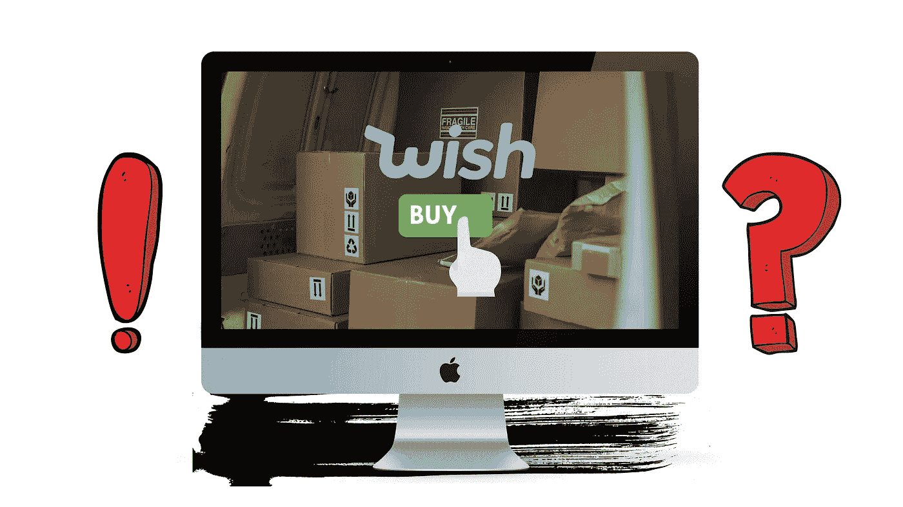

# Meme-Stock 愿望真的有什么好处吗？

> 原文：<https://medium.com/geekculture/is-meme-stock-wish-really-any-good-7416da1dd6c7?source=collection_archive---------36----------------------->

## 从开始到分红分解愿望

# 摘要

*   ContextLogic (NSDQ:WISH)拥有并运营流行的 [**Wish**](http://www.wish.com) 移动购物 app
*   尽管与亚马逊、Shopify 和 Etsy 等其他电子商务巨头相比表现不佳，但这家电子商务组织仍实现了稳定增长
*   有 **3 风险** …