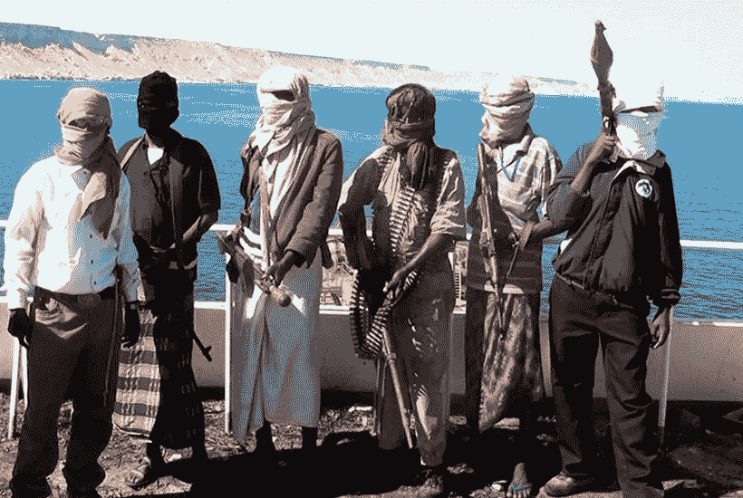
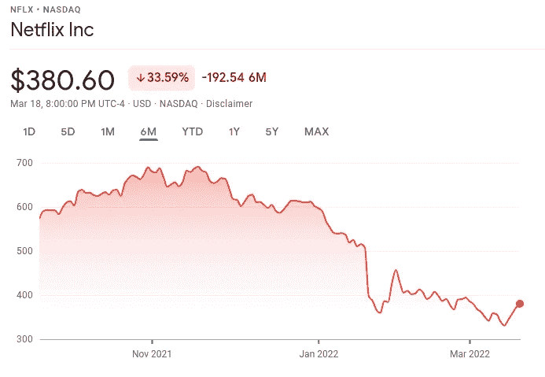
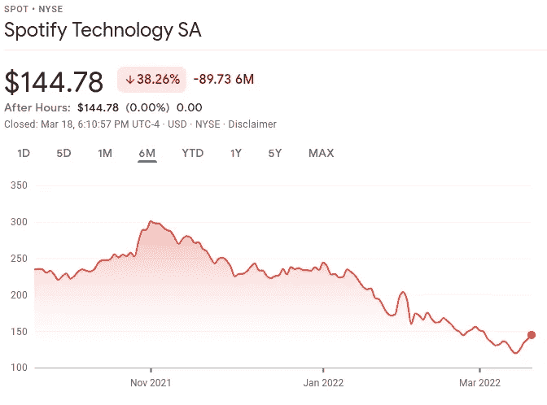

# 网络盗版其实是盗版吗？

> 原文：<https://medium.com/geekculture/is-online-piracy-actually-piracy-d80db251309f?source=collection_archive---------12----------------------->

## 简单的答案是否定的。但这有点复杂。



Photo 1 from spectator.co.uk

关于网络盗版的争论是最有争议的话题之一。一方面，有人认为你应该为每一个付费的数字内容付费。另一方面，俄罗斯人认为你应该盗版所有付费内容。许多不同的利益集团想让你相信网络盗版就是盗版。然而，一项调查将揭示网络盗版的真相。

以下是为什么网上盗版不是盗版的分析。

## 网络盗版如何不是真正的盗版？

尽管主流媒体希望你相信互联网隐私，但互联网盗版不是盗版。认为观看盗版内容实质上是从内容创作者那里偷窃是非常荒谬的。

这完全不是事实，因为数字盗版只会复制内容。真正的盗版是一个零和游戏，这意味着一个人必须从另一个人那里拿走一些东西。如果你拿了一艘船，另一个人必须失去一艘船。但是，如果你复制了一个数码产品，另一个人仍然拥有一个数码产品。


Photo 2 from npr.org

有一种观点认为，这些创意产业从这些内容创作者那里窃取了更多。你看到新的著名音乐家签署独家协议。只是为了迎接下一批新的天才。如此循环往复。

[](https://www.billboard.com/pro/bbc-documentary-predatory-behavior-music-industry/) [## 纪录片详述音乐产业的掠夺行为

### 音乐产业中的不正当性行为仍然是肮脏的、公开的秘密，掠夺性行为继续存在…

www.billboard.com](https://www.billboard.com/pro/bbc-documentary-predatory-behavior-music-industry/) 

## 为什么盗版其实对创意产业有帮助？

当然，生产的内容的价值取决于消费这些内容的人数。你可能会认为不为内容付费会减少音乐的收入。但这并没有首先承认内容是如何传播的。

如果你看一下字典中对盗版的定义，你会得到如下的解释。

```
2\. the unauthorized reproduction or use of a copyrighted book, recording, television program, patented invention, trademarked product, etc.:*The record industry is beset with piracy.*
```

对一般人来说，网上盗版就像是盗版。人们没有意识到当前数字内容的未授权再现会导致更多的未来数字内容的授权生产。一条内容不会自发地传播开来。这是通过一种叫做网络效应的东西发生的。如果说“傻瓜”疫情教会了我们什么，那就是活力是如何发挥作用的。让病毒在人群中快速传播的现象与让内容传播的现象是一样的。一个人必须和几个人分享内容。而少数人必须把这个内容分享给更多的人。一群人必须和很多人分享内容。接下来你知道你的内容已经被数百万人消费了。

这些 DMCA 律师中的大多数会展示有关净损失的数字和统计数据，但不会承认盗版获得的净收入。

> 全球电影业每年因数字盗版造成的收入损失在 400 亿至 971 亿美元之间。

阻止盗版具有与隔离相同的效果，因为它降低了内容传播的可能性。因为没有盗版，盗版者就不会消费你的内容。因此，本质上阻止盗版减少了净内容收入。这让你想知道为什么所有这些美国 DMCA 律师和公司如此不顾一切地阻止盗版？这就像试图阻止一场永无休止的猫捉老鼠的游戏。

[](https://slate.com/news-and-politics/2013/04/the-real-problem-with-law-schools-too-many-lawyers.html) [## 美国法学院的真正问题是:律师太多了

### 法律教育正面临一场危机。上个月，一个著名的法律教育团体自称…

slate.com](https://slate.com/news-and-politics/2013/04/the-real-problem-with-law-schools-too-many-lawyers.html) 

Photo 3 from tenor.com

## 盗版对我有影响吗？

人们在不同的网站上复制我的内容是没有问题的。许多网站已经把我的内容从媒体中剥离出来，放在他们的网站上，他们获得了广告收入。然而，该作品被引用并追溯到原始副本。所以从长远来看，这并不重要，因为这只是增加了我制作的内容的覆盖范围和搜索引擎优化。

当人们复制作品并声称是他们自己的，而没有反向链接到我的原始内容时，问题就来了。我的内容不仅得不到收益，还失去了外延。这是盗窃。这就把我们带到了下一点。

## 盗版内容货币化不好吗？

[假设你有我创建的系统，允许用户创建优于网飞和 Spotify 的流媒体服务](/@drechang/how-to-build-your-own-illegal-streaming-service-ff353ef70cd0)。然后修改它，以便任何在线用户都可以访问它。但是你可以通过广告或每月订阅来赚钱。你可能认为为了商业利益而盗版是不好的。但这并不是因为它仍然在传播内容的意识和外延。

当然，下一批人可以决定他们将如何消费这些内容。人们去电影院不是因为价格更好，而是因为它提供了更好的体验。与 Spotify 和网飞等音乐流媒体服务一样。这款应用为大多数用户提供了更好的体验。当然，这些公司可以故意破坏用户体验和品牌形象，从用户身上快速获利。

[](https://www.cnn.com/2022/01/14/media/netflix-raises-prices/index.html) [## 网飞正在提高价格

### 你的网飞账单又要上涨了。

www.cnn.com](https://www.cnn.com/2022/01/14/media/netflix-raises-prices/index.html) 

然而，这样做的话，人们会选择其他服务，比如烘焙。网络泛滥的增加并不是因为人们的道德堕落。这是由于公司贪婪的增加，从他们的顾客身上榨取更多的钱，却没有真正改善服务。



因为人们认为果汁已经不值得榨了。对于那些认为这是一个新现象的人来说，这没有什么新鲜的。不同的有线电视公司会捆绑有限数量的不同频道。限制选择的数量，除非人们付更多的钱。现在，同样的事情正发生在这些流媒体服务上。流媒体服务越来越多，但每种服务的内容都在减少。毫不奇怪，种子烘焙越来越受欢迎。

[](https://dataprot.net/statistics/piracy-statistics/) [## 盗版卷土重来:2022 年盗版统计数据

### 什么是盗版，它对社会有什么影响？MUSO 是一家每天都在处理这些问题的公司…

dataprot.net](https://dataprot.net/statistics/piracy-statistics/) 

## 最后

人们不想仅仅为了访问内容而订阅 5 种不同的服务。在你打开一份 BitTorrent 并开始感到“偷窃”内容的罪恶感之前。请记住，随着这些公司意识到他们的底线受到威胁，他们将不可避免地做出改变，以改善他们的服务。从长远来看，这对每个人都有好处。

网上大多数人都是网络农民。这意味着他们依赖于他们几乎无法控制的在线服务。这意味着这些平台可以很容易地限制你的存在。订阅邮件列表，学习如何停止成为网络农民。

**相关内容:**

*   [去谷歌化的完整指南](/@drechang/how-to-dismantle-the-google-empire-e652bff6d2)
*   [如何创建一个基于内容的交付网络？](/@drechang/how-to-build-a-based-content-delivery-network-e1aa8bb237b3)
*   [停止为网飞和 Spotify 付费](/@drechang/how-to-build-your-own-illegal-streaming-service-ff353ef70cd0)