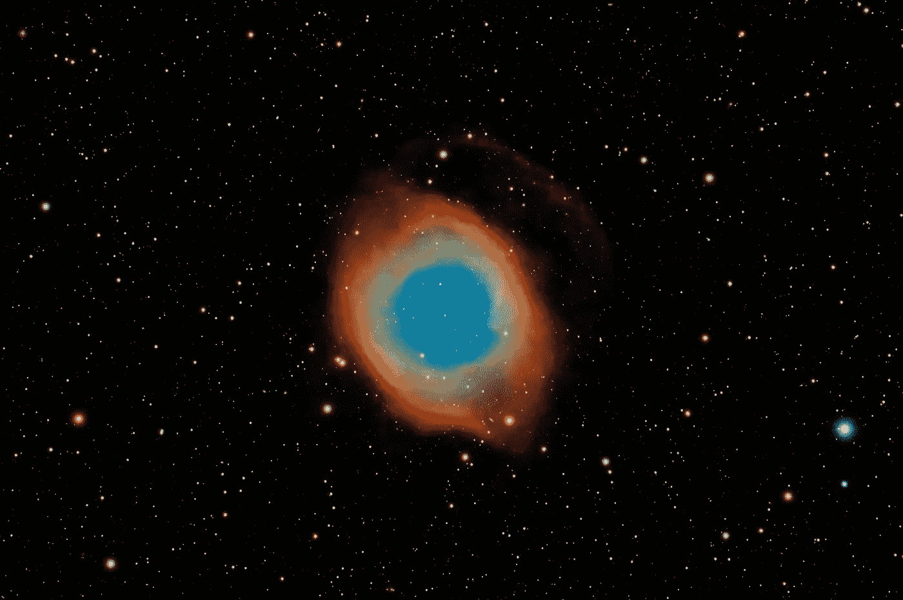

# 我们的太阳系是巨型大脑中的一个原子吗？

> 原文：<https://medium.com/geekculture/is-our-solar-system-an-atom-in-a-giant-brain-645e21aea89?source=collection_archive---------2----------------------->

## 理论上，这可能是正确的

The Helix nebula, resembling the human eyes, is also known as The Eye of God. Photo by [Guillermo Ferla](https://unsplash.com/@gferla?utm_source=unsplash&utm_medium=referral&utm_content=creditCopyText) on [Unsplash](https://unsplash.com/s/photos/helix-nebula?utm_source=unsplash&utm_medium=referral&utm_content=creditCopyText)

自从我学习了一些学校物理的基本概念后，我注意到我们的太阳系和组成原子的粒子之间有一些相似之处。我指的是可以在原子中看到的微小的“太阳系”，因为电子围绕原子核旋转，就像行星围绕太阳旋转一样。

如果我们只是一个巨大的隐喻洋葱的一个果皮，如果我们的太阳系只是比我们自己甚至意识更大的宇宙中的一个微小的原子，会怎么样？这个理论不是很新，社交媒体上也经常流传。

这个理论有很多线索，你会在下面看到。

# 宇宙形状类似于人的形状

当谈到亚原子粒子、细胞和组织结构以及太阳系中行星的天体的结构和行为时，有些模式是你无法忽视的。

## 星系团和神经元连接

当你看到已知宇宙的图像，并将其与人类大脑中神经元的照片进行比较时，它们非常相似。宇宙中已知的最大结构是大星系团，它们形成连接，它们之间有空白空间，这使得它们类似于神经元的结构和人脑中的路径。

## 人类眼球和宇宙星云

使用望远镜捕捉到的一些星云的图像，如[螺旋星云](https://en.wikipedia.org/wiki/Helix_Nebula)类似于许多人的眼球，细节如虹膜。

## 星系的螺旋模式

许多星系呈螺旋形，因为恒星围绕星系中心旋转。蜗牛壳和一些贝壳是螺旋形的。这是巧合吗？大概不会。它们可能遵循与星系相同的模式。

> "如上，如下，如内，如外，如宇宙，如灵魂……"
> 
> **赫尔墨斯 Trismegistus**

# 微观世界和宏观世界的规模

已知物质的每一部分都有大量的原子。在星系中也发现了大量有行星环绕的恒星。不仅在原子世界和银河世界中可以找到相同的结构，而且在微观世界和宏观世界中也有相同的物理定律。只是尺度不一样而已。

## 异次元？

我想知道这是不是唯心论者所说的维度，因为维度似乎共存于同一个地方，但却是平行的。这也适用于平行宇宙的可能性。也许宇宙中有宇宙，只是规模不同。

## 该结构在细节上非常相似

与可观测宇宙的构造方式相比，大脑的构造方式有相似之处。这些相似性甚至可以在结构的更深层细节中看到，例如神经元之间的距离与星系团之间的距离的比例。

## 一切都是大量的

有大量的电子、原子、人类细胞、地球上的人类、银河系中的恒星、星团中的星系……我想知道在更大的尺度上这在哪里结束……会有大量的宇宙吗？我打赌可能有！

总之，我们的太阳系只是一个巨大大脑中的一个原子吗？理论上，这可能是真的。实际上，人类可能只有在未来才能发现真相。我们现在知道的唯一事实是，人类大脑的构造方式和可观测宇宙的构造方式有许多相似之处。

如果这是真的，宇宙是一个巨大的大脑，这将意味着宇宙只是一个智慧生命的一部分。我们还不知道这一点，我们只是希望在未来我们会找到答案。