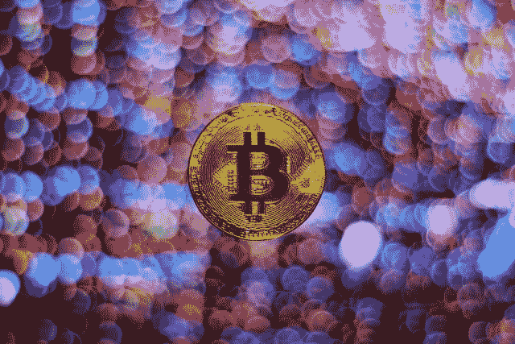

# PLC Ultima (PLCU)值 31，002.70 美元吗？—市场疯人院

> 原文：<https://medium.com/geekculture/is-plc-ultima-plcu-worth-31-002-70-market-mad-house-801b8ce072fb?source=collection_archive---------8----------------------->

2022 年 6 月 16 日，市场先生为 **PLC Ultima (PLCU)** 支付了 31，002.70 美元的硬币价格。因此，市场先生为 PLCU 支付了比 BTC 更多的钱。2022 年 6 月 16 日，市场先生为**比特币(BTC)** 支付了 20，606.50 美元。

那么什么是 PLC Ultima，它值 31，002.70 美元吗？是一个庞大的区块链技术基础设施项目，旨在建立一个全球支付系统。