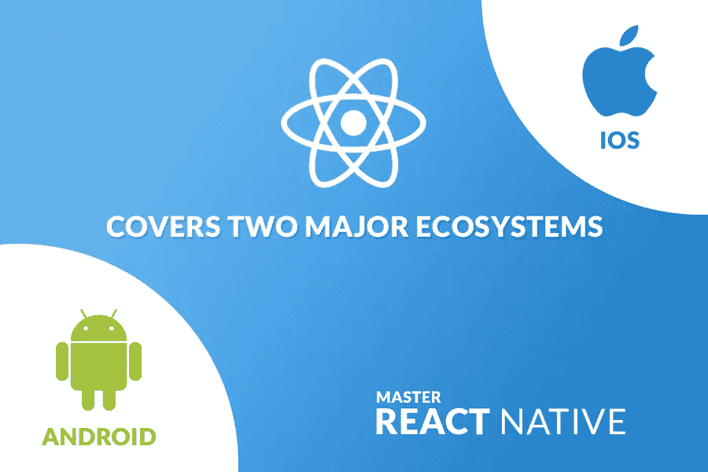

# React Native 是移动 App 开发的好选择吗？

> 原文：<https://medium.com/geekculture/is-react-native-a-good-choice-for-mobile-app-development-a276cc1b3968?source=collection_archive---------5----------------------->

随着支持各种类型应用程序的智能手机的出现，你有没有意识到生活变得多么娱乐和交流？

是啊！是真的。**移动应用**正扮演着重要的角色，因为它们是无需投入大量时间就能提供特定产品或业务相关信息的主要来源。

好吧，如果你知道移动应用的重要性，并在日常生活中使用它们，但你知道是什么让一个特定的移动应用成为完美的应用吗？

您的移动应用程序基于构建它的框架运行。有各种各样的移动应用程序开发框架，其中 ***React Native*** 是我们这里要讨论的一个。

**什么是 React Native？**

React Native 是一个用于移动应用开发的**开源框架**。它提供了一种廉价而快速的完成途径，并且在目标平台上运行良好。

从技术角度来说，React native 可以说是一个基于 Js 和 React(用于创建 UI 的 Js 库)的 Javascript 开源框架。该框架因其积极的特性而被广泛用于移动应用程序开发。让我们来看看它的重要性:

据[techtic.com](https://www.techtic.com/blog/how-react-native-is-the-future-of-app-development)报道，react native 是移动应用开发的未来，越来越多的开发者将这一框架融入到他们的应用构建过程中。到 2020 年，通过应用内广告和应用商店，移动应用将产生 1889 亿美元的收入。此外，**对移动应用程序的美学吸引力和无缝导航的持续需求**使得采用 React Native 进行应用程序开发变得至关重要。

**有哪些著名的手机应用是用 React Native 打造的？**

React Native 已被多家知名公司选择用于开发移动应用，因为这是最强大、最可靠的跨平台开发框架之一。

脸书，Instagram，Uber Eats，Pinterest，Salesforce，Wix，彭博，肯德基，Vogue，Wallmart，都是使用 React Native 构建的一些著名的移动应用程序。当微软旗下的 Skype 不使用自己的 Xamarin，而是使用 React Native 时，React Native 的威力就可见一斑。

**为什么选择 React Native 进行移动 App 开发？**

以下是一些亮点，展示了在移动应用开发中使用 React Native 的重要性，以及使用 React Native 开发移动应用的未来。让我们来看看:

**跨平台兼容性**

最初 React Native 只是为 iOS 推出的，但逐渐记住了它的惊人功能，脸书决定也为 android 推出它。到目前为止，大多数 API 都是跨平台的，这证明开发人员能够利用 React Native 构建 Android 和 iOS 应用程序。

没有必要使用像 JAVA，Swift，C+这样的语言。你只需要和一个在原生 UI 库、API、混合移动应用开发方面有效率的 Javascript 开发者接触。

除此之外，为了证明 app 的真实性，你可以很容易地嵌入原生代码，而不用浪费太多时间和金钱在开发成本上。

**更快的开发周期**

在 React Native 的帮助下，开发人员可以更快地构建应用程序。在更短的时间内，它在开发人员社区中变得很有名。正如我们已经知道的，react Native 是一个 Javascript 的开源框架，它提供了各种可以在本地使用的组件，这有助于开发人员更快地工作，开发时间至少缩短了 30%。

**多种结果和一个简单的解决方案**

React Native 是流行的想法，你可以开发一个移动应用程序，利用简单的代码执行实际上复杂的任务。脸书为这个框架提供了一个 UI 库，这样它就可以编写更简单的代码来实现和执行 ReactJS。它的核心是一个面向移动应用开发者的“实时重新加载”功能。有了它的帮助，你可以在应用程序加载的时候及时进行修改。

**有助于紧缩预算**

每当你开始做生意时，首先想到的是钱或预算，这是一个人无法回避的主要问题。每个企业都希望投资后能更快获得回报。在这种情况下，雇用 React Native developer 进行移动应用程序开发可能是一个不错的选择，因为这样做可以节省大量时间和金钱。

**开源**

你已经知道术语开源。开源项目意味着大量的贡献者都在致力于使项目变得越来越好。就像这样，React Native 也是一个由高效开发人员组成的大型社区，他们正在修复 bug，改进功能，并帮助人们方便地使用它。

因此，React Native 的开源特性也是在创建普通移动应用程序时非常容易识别的特性之一。

**原生功能**

术语“React Native”的名称背后的原因是，在该平台上开发的应用程序可以像任何本机应用程序一样运行。除此之外，开发者不能忽视的事实是，React Native 的受欢迎程度在于其键盘行为、滚动加速、可用性和动画。

此外，React Native 正在开发的用户界面包括本机小部件，有助于实现完美的性能。在 React Native 和 JavaScript 的帮助下，最复杂的应用程序都可以非常流畅地运行。因此，利用 React native 开发应用总是好的，因为它将总是开发健壮的应用。

**实时更新**

实时更新特性是在应用程序开发中实现 React Native 的最重要的特性之一。Javascript 帮助开发者直接在用户的手机中推送或弹出更新，而不是让他们经历应用商店的更新周期。最终让用户获得关于应用程序的最新更新，而不是与旧版本保持联系。

**有助于减少写代码的时间**

React Native 能够重用和减少以大格式编写的代码。是啊！原生反应保留该能力。但这并不意味着你只需要写一次代码就可以在任何平台上实现。作为一个开发者，你只需要开发一个新的代码来构建一个 UI 来帮助你根据他们的最佳实践和标准寻找独立的平台。

**覆盖两大生态系统**

它轻松涵盖了 iOS 和 Android 两大生态系统。为他们开发原生应用被视为开发者的克星，因为开发这些平台真的很难。

之所以考虑它们，是因为 iOS 应用程序开发需要具备 Swift 或 objective C 的适当知识，而谈到 Android 应用程序，它需要具备 Java 和 Android SDK 的高效知识。除此之外，你还需要头痛地跟上这两个生态系统即将到来的所有最新特性。

**简单易学**

React Native 是一款可读性很强且易于学习的软件，其原因在于它是基于语言基础之上的。对于不熟悉 Javascript 的新开发人员来说，它可以被认为是最好的工具之一，因为它提供了各种各样的组件，包括地图和过滤器。

**积极的开发者体验**

由于 React Native 提供了一个很好的开发环境，开发人员可以获得更好、更积极的体验。而且，这是可能的，因为这个平台的新开发人员可以在应用程序工作时修改和实现这些更改，从而消除了重新启动的需要。当您在文件中进行更改时，会出现刷新用户界面的热重新加载。

除此之外，借助 React Native 提供的 flexbox 布局引擎来生成 pp 布局，您可以只学习一个布局引擎，以便在 iOS 和 Android 两个平台上进行开发。此外，您还可以使用 chrome 开发工具将 React Native 嵌入桌面 chrome 浏览器。所以，如果你想要自己的应用，你可以 [**雇佣移动应用开发者**](https://www.alcax.com/services/hire-mobile-app-developers/) 进行 react 原生跨平台移动应用开发。

**收尾**

所以，你已经看到 React Native 这是一个开发者的大社区，是一个开源的跨平台[**移动应用开发**](https://www.alcax.com) **。**您还了解了使用 react native 开发移动应用程序的优势。现在，如果你希望开发一个多维度的应用程序，那么不要考虑另一个框架，因为这将在成本和时间方面为你提供更好的体验。

正如你已经看到的，这个框架非常有名，这就是为什么有各种各样的[移动应用程序开发公司](https://www.alcax.com/services/mobile-app-development/) 基于 React Native 开发应用程序。