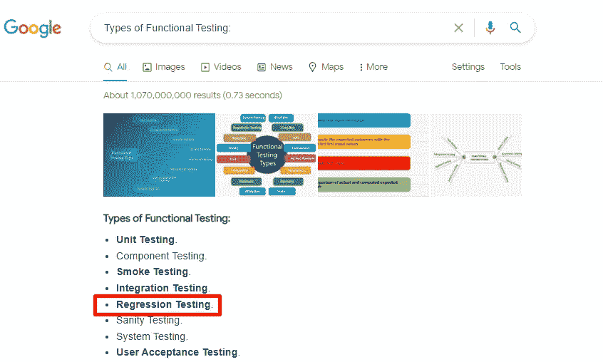

# 回归测试属于功能测试吗？

> 原文：<https://medium.com/geekculture/is-regressions-fall-under-functional-testing-b511c2fd1280?source=collection_archive---------29----------------------->

简短的回答是，是也不是🙂

让我们深入挖掘。

如果你谷歌“功能测试的类型”,结果会显示并证明回归测试是一种功能测试类型。换句话说，回归测试是一种功能测试类型，这是一个被广泛接受的事实。

所以答案是“是”

