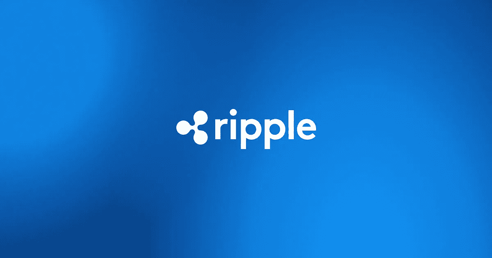

# Ripple 是死了，还是我们正在进入一个新的上升期？

> 原文：<https://medium.com/geekculture/is-ripple-dead-or-are-we-entering-a-new-upswing-c228ae4326e1?source=collection_archive---------10----------------------->

尽管与美国证券交易委员会有争议，涟漪继续扩大，而 XRP 形成一个看涨的模式

尽管 SEC 正在影响其国内业务，但 Ripple 继续在美国以外蓬勃发展。该公司还明确表示，对在法庭外与 SEC 达成和解不感兴趣。最后，你会了解我个人的想法…