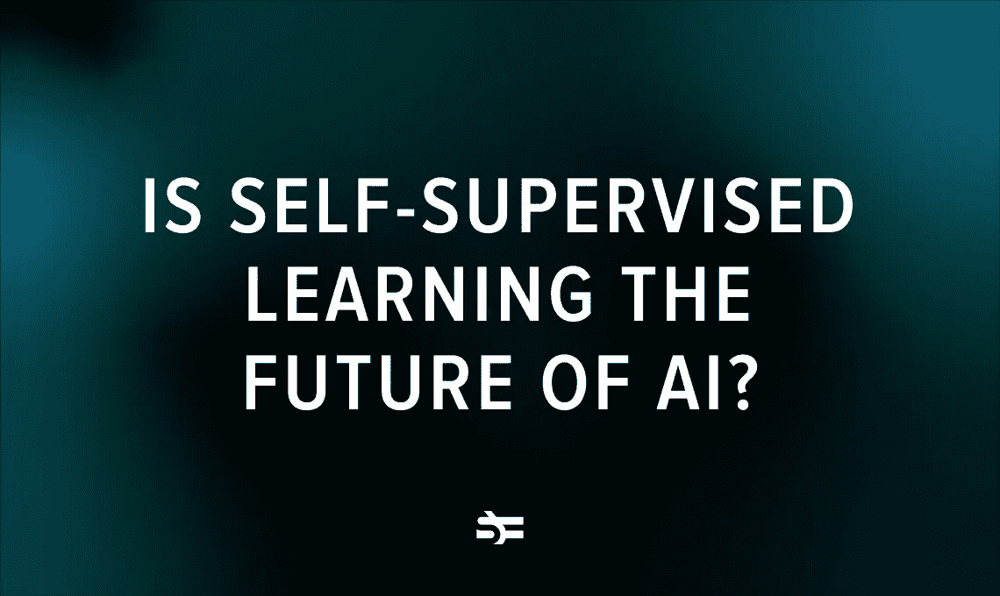

# 自我监督学习是人工智能的未来吗？

> 原文：<https://medium.com/geekculture/is-self-supervised-learning-the-future-of-ai-bd8e8d676fb5?source=collection_archive---------12----------------------->

## 最大的科技公司正在开发能够自主学习的人工智能

自我监督学习(SSL)通常被称为“人工智能的未来”。谷歌和脸书使用这种机器学习技术在自然语言处理和计算机视觉领域提出了新的基准。