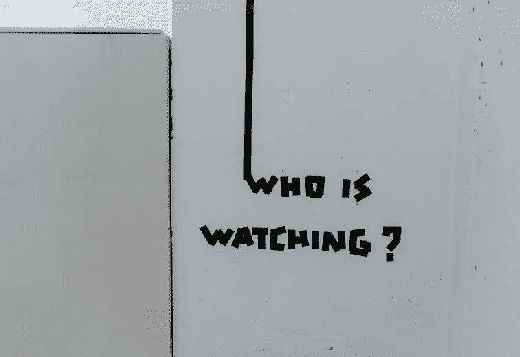
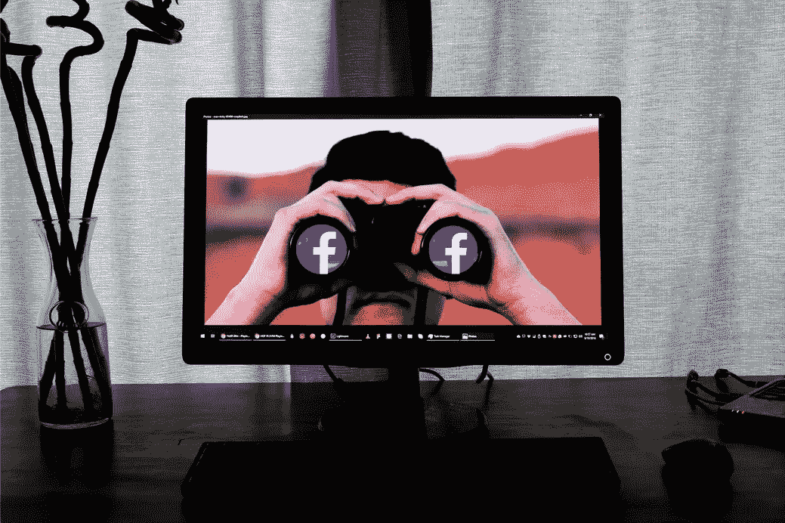

# 监控对用户的隐私构成威胁

> 原文：<https://medium.com/geekculture/is-surveillance-an-acceptable-externality-in-the-commodification-of-users-online-data-b2ae91570254?source=collection_archive---------53----------------------->

监视被用作一种控制技术，这是通向“信息资本主义”的大门(克林&艾伦，1996)。

21 世纪是“ ***监控的黄金时代***”(Naidoo，2019)大数据的兴起使得当局和企业巨头通过详细访问个人信息来侵犯人们的隐私，这在数字时代之前是前所未有的。

Photo by [Claudio Schwarz](https://unsplash.com/@purzlbaum) on [Unsplash](https://unsplash.com)

根据 Campbell & Carlson (2010)的研究，监视被用作一种控制技术，这是通向信息资本主义的大门。Julia Angwin (2014:33)确定了三种类型的监控:政府、企业和个人或“民主化的搜索网”。一个依赖另一个，因为政府经常依赖谷歌或其他互联网巨头提取的信息。

本文旨在提出**当涉及到用户数字信息的交换时，为什么企业监控不被视为一种可容忍的外部性**并**提高对监控巨头如何利用我们的个人经历**’*作为达到他人目的的手段*’(Zuboff，2019a:17)并对隐私构成威胁**的认识。这篇学术文章的范围集中在美国的监控实践，但不限于此。这些证据是基于商业监控追踪器的案例，如谷歌和脸书，它们被认为是监控资本主义时代的领导者。**

## *****商品化*****

**表现为通过'*框定*可交换的物品，使物品'*可在市场上交换'*(Sevignani，2013)。**

## *****外在性*****

**被定义为市场行为(如生产、消费)的影响，其本身不包括在交易中(Khemani & Shapiro，未注明)。**

## *****监视资本主义*****

**被 Zuboff (2019a:8)定义为“*监视经济的基础框架*”，它将**人类经验视为用于商业目的的可交换原材料** (Zubof，2019b)。**

**监控资本主义目前将谷歌和脸书置于巅峰；其次是 LinkedIn、Twitter、阿里巴巴和电信公司。监督资本主义源自信息资本主义，它被描述为大多数在线公司的商业模式(Schneier，2017)。商业模式的重点是 Zuboff (2015)所描述的'*积累的逻辑'*，它由*、【数据、提取和分析】*组成(Varian，2014:27)。数据来源于“*‘万物互联’*”(思科，2013)，主要指科技可穿戴设备、无人机、自动驾驶汽车、智能家居设备，这些对监控资本主义不断增长的基础设施至关重要(Bradshaw，2014；经济学人，2014；芬克，2014；科瓦奇，2013；凯利，2014；林，2014)。此外，谷歌之前已经收购了擅长数据挖掘或其他人工智能技术的成功初创企业(Press，2019；吉布斯，2014；Shontell，2011 年)。**

**第二个来源被认为是政府和企业界(银行、金融机构、航空公司等)的数据库。**

**另一个数据来源集中在监控摄像头(包括从手机摄像头到街景或谷歌地球的所有东西。因此，谷歌未经个人许可就将创新置于首位(Streitfield，2013)。如果出现问题或对手采取行动，谷歌会在法庭上支付罚款，与获得的回报相比，这笔罚款实际上微不足道。这种做法被 Siva Vaidyanathan 称为“基础设施帝国主义”(Vaidyanathan，2011)。此外，根据 EPIC 的说法，他们的数据库保存了大量针对谷歌的案件的在线记录，这些案件从未在第一时间出现在公众面前(EPIC，2014)。这一过程的下一步是“提取”，提取被定义为有时通过武力获取某物(剑桥，未注明日期)。**

**考虑到这一点，可以建议数据的提取不要与*同意*同时进行。最后一步是“分析”，这基本上意味着将预测分析和模式化数据挖掘付诸实践，并对提取的数据进行分类。数据返回到第二个分析阶段，在此阶段，数据已经转化为收入。累积逻辑的关键特征由代表收入的'*监视资产* ' (Zuboff，2015:81)表示。这些资产最终导致了监督资本的投资。这种类型的先驱是谷歌，其次是脸书，然后这个概念被大多数在线公司接受。这种新的经济模式对谷歌来说是强制性的，以便能够保持和进一步增加他们的收入(金融时报，2019)。**

****

**Photo by [Glen Carrie](https://unsplash.com/photos/ra4vJwxnvAo) on [Unsplash](https://unsplash.com)**

**简而言之，谷歌和脸书窃取个人信息，并将其用于自己的利益，如实现利润最大化(BBC，2018)。隐私似乎一直受到侵犯，因为商业模式完全基于对个人的监视。然而，在更好的隐私实践方面已经有所改进。一个合适的例子是脸书和美国美国联邦贸易委员会之间就侵犯隐私和需要重新考虑其隐私监督方法达成的和解(脸书，2019 年 a)。**

## **隐私丑闻**

**另一方面，关于前者的证据表现为多年来遇到的许多隐私丑闻，这些丑闻清楚地说明了基于监控的商业模式的负面影响，并对他们声称要改变这种模式的努力产生了困惑。历史上已知最大的**泄密事件**和最引人注目的是 [**剑桥分析公司丑闻案**](https://www.nytimes.com/2018/04/04/us/politics/cambridge-analytica-scandal-fallout.html) 。超过 7800 万份脸书个人资料被挖掘出个人数据，这些数据影响了美国总统候选人特德·克鲁兹的竞选活动(Davies，2015)。剑桥分析公司及其策划人亚历山大·科岗博士被要求删除这些数据，尽管他们同意了(脸书，2018 年)，但事实上这些数据仍然可以在以后被访问(刘易斯等人，2018 年)。2016 年晚些时候，剑桥分析公司(Cambridge Analytica)受雇确定目标受众，以帮助唐纳德·特朗普(Donald Trump)的美国总统竞选。只是在 2018 年，纽约时报揭露了剑桥分析公司使用数据的方案后，脸书联系了受影响的用户(Browne，2018；罗森伯格等人，2018)。这一丑闻的一个主要方面是，尽管脸书至少自 2015 年以来就意识到了数据泄露，但在澄清此事方面却出现了巨大的延迟。第二个方面是脸书限制了应用程序开发者对数据的访问(脸书，2019b)。此外，丑闻说服了谷歌和脸书在政治广告方面进一步扩大透明度(谷歌，2018；脸书 2019c)。**

**毫无疑问，谷歌和脸书采用的商业模式让他们几乎完全控制了社交媒体渠道。根据欧盟委员会首席顾问 Paul Nemitz 的说法，大数据巨头的力量有四个相互交织、相互依赖的关键方面。这些将是影响政治和市场的力量；权力高于民主；剖析能力；影响对自己有益的知识的能力；人工智能创新中的垄断也应予以考虑(Nemitz，2018)。互联网巨头不断增强的实力也对个人的在线隐私构成了威胁。与此同时，麦肯锡(McKinsey)、普华永道(PWC)或世界经济论坛(World Economic Forum)等受信任的组织正在说服个人相信，数据必须在征得个人同意的情况下产生，因为这是必须给予的东西(Couldry，2017:7)。**

## **恰恰相反，**

**很明显，企业巨头将数据视为*【互联网的新石油和数字世界的新货币】* (Kuneva，2009)。公司有权设定合同的条款和条件(Sevignani，2013)。因此，这为个人提供了接受或拒绝的选择。后者通常意味着服务不能被使用，除非条款和条件被接受。从本质上讲，这使得个人成为契约接受者*，而不是契约制定者*(Gandy，1993)；最终造成一种错误的信念，即信息交流的成本是合理的。**

**此外，一些学者认为个人数据的交换应该得到补偿(Litman，2000)，因为“免费的午餐”这一术语与侵犯个人隐私并不相关(Laudon，1996:103)。与此相反，Lessig (2002)认为，如果个人对隐私访问有所顾虑，出于同样的原因，版权所有者也会以同样的方式制定保护公司的合同协议。考虑到第一种观点胜过反对者的观点，公司需要找到一种策略，使个人信息的交换对双方都更加公平。**

## **另一方面，为了更好地理解监控的整体作用，重要的是不要忽视其优势。**

**一个主要的积极方面是自我监测，随着监测你的步伐、心率和其他许多指标的可穿戴技术的发布，自我监测变得越来越普遍(Davies，2015)。这些人认为'*自知*'可以带来更好的生活方式(查莫罗-普雷姆兹奇，2015)，尽管大多数人忽视了手头的数据代表了可穿戴公司收集的大鲸鱼的一小部分这一事实(里昂，2018)。监督的另一个好处是将信用欺诈的*最小化* (New York Times，2016)。此外，监督被用来*提高在线广告的效率*，以及*减少工作场所的不确定性* (Campbell & Carlson，2002)。在概述了这些优势之后，这显然不足以弥补个人信息商品化带来的成本——人们的隐私。**

**人们普遍认为，监控有助于在数据挖掘技术的帮助下最大限度地减少恐怖袭击。9/11 之后，人们对预测数据挖掘的效率及其局限性越来越感兴趣。因此，美国本土加强了监视，以识别类似的模式或线索，防止可能的下一次袭击。**

**尽管有研究表明，像恐怖主义这样的事件不能通过积累大量数据来预测。对此的证据是(Angwin，2014)得出的结论，该结论指出，在恐怖主义和数据挖掘方面，没有足够的历史数据能够产生可靠的模式。**

## **因此，它在恐怖主义发现上下文上有其局限性。**

**此外，美国国家科学院(2008)指出，某些数据挖掘技术实际上可能会提供错误的线索，从而导致侵犯隐私。话虽如此，除了一系列的尝试之外，9/11 之后还发生了几次成功的袭击:[胡德堡(2009)](https://www.google.com/url?sa=t&rct=j&q=&esrc=s&source=web&cd=&cad=rja&uact=8&ved=2ahUKEwjrl_rF-ZTyAhUQY8AKHXyCAngQFjAFegQIBRAD&url=https%3A%2F%2Fen.wikipedia.org%2Fwiki%2F2009_Fort_Hood_shooting&usg=AOvVaw3PhJkoJR5D6k984cf-9SG2) ，[小石城(2009)](https://www.google.com/url?sa=t&rct=j&q=&esrc=s&source=web&cd=&cad=rja&uact=8&ved=2ahUKEwjlxdDX-ZTyAhUPWsAKHUu0A_YQFjAAegQIBxAD&url=https%3A%2F%2Fwww.nytimes.com%2F2009%2F06%2F02%2Fus%2F02recruit.html&usg=AOvVaw3uADvdy6gcUZGBiHdPSTNc) ，[内衣炸弹客(2009)](https://www.google.com/url?sa=t&rct=j&q=&esrc=s&source=web&cd=&ved=2ahUKEwia8cfj-ZTyAhWkQkEAHQm0CJ0QFjAAegQIBRAD&url=https%3A%2F%2Fen.wikipedia.org%2Fwiki%2FUmar_Farouk_Abdulmutallab&usg=AOvVaw0MQdqXlJ8RfdHkinzsPm22) 和[波士顿马拉松爆炸案(2013)](https://www.google.com/url?sa=t&rct=j&q=&esrc=s&source=web&cd=&ved=2ahUKEwia8cfj-ZTyAhWkQkEAHQm0CJ0QFjAAegQIBRAD&url=https%3A%2F%2Fen.wikipedia.org%2Fwiki%2FUmar_Farouk_Abdulmutallab&usg=AOvVaw0MQdqXlJ8RfdHkinzsPm22) (Angwin，2014；《卫报》，2017)。此外，在斯诺登泄密后，美国国家安全局局长透露，电话记录并没有直接促成 2009 年内衣炸弹袭击者的被捕，而且还会有其他方法(Angwin，2014:46)。**

## **有鉴于此，生活在一种恐惧状态下真的值得吗？在这种状态下，监控可以识别无效的关联，甚至侵犯我们的隐私，而其最强有力的支持者表示，这不太适合预测恐怖事件。**

# ****关键要点****

**总之，很明显，监视并不是用户在线数据商品化的一个可接受的外部因素。**

**尽管监控有其已知的好处，比如 T2 自我跟踪，T4 最大限度地减少信用欺诈，或者提高网络广告的效率，但这还不足以克服它对个人隐私的负面影响。当务之急是，企业要把它们面临的众多丑闻视为一个教训，并开始为妨碍个人隐私承担责任。显然有必要将基于监控的商业模式重新整合为一种对双方都更加友好的模式，并且不会改变人们对用于获取利润的商品的体验。**

**同样，当涉及到为各种服务交换个人信息时，个人必须提高意识，并对他们同意的隐私政策合同更加谨慎。**

# ****资源:****

**安格温律师事务所，2014 年。《搜索之国:在无情监视的世界中寻求隐私、安全和自由》,纽约时报图书。**

**[https://www.bbc.co.uk/news/technology-46618582](https://www.bbc.co.uk/news/technology-46618582)【2020 年 5 月 3 日访问】。**

**[https://www.cnbc.com/2018/04/09/facebook-to-](https://www.cnbc.com/2018/04/09/facebook-to-)**

**[https://www . tandfonline . com/doi/ABS/10.1207/s 15506878 jobem 4604 _ 6](https://www.tandfonline.com/doi/abs/10.1207/s15506878jobem4604_6)**

**[https://www.theguardian.com/media-](https://www.theguardian.com/media-)网/2015/7/17/可穿戴设备-技术-监测-行为-健康**

**[https://epic.org/privacy/streetview/](https://epic.org/privacy/streetview/)**

**[https://news room . FB . com/news/2019/03/a-better-way-to-learn-about-ads/](https://newsroom.fb.com/news/2019/03/a-better-way-to-learn-about-ads/)**

**[https://www . the guardian . com/us-news/2015/dec/11/senator-ted-Cruz-president-campaign-](https://www.theguardian.com/us-news/2015/dec/11/senator-ted-cruz-president-campaign-)Facebook-user-data**

**[https://about.fb.com/news/2019/07/ftc-agreement](https://about.fb.com/news/2019/07/ftc-agreement)**

**[http://money.cnn.com/2014/03/20/technology/security/](http://money.cnn.com/2014/03/20/technology/security/)**

**[https://www.blog.google/technology/ads/introducing-](https://www.blog.google/technology/ads/introducing-)新闻-透明-报道-政治-广告/**

**【http://money.cnn.com/2014/03/】T219/technology/mobile/wearable-devices/index . html**

**http://www.businessinsider.com/googles-plan-to-take-over-T4 世界 2013-5**

**[http://www.theatlantic.com/](http://www.theatlantic.com/)技术/档案/2014/01/如果你的自动驾驶汽车保持-路由-你过去-krispy- kreme/283221/**

**[https://www.ft.com/content/7fafec06-1ea2-11e9-b126-](https://www.ft.com/content/7fafec06-1ea2-11e9-b126-)46 fc 3 ad 87c 65**

**https://www . the guardian . com/technology/2014/Jan/27/Google-acquisites-uk-artificial-intelligence-startup-deep mind**

**[https://EC . Europa . eu/commission/press corner/detail/en/SPEECH _ 09 _ 156](https://ec.europa.eu/commission/presscorner/detail/en/SPEECH_09_156)**

**[https://www.theguardian.com/uk-](https://www.theguardian.com/uk-)news/2018/05/06/Cambridge-analytic a-keep-Facebook-data-models-through-us-election**

**[https://www8.nationalacademies.org/onpinews/newsitem.aspx?RecordID=10072008A](https://www8.nationalacademies.org/onpinews/newsitem.aspx?RecordID=10072008A)**

**[https://royal society publishing . org/doi/10.1098/rsta . 2018.0089](https://royalsocietypublishing.org/doi/10.1098/rsta.2018.0089)**

**[https://www . nytimes . com/2016/12/18/technology/a-world-of-surveillance-](https://www.nytimes.com/2016/12/18/technology/a-world-of-surveillance-)doesnt-always-help-to-catch-a-thief.html**

**https://www . Forbes . com/sites/Gil press/2019/07/01/big-data-is-dead-long-live-big-data-**

**[https://www . nytimes . com/2018/03/17/us/politics/Cambridge-analytic a-trump-](https://www.nytimes.com/2018/03/17/us/politics/cambridge-analytica-trump-)**

**[https://www . schneier . com/news/archives/2017/07/surveillance _ is _ the _。html](https://www.schneier.com/news/archives/2017/07/surveillance_is_the_.html)**

**https://0-doi-org.pugwash.lib.warwick.ac.uk/10.1093/scipol/sct082**

**http://www.nytimes.com/2013/03/13/科技/谷歌支付给 fine-over-street-view-privacy-breach.html。**

**[http://www . euro investor .](http://www.euroinvestor.)com/news/2014/01/14/Google-to-buy-nest-labs-for-320 亿-update/12658007**

**[https://www . economist . com/business/2014/01/16/the-new-ge-Google-everywhere](https://www.economist.com/business/2014/01/16/the-new-ge-google-everywhere)**