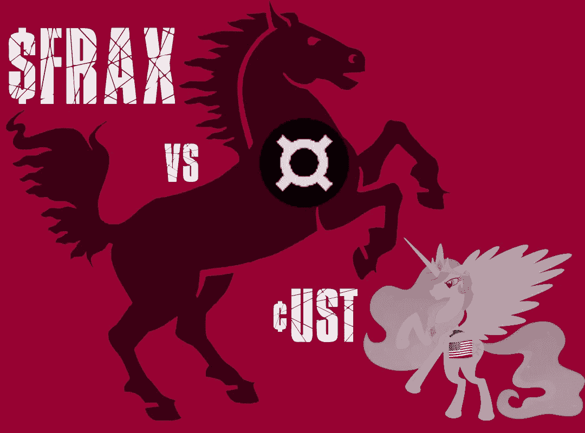

# FRAX 稳定币安全吗？是的。

> 原文：<https://medium.com/geekculture/is-the-frax-stablecoin-safe-yes-ce7f1bbc2f13?source=collection_archive---------2----------------------->

特拉·UST 庞氏骗局的崩溃已经引起了货币市场的恐慌。为什么$FRAX 与众不同，为什么它是 crypto 需要的解决方案。

Image: PixTeller

> 你有很多新手投资者，他们进入市场寻找轻松赚钱的机会，完全不考虑基本面——伯尼·麦道夫