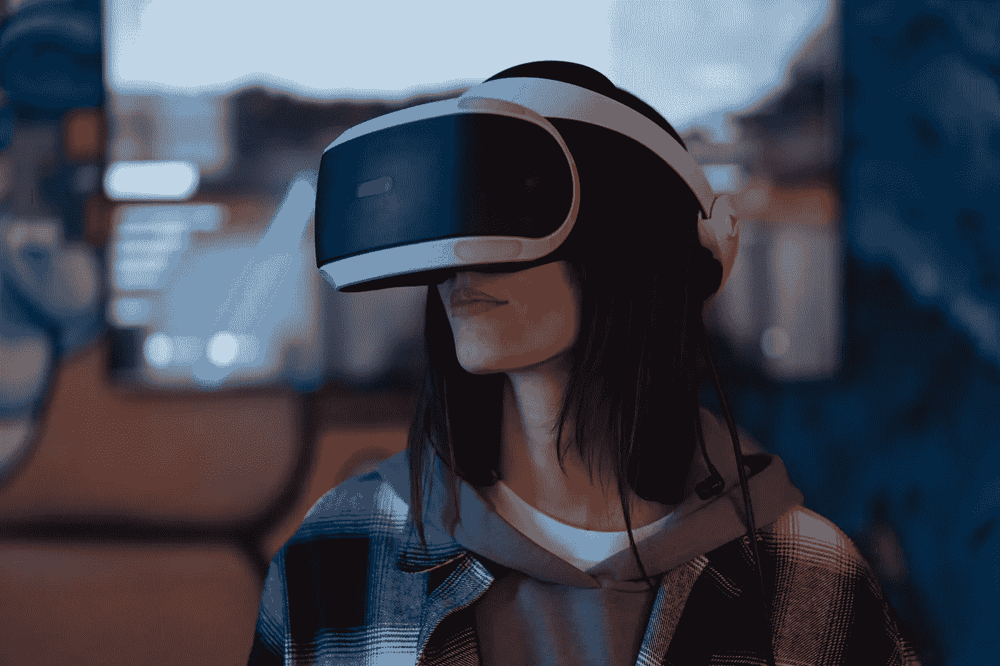

# 元宇宙是一个伟大的想法还是一部正在制作中的科幻恐怖电影？

> 原文：<https://medium.com/geekculture/is-the-metaverse-a-great-idea-or-a-sci-fi-horror-movie-in-the-making-68785fb70e7d?source=collection_archive---------11----------------------->

## 元宇宙的显著特征以及为什么它们会成为一个大问题

Photo by [Mikhail Nilov](https://www.pexels.com/@mikhail-nilov?utm_content=attributionCopyText&utm_medium=referral&utm_source=pexels) from [Pexels](https://www.pexels.com/photo/woman-wearing-a-virtual-reality-headset-7887258/?utm_content=attributionCopyText&utm_medium=referral&utm_source=pexels)

大家好，欢迎来到我们的黑镜季首播:真实版。

我不是在开玩笑，我们不妨在这一点上说。讽刺的是，黑镜的“真实”版本是…