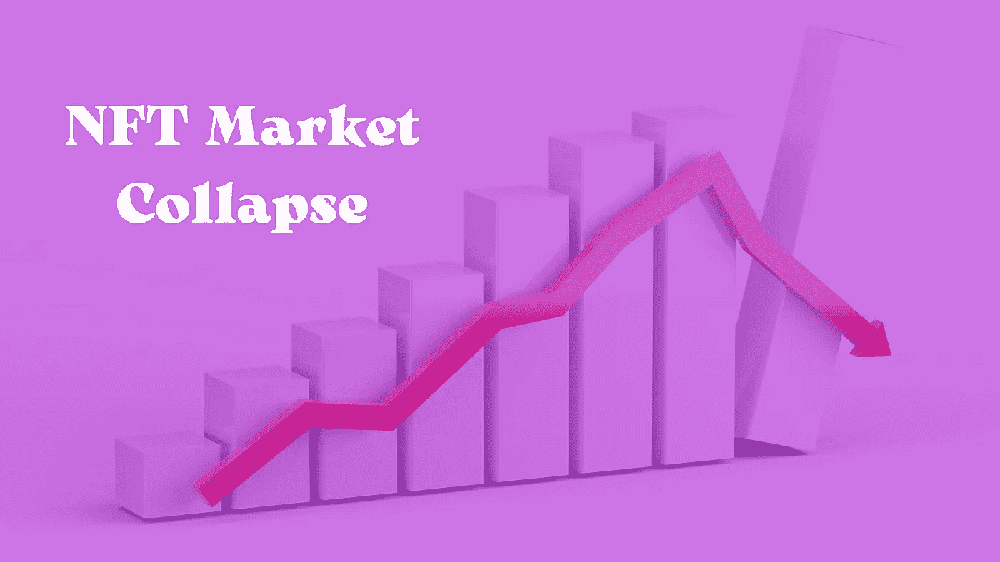

# NFT 市场是在崩溃，还是还有未来？

> 原文：<https://medium.com/geekculture/is-the-nft-market-collapsing-or-does-it-still-have-a-future-830c99d2c716?source=collection_archive---------16----------------------->

Does the NFT market have a future?

最近，不可分解的公司发布了 2022 年第三季度的报告，让许多人担心 NFT 市场正在消亡。华尔街日报和其他媒体报道称，NFT 市场“停滞不前”，比去年 9 月下降了 92%。当一些人开始拔掉他们的头发时，另一些人试图在专家的分析中找到平静，他们说兴趣下降是很自然的。所以，让我们更仔细地看看 NFTs 是怎么回事，以及我们对未来可能的期望。

# **NFT 市场正在崩溃吗？**

NonFundible 在 2022 年发布的第一份报告让所有人都认为 NFT 市场即将结束，因为不可兑换代币的销售降至日均约 19，000 枚，比去年 9 月的峰值下降了 92%，令人印象深刻。

此外，与 2021 年 11 月相比，NFT 市场的活跃钱包数量下降了 88%。

许多 NFT 所有者发现，他们的资产价值远远低于他们支付的价格。人们似乎也对一度繁荣的非正规金融服务失去了兴趣。

根据谷歌趋势，自一月份以来，NFT 一词的搜索量下降了大约 80%。随着乌克兰战争在 2 月份爆发，人们的注意力集中在了 it 上，而不是新的数字资产上。

但是在你开始寻找第三份兼职工作来支付你的费用之前，让我们看看 NFTs 在未来会变成什么样子。

# **NFTs 的未来是什么？**

尽管 NFTs 似乎越来越不受欢迎，但这个想法不太可能很快消失。目前，NFT 使用的两个最大领域包括收藏品和游戏代币。尽管最近观察到代币越来越不受欢迎，NFT 的粉丝和专家仍然相信还有增长和扩张的空间。让我们仔细看看。

***分权财务***

由于非金融资产具有独特性和特定价值，它们可能成为一种新的金融工具。因此，你将能够用 NFTs 投资，用 NFTs 支付，以 NFTs 的形式买票，等等。例如，最近，NFT 已经成为一种有价值的捐赠工具。人们现在可以捐赠对慈善事业有价值的非功能性食物。例如，在乌克兰正在进行的战争中，人们捐赠国家森林公园来帮助乌克兰人。还有像“[现实生活中的数字艺术](https://opensea.io/collection/ukrainianartforlife)”这样的倡议，出售 NFT 来支持军队。在这种情况下，人们投资不是为了获取利润或期望回报，而是打算做好事。

***虚拟现实***

随着数字技术的到来，我们的生活变得越来越数字化。现在，一切都被转移到了数字世界，包括通信、商业活动和记忆，尤其是虚拟现实和元宇宙的扩张。随着现实世界和数字世界之间的交叉越来越紧密，人们希望将他们的物理财产像飞人乔丹那样转移到现实世界中。非功能性测试可以达到这个目的。

***娱乐艺术***

*艺术家们已经在利用这个机会直接参与和支持。回到世界的数字化，艺术家们正以同样的速度将他们的创造力转移到电脑上。有了 NFTs，直接交易简化了接触艺术家的过程，也让购买他们的作品变得更加容易。从画家和动作设计师到歌手，比如 Shawn Mandes 和 Snoop Dog，有创造力的人已经获得了一种新的方式来将他们的创作货币化。这也是有益的，只要 NFT 允许拥有艺术品的份额，这使得集体所有权成为一种出路，如果他们准备分享所有权和成本的话。*

# ***代替结论***

*NFT 市场仍处于早期发展阶段。就像加密货币一样，这个想法也经历了自己的起伏。实际上，NFT 与其说是投资，不如说是实施区块链技术。问题是，就像任何创新一样，非技术创新仍然需要获得更多的关注和追随。希望这条船不会沉，因为这个想法是做好事、支持他人的好工具。谁知道呢，也许现在设法参与 NFT 的每个人都会在某个时候收获果实。*