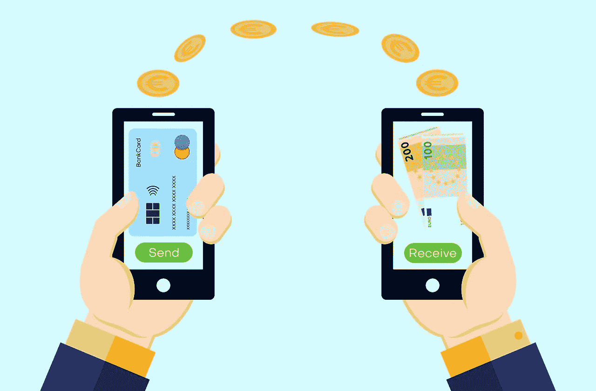

# 原产地美元(OUSD)是真的吗？—市场疯人院

> 原文：<https://medium.com/geekculture/is-the-origin-dollar-ousd-for-real-market-mad-house-e4ca7927b1d2?source=collection_archive---------18----------------------->

最初的美元(OUSD)是一种可以赚取利息的稳定货币。为了解释这一点，他们声称在 OUSD 投资可以获得 8.2%的年收益率(APY)。

他们声称一个 [OUSD 余额一天可以复利多次](https://www.ousd.com/)。此外，他们声称 Origin 协议自动转换 DeFi(分散融资)收益。这些收益将累积在一个数字钱包里。

