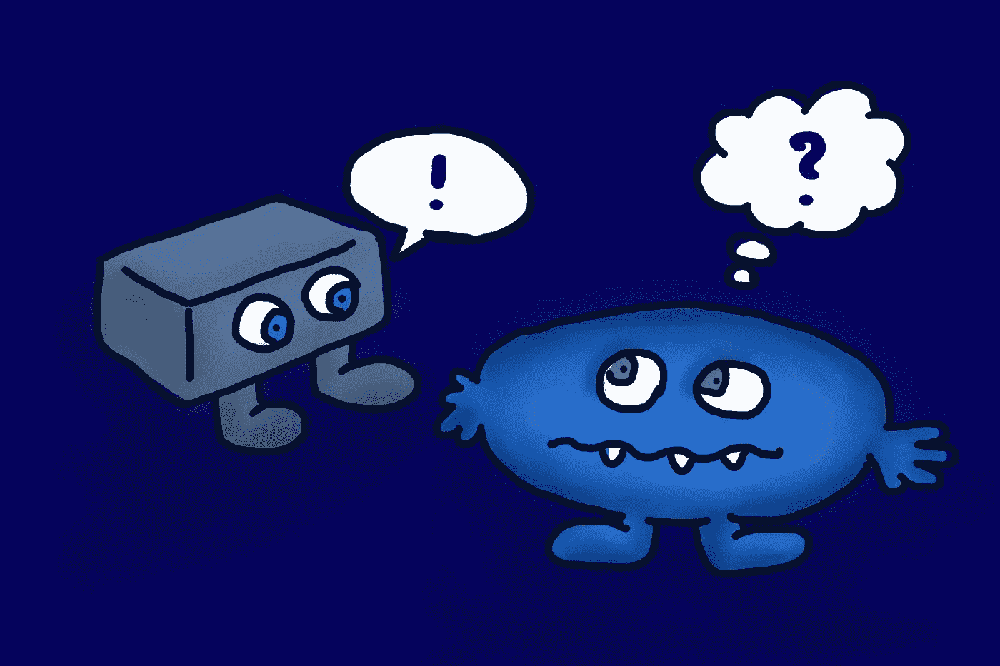

# 通往有意识 AI 的道路比我们想象的要短吗？

> 原文：<https://medium.com/geekculture/is-the-path-to-conscious-ai-shorter-than-we-think-e85a76f784c7?source=collection_archive---------5----------------------->

## 可能不会，但是像谷歌的 PaLM 这样的模型正在做一些令人费解的事情

Humans are feeling baffled about the success of AI in recent years.

去年夏天，一名谷歌工程师公开表示，他相信聊天机器人 LaMDA 可能是有意识的。这在网上引起了轰动。

作为科幻小说中的中流砥柱，有感知能力的机器有着不可估量的巨大魅力