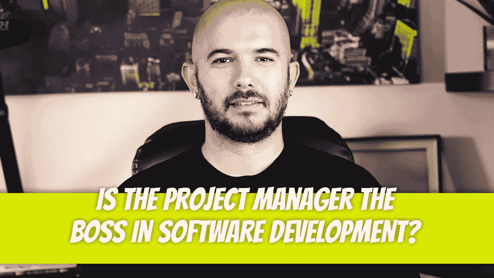

# 项目经理是一个软件开发团队中的老大吗？

> 原文：<https://medium.com/geekculture/is-the-project-manager-the-boss-in-a-software-development-team-6d54bca9b3ce?source=collection_archive---------11----------------------->

如果你在一家项目经理是老板的公司工作，跑吧。你不会在比这更毒的环境中工作。把它从你的职业清单上划掉，永远不要再回想它。

项目经理不应该被视为软件开发团队中的老板。软件开发团队是职能团队，每个人服务于一个特定的…