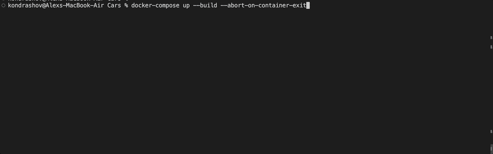
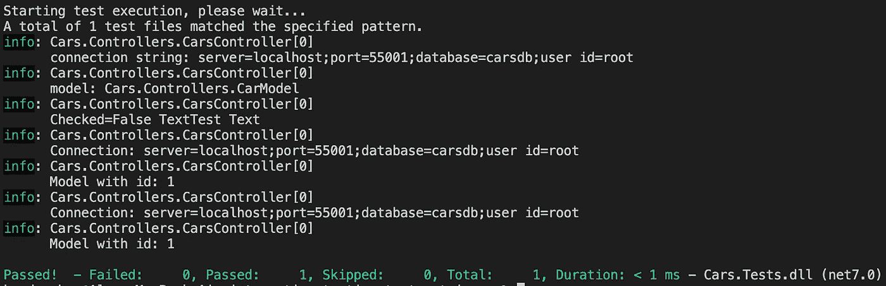

# 中使用容器编写集成测试有没有更好的方法？网？

> 原文：<https://medium.com/geekculture/is-there-a-better-way-of-writing-integration-tests-in-using-containers-net-233de3a23891?source=collection_archive---------11----------------------->


Photo by [ValdasMiskinis](https://pixabay.com/users/valdasmiskinis-12049839/) on [Pixabay](https://pixabay.com/?utm_source=medium&utm_medium=referral)

# 太长了，读不下去

编写集成测试最干净的方式是使用一次性容器。TestContainers 库帮助你轻松管理它。

# 更多…

管理自动化测试的依赖关系是一项挑战。我们可以花费数小时来手动管理它，或者我们可以自动化它并使用第三方库来管理它。在这篇文章中，我正在寻找一种简洁、简单的方法来为现代 ASP.NET web 应用程序编写集成测试。

## 被测系统

我的例子公开了一个 REST API 来*创建*和*获取*汽车:

```
[HttpPost]
public async Task<CarModel> Create(CarModel model)
{
    using (var connection = await _dbConnectionFactory.CreateConnectionAsync())
    {
        _logger.LogInformation("connection string: " + connection.ConnectionString);
        _logger.LogInformation("model: " + model);
        _logger.LogInformation("Checked=" + model.Available + " Text" + model.Name);
        var result = await connection.QueryAsync<string>("INSERT INTO cars (name, available) values (@Name, @Available); SELECT LAST_INSERT_ID();", model);
        var id = result.Single();
        return await Get(id);
    }
}

[HttpGet("{id}")]
public async Task<CarModel> Get(string id)
{
    using (var connection = await _dbConnectionFactory.CreateConnectionAsync())
    {
        _logger.LogInformation("Connection: " + connection.ConnectionString);
        var result = await connection.QueryAsync<CarModel>("SELECT id,available,name FROM cars WHERE id=@Id", new { Id = id });
        var model = result.FirstOrDefault();
        _logger.LogInformation("Model with id: " + model.Id);
        return model;
    }
}
```

你可以在这里找到完整的代码。

# 从集成测试开始

🟢 ⚪ ⚪

> **集成测试** —是一种软件测试，其中软件应用程序的不同单元、模块或组件作为一个组合实体进行测试。

我们如何知道我们写了一个集成测试？我们应该在测试中从上到下调用我们系统的所有层: *REST API* ，*控制器*，*服务*，*仓库*和*数据库*。

```
[Fact]
public async void testCreateCar()
{
    var client = _factory.CreateClient();

    var car = new CarModel { Available = false, Name = "Test Text" };

    var result = await client.PostAsync(_endpoint, new StringContent(JsonConvert.SerializeObject(car), Encoding.UTF8, "application/json"));
    var expectedModel = JsonConvert.DeserializeObject<CarModel>(await result.Content.ReadAsStringAsync());

    var response = await client.GetAsync($"{_endpoint}/{expectedModel.Id}");
    var actualModel = JsonConvert.DeserializeObject<CarModel>(await response.Content.ReadAsStringAsync());

    Assert.Equal(expectedModel.Id, actualModel.Id);
    Assert.Equal(expectedModel.Name, actualModel.Name);
}
```

如果我们在运行测试之前运行 REST API 和数据库，它将会通过。我们有证据证明我们的系统现在工作了！任何集成测试都比没有测试要好。

# 使用 Docker 的 DIY 一次性容器

🟢 🟢 ⚪

上面的测试有什么问题？运行它需要大量的体力劳动。我们需要手动管理数据库和 web 应用程序。

当我们开始测试时，我们希望增强依赖关系，当执行结束时，我们希望拆除依赖关系。码头工人应该能帮上忙。我们可以使用 3 个容器来完成它:运行集成测试的`web application`、`database`和`integration`容器。容器之间的所有集成都在`docker-compose.yml`中编码:

```
version: '3'

services:
  integration:
    build: 
      context: .
      dockerfile: Dockerfile.integration
    environment:
      - API_URL=http://web:5001
      - CONNECTION_STRING=Server=db;Database=carsdb;Uid=root;Pwd=password;SslMode=Required;      
    entrypoint: bash /app/wait_for_it.sh web:5001 -t 0 -- dotnet test --logger "console;verbosity=detailed"
    depends_on:
      - web
      - db
  web:
    build: .
    ports: 
      - 5001:5001
    environment:
      - ASPNETCORE_ENVIRONMENT=Development
      - CONNECTION_STRING=Server=db;Database=carsdb;Uid=root;Pwd=password;SslMode=Required;
    entrypoint: bash /app/wait_for_it.sh db:3306 -t 0 -- dotnet /app/Cars.dll
    depends_on:
      - db
  db:
    platform: linux/x86_64
    image: mysql
    ports:
      - 3307:3306
    # Start the container with a carsdb, and password as the root users password
    environment: 
      - MYSQL_DATABASE=carsdb
      - MYSQL_ROOT_PASSWORD=password
    # Volume the scripts folder over that we setup earlier.
    volumes: 
      - ./Scripts:/docker-entrypoint-initdb.d
```

完整的代码是[这里是](https://github.com/alkondrashov/integration-testing-docker)。

我们现在可以通过`docker-compose up -build -abort-on-container-exit`运行集成测试。



Console output when running tests using ***docker-compose***

这看起来好多了！我们不必分别管理数据库和 web 服务器。一切都通过 Docker 处理。但是，解决方案并不干净，还可以改进。主要问题是我们继承了底层 Docker 设置。此外，容器在测试执行后不会被清除。

# 管理一次性容器的 TestContainers

🟢 🟢 🟢

> **Testcontainers** 用于。NET 是一个库，支持对所有兼容的 Docker 容器的一次性实例进行测试。NET 标准版本。图书馆建在屋顶上。NET Docker remote API，并提供了一个轻量级的实现来支持所有情况下的测试环境。

如果我们不想自己管理 Docker 容器，这个库提供了一种简洁的方式来编写集成测试。

我们可以为我们的 web 应用程序使用预定义的`MySqlTestcontainer`。TestContainer 的配置是通过`WebApplicationFactory`类完成的:

```
public class IntegrationTestFactory : WebApplicationFactory<Program>, IAsyncLifetime
{
    private readonly TestcontainerDatabase _container;

    public IntegrationTestFactory()
    {
        _container = new TestcontainersBuilder<MySqlTestcontainer>()
            .WithDatabase(new MySqlTestcontainerConfiguration
            {
                Password = "localdevpassword#123",
                Database = "carsdb",
            })
            .WithImage("mysql:latest")
            .WithCleanUp(true)
            .Build();
    }

    protected override void ConfigureWebHost(IWebHostBuilder builder)
    {
        builder.ConfigureTestServices(services =>
        {
            services.RemoveAll<IDbConnectionFactory>();
            services.AddSingleton<IDbConnectionFactory>(_ => new MySqlConnectionFactory(_container.ConnectionString));
        });
    }

    public async Task InitializeAsync()
    {
        await _container.StartAsync();
        await _container.ExecScriptAsync("CREATE TABLE IF NOT EXISTS cars (id SERIAL, name VARCHAR(100), available BOOLEAN)");
    }

    public new async Task DisposeAsync() => await _container.DisposeAsync();
}
```

多亏了`IAsyncLifetime`，我们可以使用`InitializeAsync()`和`DisposeAsync()`方法初始化和处理我们的数据库。

我们现在需要使用`IntegrationTestFactory`来得到一个假的`HttpClient`:

```
[Fact]
public async void testCreateCar()
{
    var client = _factory.CreateClient();

    var car = new CarModel { Available = false, Name = "Test Text" };

    var result = await client.PostAsync(_endpoint, new StringContent(JsonConvert.SerializeObject(car), Encoding.UTF8, "application/json"));
    var expectedModel = JsonConvert.DeserializeObject<CarModel>(await result.Content.ReadAsStringAsync());

    var response = await client.GetAsync($"{_endpoint}/{expectedModel.Id}");
    var actualModel = JsonConvert.DeserializeObject<CarModel>(await response.Content.ReadAsStringAsync());

    Assert.Equal(expectedModel.Id, actualModel.Id);
    Assert.Equal(expectedModel.Name, actualModel.Name);
}
```

这种方法允许我们使用`dotnet test`命令运行测试，这是一个优点:



Console output when running tests using TestContainer

看看这个！我们已经在 Docker 中运行了集成测试，无需手动管理容器。

# 摘要

我们已经编写了一个集成测试，运行它所需要做的就是启动 Docker 并执行`dotnet test`命令。web 服务器和数据库将由 TestContainers 库为我们提供。如果你认为这有什么缺点，请在下面的评论中告诉我。

# 资源

1.  [存储库](https://github.com/alkondrashov/integration-testing-docker)使用 Docker Compose 进行集成测试。
2.  [存储库](https://github.com/alkondrashov/integration-testing-testcontainers)使用 TestContainers 进行集成测试。