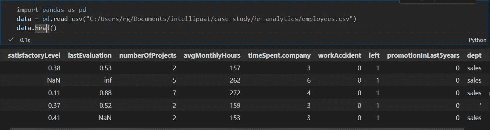
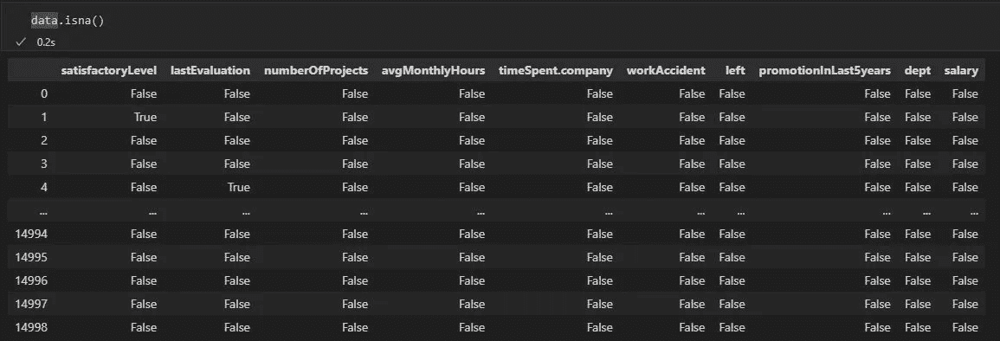
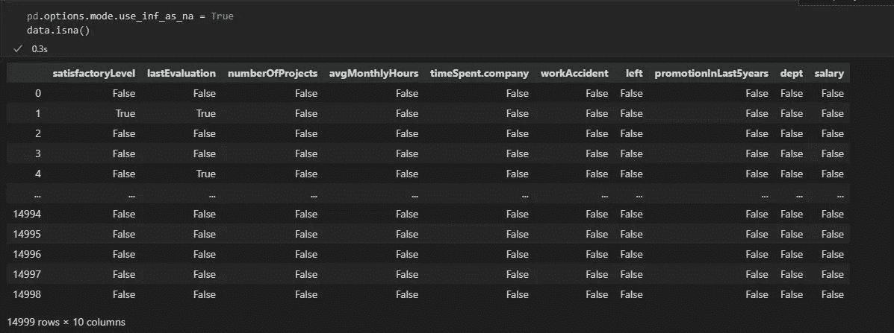
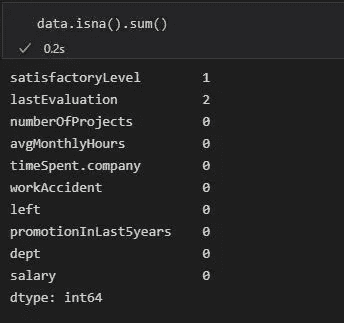
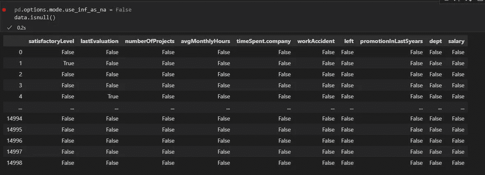
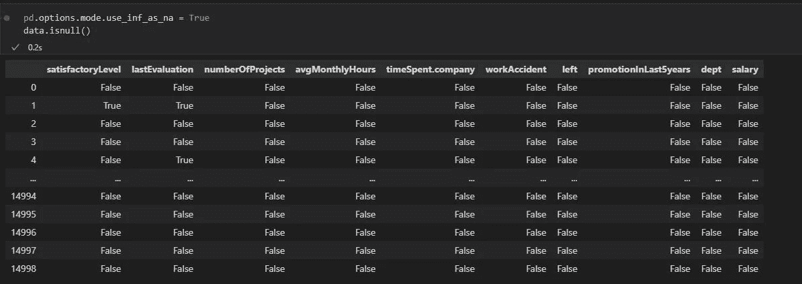
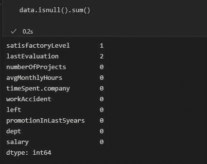

# 熊猫 DataFrame 的 isnull()和 isna()方法有区别吗？

> 原文：<https://medium.com/geekculture/is-there-any-distinction-between-isnull-and-isna-method-of-pandas-dataframe-47095c16f026?source=collection_archive---------3----------------------->

这篇文章是专门为那些熟悉 python 中用于数据分析的`pandas`库的人写的。那些和 pandas 一起工作的人已经遇到了`inull()`和`isna()`方法，这种方法用于在执行数据清理时检测空值或缺失值。

因此，当我们处理数据时，我们只需要干净的数据。在数据科学中，数据清理是一项非常重要的任务，因为如果您的数据不干净或充满了垃圾值，您将最终得到不准确的推断。一般来说，人们只为他们的数据科学项目花费 60 -80%的时间在数据清理上。


Photo by [Ilya Pavlov](https://unsplash.com/@ilyapavlov?utm_source=unsplash&utm_medium=referral&utm_content=creditCopyText) on [Unsplash](https://unsplash.com/s/photos/technology?utm_source=unsplash&utm_medium=referral&utm_content=creditCopyText)

在执行数据清理时，一项非常重要的任务是检查数据中是否存在缺失值。Pandas DataFrame 类提供了两个方法`isna()`和`isnull()`来检测缺失值。我们将首先看到如何在数据上使用每种方法，然后我们将继续区分这些方法。我们将使用 [employees.csv](https://github.com/grgupta13/PythonProgramming/blob/main/employees.csv) 数据来执行这些任务。我们将使用以下代码加载 employees.csv:

```
import pandas as pd
data = pd.read_csv("C:/Users/rg/Documents/intellipaat/case_study/hr_analytics/employees.csv")data.head()
```



您可以看到数据集中有缺失的值。我们现在可以使用`isnull()`和`isna()`方法来计算缺失值的数量。

1.  **isna():**

`isna()`返回由真值和假值组成的数据帧。true 值表示数据为空或缺失，而 false 值表示数据不为空且不缺失。



`isna()`不会将 inf 值检测为缺失数据，因为它出现在第二行中。要将 inf 值也视为缺失数据，请设置 pandas . options . mode . use _ INF _ as _ na = True。现在您可以看到第 2 行中的`lastEvaluation`列显示为真。

```
pd.options.mode.use_inf_as_na = True
data.isna()
```



您还可以使用`isna().sum()`计算每列中缺失值的数量，该函数在调用`isna()`方法后对返回的数据帧应用 sum 函数。

```
data.isna().sum()
```



2.isnull():

`isnull()`返回由真值和假值组成的数据帧。`True`值表示数据为空或缺失，而`False`表示数据不为空且不缺失。我们正在将`pandas.options.mode.use_inf_as_na = False`设置为默认模式。



`isnull()`像`isna()`一样不会将 inf 值检测为缺失数据，因为它出现在第二行中。要将 inf 值也视为缺失数据，请设置 pandas . options . mode . use _ INF _ as _ na = True。现在你可以看到第 2 行中的`lastEvaluation`列显示为真。



类似地，您可以使用`isnull().count() method`计算每一列缺失值的数量。

```
data.isnull().sum()
```



**区分** `**isna()**` **和** `**isnull()**` **熊猫 DataFrame 类的方法:**

从上述结果可以清楚地看出，`isna()`和`isnull()`方法之间没有区别。这两个功能执行相同的事情。`isnull()`只是`isna()`的别名。

```
isna: () and isnull() both returns DataFrame and used to detect missing values.Each functions returns a boolean same-sized object indicating if the values are NA. NA values, such as None or numpy.NaN, gets mapped to True values. Everything else gets mapped to False values. Characters such as empty strings '' or numpy.inf are not considered NA values (unless you set pandas.options.mode.use_inf_as_na = True).
```

`isna()`和`isnull()`都不检测空字符串“”。因此您需要应用不同的函数来处理空字符串“”。

我希望这篇文章对你有用。感谢您阅读并抽出时间这样做。在 Medium 上关注我，阅读更多文章。