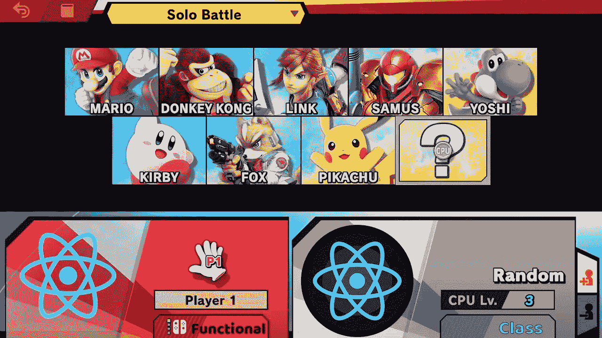

# 还有理由继续使用 React 类组件吗？

> 原文：<https://medium.com/geekculture/is-there-any-reason-to-still-use-react-class-components-9b6a1e6aa9ef?source=collection_archive---------1----------------------->

## 用 React 钩子看函数组件和类组件

Choose your character!

没有。

感谢阅读！

.

.

哦，我必须解释我自己？好吧好吧…

# 快速背景

所以当我第一次学习 React 时，你必须在创建组件时做出选择。您可以将组件创建为返回一些 JSX 的简单函数(因此它被称为功能组件)，或者您可以将组件声明为 React。组件类继承自 React 库(因此它被称为类组件)。

Functional 组件通常用于简单的组件，只显示传递给它的信息，而 Class 组件是当您需要在组件中存储状态时，或者如果您想做一些更有趣的事情，比如在组件装载到 DOM 后异步加载内容时，可以使用的组件。

这一切都在 2018 年改变了，当时 React 团队发布了 [React Hooks](https://reactjs.org/docs/hooks-intro.html) 。钩子内置于执行预设任务的函数中，例如赋予组件存储状态的能力(useState 钩子)或允许您在加载组件时执行副作用(useEffect 钩子)，类似于生命周期事件，例如类组件中的 componentDidMount。

# React 挂钩的当前状态

随着时间的推移，社区越来越倾向于使用 React 挂钩，并且很多支持都集中在它们而不是类上。此外，我看到越来越多的新一批工程师开始把他们的时间集中在学习钩子上，并在学校/训练营上课前学习它们。

虽然 React 团队没有计划放弃类组件，但我感觉他们每年都在慢慢地转移他们的注意力。这只是我的看法，但我有一种感觉，在未来几年内，他们可能会完全停止支持它。

使用 classComponents 的缺点是，不管你想不想要，它们里面都有一堆预装的东西。例如，如果你只是在一个组件中使用状态，那么每次你渲染这个组件时，你仍然要加载所有其他的东西。随着代码库变得越来越大，这意味着每次页面加载都必须传输更多的数据，渲染时间也越来越长。

使用功能组件，组件开始时要轻得多，并且您可以根据需要添加功能。是的，在创建组件时，导入 useState 和 useEffect 挂钩，并设置每一个挂钩，而不是为您预加载，这可能需要更多的工作，但是当您开始扩展应用程序时，这一点点额外的工作可以在应用程序加载大小和文件大小方面带来好处。

对于大多数应用程序来说，useState、useEffect 和 useContext 应该涵盖大约 99%您需要一个类组件来完成的事情。还有[几个钩子](https://reactjs.org/docs/hooks-reference.html)用于更具体的应用。对于那些真正雄心勃勃的人来说，这里有一个来自本·阿瓦德在 YouTube 上的精彩视频，更详细地讲述了这些额外的挂钩。

[www.youtube.com/watch?v=f687hBjwFcM](https://www.youtube.com/watch?v=f687hBjwFcM)

如果你刚刚开始，我甚至不会担心那些额外的，只会专注于掌握主要的 3 个。

# 必须使用类组件的边缘情况

当然，像软件开发中的任何事情一样，在某些情况下，你没有选择，不得不使用类，尽管它们非常罕见。

在极少数情况下，您需要访问

*   getSnapshotBeforeUpdate
*   getderivedstatefromrerror
*   componentDidCatch

目前还没有直接的 React Hook 等价物，但是显然有计划在将来开发这些，在这种情况下，本文标题问题的答案将是响亮的“不”

# 定论

**99.9%的时间你应该在使用功能组件**。如果你一直在学习，那你就有功课要做了！