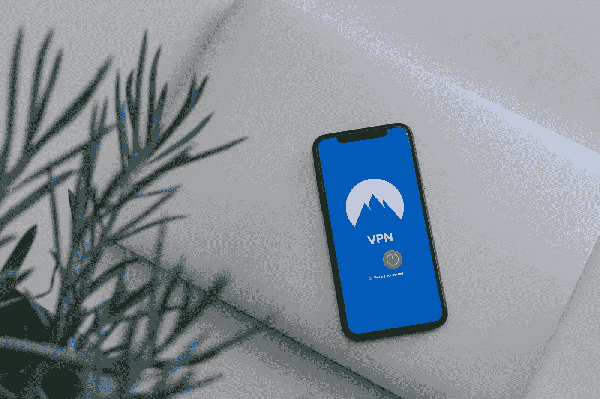

# 这是解决 VPN 问题的方法吗？

> 原文：<https://medium.com/geekculture/is-this-the-solution-to-vpn-problem-e44cc4da8d6f?source=collection_archive---------26----------------------->

检查中央 VPN 提供商的问题，以及潜在的解决方案— dVPN。

Photo by [Petter Lagson](https://unsplash.com/@lagopett?utm_source=unsplash&utm_medium=referral&utm_content=creditCopyText) on [Unsplash](https://unsplash.com/s/photos/vpn?utm_source=unsplash&utm_medium=referral&utm_content=creditCopyText)

大纲:

*   介绍
*   VPN 的问题
*   区块链 VPN — dVPN
*   dVPN 的潜在问题
*   结论

## 介绍

虚拟专用网络(VPN)是您的设备与互联网之间的加密隧道。VPN 保护您的互联网连接免受中间人(MITM)攻击或网络窥探。由于加密的数据隧道，您的 ISP 看不到您使用 VPN 在互联网上浏览的内容。换句话说，他们知道你正在访问互联网，但由于加密，他们不知道它的内容。我们经常在公共 Wi-Fi 上使用 VPN 来保护我们的连接，或者简单地绕过特定国家的审查。

# VPN 提供商的问题

## 信任 VPN 提供商

VPN 的主要问题是我们把信任放在了一个中央实体上。它完全建立在信任的基础上。

VPN 提供商持有加密密钥。换句话说，在您使用 VPN 之前，您的 VPN 已经了解了您的 ISP。他们可以看到您所有的互联网流量及其内容。此外，VPN 需要会话日志记录。本质上，他们**知道**:

*   您连接到他们的服务器的时间(服务器日志)。
*   您的互联网流量内容。
*   数据量。

我们必须相信供应商。相信他们坚持他们的无日志策略。相信他们不会出售我们的数据。相信他们拥有强大的安全基础设施，不会受到恶意对手的攻击。

即使你找到了一个相当透明和值得信赖的 VPN 公司，消费者也必须检查 VPN 公司成立时的数据隐私法的本质细节。

## 执法抓捕行动

铁的事实是，有用户使用 VPN 服务进行有害的活动。最近的案例是 DoubleVPN。一个勒索软件集团使用 DoubleVPN 来隐藏他们的踪迹，这促使执法机构关闭了 VPN 服务。

> “执法部门进入了 DoubleVPN 的服务器，并获取了 DoubleVPN 保存的所有客户的个人信息、日志和统计数据。”— [来源。](https://edition.cnn.com/2021/06/30/tech/doublevpn-law-enforcement/index.html)

无辜的用户的数据会因为这些执法行动而受到损害。

## 警惕免费 VPN

使用免费的 VPN 提供商可能不是一个好主意。如果你不为产品付费，你就是产品。

免费虚拟专用网络提供商面临着他们在用户的网络浏览器中安装恶意扩展和 JavaScript 代码的报告。有些人甚至把你的数据卖给第三方。这份[报告](https://www.top10vpn.com/research/free-vpn-investigations/ownership-risk-index-update/)发现他们调查的 85%的免费 VPN 提供商包含侵入性权限。

不要使用免费的 VPN 提供商，除非你想出售你的数据。

## 网络安全风险

流行的 VPN 提供商对黑客来说就像一座金矿。如果恶意行为者获得了 VPN 解密密钥，用户的数据就会暴露。

VPN 服务通过实现完美转发保密(PFS)对此采取了预防措施。PFS 会定期更改其加密密钥。可以只解密最新的数据，而不是将数据的整个历史置于危险之中。

无论一家公司的安全基础设施有多强大，它仍然容易受到黑客攻击。大公司被黑了，另一个提供商遭受同样的漏洞只是时间问题。NordVPN，一个流行的 VPN 提供商，[被黑客攻击](https://techcrunch.com/2019/10/21/nordvpn-confirms-it-was-hacked/)。NordVPN 使用 PFS 和无日志策略。没有用户数据或凭据受到影响。

任何时候都不存在万无一失的网络安全。点对点 VPN 比信任中央提供商更好吗？

# 区块链 VPN —去中心化 VPN (dVPN)

采用区块链技术的分布式虚拟专用网络。分布式 VPN (dVPN)是一种对等 VPN 系统。有了它，用户就不必信任一个中央实体。以下是一些 dVPNs:

*   [神秘网络](https://mysterium.network/)
*   [兰花](https://www.orchid.com/)

这两个网络都使用开源代码。两者都使用 [OpenVPN](https://openvpn.net/) 协议，一种开源的 VPN 协议。开源代码和开源协议，懂编码语言的可以验证一下。

dVPNs 使用现收现付模式，而不是订阅模式。用户为他们使用的带宽量付费，而不是每月定期付费。对于只使用互联网浏览网站的用户来说，这可能更经济。他们还允许加密支付，如果用户愿意，允许匿名支付。

带宽提供商运行所谓的网络节点。dVPN 用户可以从广泛的节点网络中进行选择。用户可以根据特定国家的 IP 地址，甚至根据网络速度来选择节点。

dVPN 整个网络很难被政府查封。由于其分散模式，政府很难保留整个网络。因此，恶意使用不太可能危及整个用户数据。

提供带宽和节点的用户受到金钱的激励。发展 dVPN 网络的有偿激励。使用网络的用户越多，就有越多的提供商愿意为网络贡献带宽。节点选择越多，网络就越大。

# dVPNs 的潜在问题

## 带宽提供商没有进入壁垒

任何人都可以运行一个节点。带宽提供商可能会出售你的数据。兰花的解决方案是使用多跳电路，Mysterium 也在考虑在不久的将来实施。

多跳电路类似于洋葱路由器(Tor)T1。利用入口节点、中继节点和出口节点。没有一个节点可以看到整个互联网流量。入口节点知道您的 IP 地址，但不知道您正在访问哪个站点。出口节点知道流量的内容，但不知道它是在哪里被访问的。这防止一个节点知道太多关于用户的数据。但是，这种多跳电路会影响网络速度吗？Tor 是出了名的慢。

## **带宽提供商的法律问题**

如果用户使用其带宽进行非法活动，运行节点的用户将面临法律麻烦的风险。在 Tor 中运行出口节点的用户可以看到这一点，因为它从他们的 ISP 和政府那里得到[法律麻烦](https://www.zdnet.com/article/austrian-man-raided-for-operating-tor-exit-node/)。一些 dVPN 提供商允许他们的节点提供商将网站列入白名单。白名单只允许经批准的网站访问，其他网站自动不可访问，除非得到网络提供商的批准。还有由 [Tor community](https://2019.www.torproject.org/eff/tor-legal-faq.html.en) 和 [dvpnalliance](https://dvpnalliance.org/exit-node/) 提供的保护你运行退出节点合法权益的指南。

## **价格不平等**

节点自己定价，不受 dVPN 项目控制。由于需求，较高质量的节点可能很昂贵。想要那个要求很高的高速节点？用户可能需要支付更高的价格。

# 结论

VPN 虽然有它的缺陷，但还是用起来比较好。将我们的信任从一个实体(ISP)转移到一个更值得信赖的实体(VPN 提供商)。此外，它加密您的数据，并防止 DNS 泄漏。提高公共 wi-fi 的安全性，防止 MITM 攻击。dVPN 的最大问题是恶意节点。多跳电路可以防止它，但有人担心它会降低网络速度。区块链技术为我们的传统系统创造了许多去中心化的系统，比如金融系统。VPN 可能就是下一个。

想更多地了解区块链吗？每周日，我都会在 comprehend.substack.com*分享关于区块链的基础知识或项目*