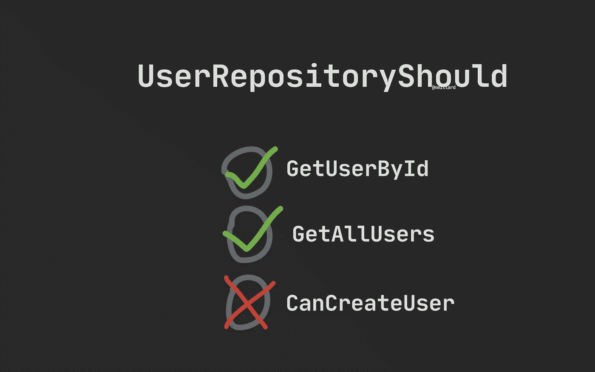

# 单元测试真的值得吗？

> 原文：<https://medium.com/geekculture/is-unit-testing-really-worth-it-cabb3b16e0a1?source=collection_archive---------9----------------------->

## 实用编程建议

## “这是浪费时间。我只是打了邮递员，看看我得到了什么”。

Image by [Nicklas Millard](https://medium.com/u/7c7a43b3d9de?source=post_page-----cabb3b16e0a1--------------------------------)

许多初学者经常问的一个问题是“单元测试值得吗？”、“我为什么要进行单元测试”，或者看到他们做出“测试是浪费时间”之类的论断。