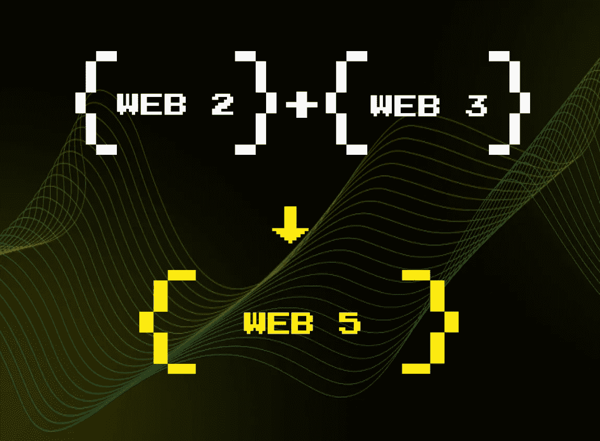

# Web5 是杰克·多西假想的以太坊在比特币区块链上的实现吗？

> 原文：<https://medium.com/geekculture/is-web5-jack-dorseys-imaginary-implementation-of-ethereum-on-the-bitcoin-blockchain-cfd8808bd6d?source=collection_archive---------9----------------------->

## 第 18 集

## 前 Twitter 首席执行官杰克·多西诞生了一个新的互联网标准，它将依赖于比特币闪电网络

推特的联合创始人和前首席执行官杰克·多西已经离开两个多月了