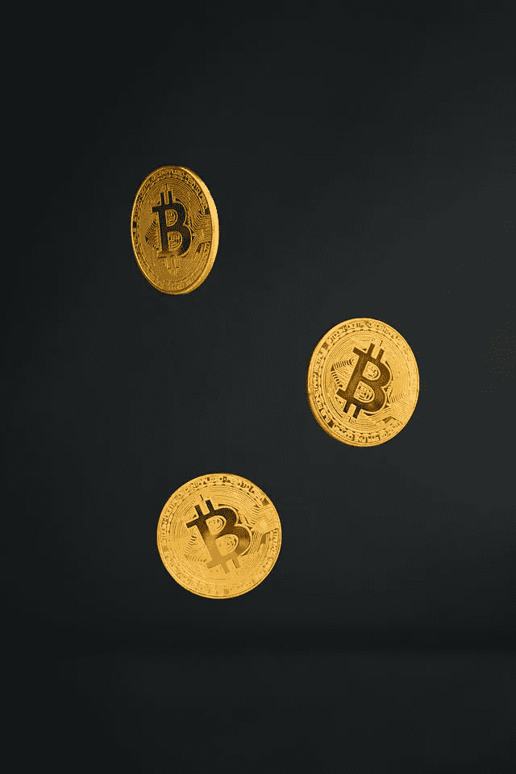

# 包装好的比特币(WBTC)值 29425.51 美元吗？

> 原文：<https://medium.com/geekculture/is-wrapped-bitcoin-wbtc-worth-29-425-51-915c1df2615b?source=collection_archive---------19----------------------->

市场先生喜欢**包装好的比特币(WBTC)** 。事实上，2022 年 5 月 24 日，CoinMarketCap 将包装比特币评为最受欢迎的加密货币。

同样，CoinMarketCap 在 2022 年 5 月 26 日将包装比特币的硬币价格定为 29，425.51 美元，市值为 81.01 亿美元，24 小时市场交易量为 4.14673 亿美元。那么，**包裹的比特币(WBTC)** 是什么，值 29425.51 美元吗？

