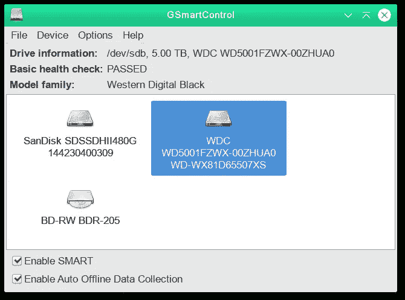
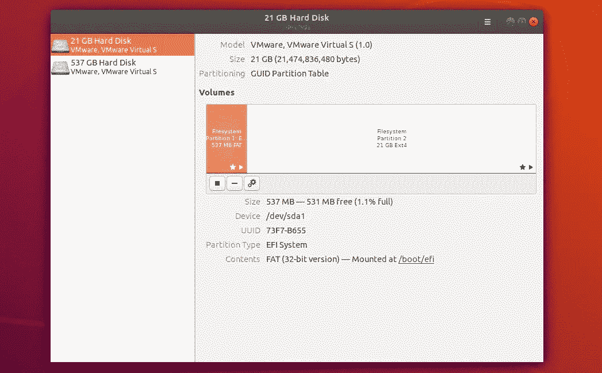

# 你的硬盘快没电了吗？

> 原文：<https://medium.com/geekculture/is-your-hard-drive-about-to-die-a4cef19e35ad?source=collection_archive---------17----------------------->

## 故障硬盘的故障诊断


Photo by [Art Wall - Kittenprint](https://unsplash.com/@artwall_hd?utm_source=medium&utm_medium=referral) on [Unsplash](https://unsplash.com?utm_source=medium&utm_medium=referral)

在运行的第 7 年之前，几乎一半的硬盘都会出现故障。某些类型的硬盘可能会更早损坏，而另一些可能会更晚损坏。并且根据制造质量，该分布的中间值可能向左或向右移动。例如，普通廉价的台式机/笔记本电脑硬盘的制造标准低于昂贵的网络连接存储硬盘。台式机/笔记本电脑用户的硬盘可能会比预期更早损坏。

以下是如何检查你的硬盘是否健康？

## 硬盘驱动器的结构


Photo by [engin akyurt](https://unsplash.com/@enginakyurt?utm_source=medium&utm_medium=referral) on [Unsplash](https://unsplash.com?utm_source=medium&utm_medium=referral)

这是硬盘的简化结构。你有一个盒子，里面装着一堆磁盘。这些磁盘包含数十亿个翻转的磁铁。这取决于可以代表 1 或 0 的方向。你有一个可以读取磁翻转的标题。要读取硬盘，它必须旋转。旋转速率决定了读写时间。

> 旋转速度越快，读/写时间越快。

数据的位置也决定了读写时间。如果你在大学里上过物理入门课，你就会知道这一点，那会教你角速度的概念。

Equation 1 by Dre Chang

所以圆盘外侧的速度比圆盘内侧的速度快。这意味着离磁盘中心越远，读写时间越快。而且数据之间的距离也决定了读写时间。您应该定期执行碎片整理，以尽可能紧密地分配数据。固态硬盘不受这些问题的影响。但是它们存在故障前写入次数较少的问题，因此寿命较短。

## 如何检查驱动器的健康状况？

无数的工具被设计用来监控你的硬盘驱动器的健康状况。然而，大多数软件所依赖的是智能工具。您可以在上使用以下命令安装 SMART 工具

**Debian/Ubuntu**

```
sudo apt-get install smartmontools
```

**Arch Linux**

```
sudo pacman -S smartmontools
```

**FreeBSD**

```
cd /usr/ports/sysutils/smartmontools
make install clean
```

您可以使用以下命令运行一个简短的测试。

```
sudo smartctl -t short /dev/sd*
```

并使用以下命令检查结果。

```
# Get attributes
sudo smartctl -A /dev/sdb# List out all of the results
sudo smartctl -l self-test /dev/sd*# List out all of the error results
sudo smartctl -l error /dev/sd*
```

## 如何自动检查？

做这样的事情有臃肿和不臃肿的方式。最不臃肿的方法是使用 cron 自动完成任务。一旦添加了 smart 工具，就可以添加以下命令来监视根 crontab 文件中的每个设备。

```
# Enables a periodic short test scan for a hard drive
# 1 AM every day
0 1 * * * smartctl -t short /dev/sd*# Enables a periodic long test scan for a hard drive
# 2 AM on Monday every week
0 2 * * 7 smartctl -t long /dev/sd*
```

然而，一些现有的 GUI 应用程序可以执行智能测试。

*   [GSmartControl](https://gsmartcontrol.shaduri.dev/)



Photo 1 from [https://gsmartcontrol.shaduri.dev/](https://gsmartcontrol.shaduri.dev/)

*   [GNOME 磁盘工具](https://github.com/GNOME/gnome-disk-utility)



Photo 2 from [https://linuxhint.com/](https://linuxhint.com/)

这些测试并不能保证司机的健康。并且它仍然可能在任何时候失败。因此，建议您至少每周执行一次自动备份。有些人会争辩说，在云中备份数据可以直接防止数据丢失。然而，这是[在安全和隐私方面最糟糕的建议。](/@dretechtips/the-dark-truth-about-using-google-on-your-phone-2aec68041dbf)[的主要建议是建立你的企业云解决方案](/@dretechtips/how-to-dismantle-the-google-empire-e652bff6d2)。普通人无法[建立一个完整的企业数据备份解决方案](/geekculture/buy-enterprise-it-equipment-cheaply-in-2022-4356a4e20d46)。因此，对大众来说，最实用的建议是使用外部备份驱动器。

在评论部分留下您使用什么工具来执行智能测试的评论。

## 为什么硬盘会出故障？

驱动器故障最常见的原因是数据损坏。

*   制造商的过失
*   过热
*   机械故障
*   损坏/无效的数据
*   意外电源故障

请在评论区发表评论，说明为什么您的最新硬盘会出现故障或即将出现故障。

## 当你的硬盘出现故障时该怎么办？

硬盘故障意味着您的计算机将无法启动。步骤[有点类似于在 Linux 上忘记根密码时如何重置它](/@dretechtips/how-to-reset-the-root-password-on-any-linux-os-7b2075eed7dc)。你有两种选择:把它取出来，插入另一台运行中的计算机。或者，您可以在现有计算机中添加另一个工作正常的硬盘，然后从该计算机启动。第一步是检查你的硬盘是否能运行。跑不起来就是没电了。假设电源正常工作，这意味着硬盘驱动器已经完全死亡，因为调节电源的模块出现了故障。假设没有发生备份，您将需要获得新的驱动器或雇用数据恢复专业人员来恢复数据。但是，您可能会听到硬盘上的咔哒声。有时这并不意味着什么，但是，这通常是驱动器出现故障或即将出现故障的信号。一旦它开始运行，你就要检查操作系统是否能检测到硬盘。检测并不意味着该驱动器上的数据是完整的。您需要运行智能工具来检测错误。它将检查[数据是否与奇偶校验位](https://www.tutorialspoint.com/what-is-a-parity-bit)匹配。失败意味着数据被搞乱，必须恢复。有时您将能够恢复数据。您可以尝试运行软件工具来修复错误。但是错误是硬盘将来会有更多错误的标志。所以问题是你想不想把罐子踢到马路上去？假设数据是可恢复的，那么建议尽快将其转移到另一个驱动器。

## 最后

IT 和工程领域是快速发展的领域。跟不上意味着你将被落在后面。跟上的最好方法是保持最新的新闻和教育内容。[订阅免费电子邮件列表，将你的职业生涯提升 10 倍。](/subscribe/@dretechtips)

**加入我们，因为 50 多名想要快速提升职业生涯和知识基础的人已经注册。**

达到这一点可能意味着你同意大部分已经写了。留下大量掌声，让算法向大众推广关于自助服务技术的不受欢迎的观点。

**相关内容:**

*   [如何备份您的媒体状态？](/geekculture/how-to-backup-your-media-presence-b1b5a9125159)
*   [快速简单的安装 Arch Linux 的方法](/geekculture/the-quick-and-easy-way-to-install-arch-linux-70b9bfc35863)
*   [Linux 内核初学者指南](/geekculture/the-beginners-guide-to-the-linux-kernel-29743b1a2daf)