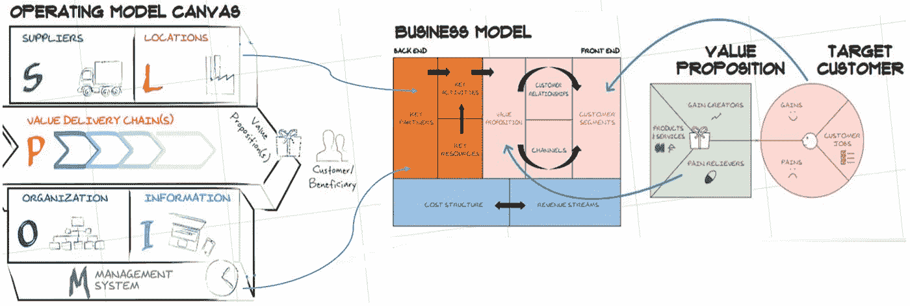

# 你的 it 运营模式准备好数字化了吗？

> 原文：<https://medium.com/geekculture/is-your-i-t-operating-model-ready-for-digital-part-i-954971007c22?source=collection_archive---------9----------------------->

企业构建设计运营模式、重塑信息技术和加速数字化转型的关键维度。

Your I(&T) Operating Model is the Backend of your Enterprise Business Model. Image credits [here](https://www.flickr.com/photos/remo-knops/37386896094/in/photostream/)

# “您的 it(&)运营模式准备好数字化了吗”系列的一部分

🔘*第一部分:* ***运营模式精选。***

🔘 [*第二部分*](https://jhadnr68.medium.com/is-your-i-t-operating-model-ready-for-digital-part-ii-5fd65ddffa30) *:* ***为什么你的 I( & )T 运营模式应该是任何企业运营模式的中坚力量。***

🔘*第三部分:* ***打造自己的 I( & )T 运营模式菜谱。***

# 开始之前

# 放弃

**本帖为个人中帖**。这里表达的任何观点仅属于作者，并不反映作者曾经或现在隶属的任何公司或组织的任何观点或意见。点击查看完整免责声明[。](https://jhadnr68.medium.com/disclaimer-70803d581009)

# 第一部分: ***运营模式提炼。***

# 📝1 |运营模式。

你的企业开始了一个新的战略周期。

您需要讨论并随后设计一个与新的企业战略高度一致的新的信息技术战略。

您的策略可能只是企业范围或领域范围的。

你会见了一群经理和其他人，在长时间的战略规划会议上集思广益。

您与一些顾问进行了交谈，以了解变革背后的一些驱动因素。

您与其他业务部门讨论了如何设定您的范围和界限。

经过一些迭代，您收集了有价值的信息、许多有价值的见解和许多宝贵的反馈。但是，您意识到您刚刚制作了一份文档或演示文稿草稿的候选人。

> ⛐ ❝ **不知何故，你会觉得自己错过或隐瞒了战略的全部内容。** ❞

你知道你需要一个实施计划。而且，尽管你可能会尝试，但现在画它变得很有挑战性。你寻找一些关于如何草拟计划的指导。

在你的最后一页笔记上，你已经写下了一组**目标**。它们与引导你踏上新旅程的思维导图密切相关。最后，你会看到一扇门，向你展示你的最终目的地，你想要的最终目标。

你已经写下了一个接近你“梦想”的“日期”任何战略周期都有一个“结束日期”。

你终于意识到推动“梦想”前进是你的任务、工作和责任。

但是这是什么意思呢？

如果你开始让每个人都为即将到来的变化做好准备，这将会有所帮助。这一次不再是战略，也不是计划或执行。

这是为了确保企业做好前进的准备。

> 💣❝突然意识到，重新设计和实施一个适用的运营模式变得至关重要。❞

你坐下来，意识到这是反思设计一个**新颖而有效的**运营模式的真正重要性的最佳时机。

你知道所有已经收集的支持新设计的新需求已经为不同的能力和成熟度等级建立了新的**雄心勃勃但富有挑战性的目标。**

**您认为**定义的目标是交付期望的企业能力所必需的。并成功交付新的企业战略。但是你知道有些人会很有挑战性。

你知道你将需要**透明地列出、清晰地表达并与任何人交流“梦想”以及随后变化背后的东西。你需要每个人帮助你打开思维导图的大门。**

现在，你对未来的挑战已经很清楚了。

## 战略

首先，你再次回到你的策略。因为你知道，无论如何，你都需要让你的新运营模式与你的战略保持一致。

你知道你需要陈述“如何明确地”:

*   **作为新战略的结果，企业计划如何实现其目标**。
*   **“如何”企业在实践中执行新战略**及路径追溯。
*   **【如何】**这些路径将允许企业**创造价值**(“如何取胜”)。

你知道运营模式不是一个静态的结构或静态的组织模式——甚至更少，不仅仅是一些新的组织层级的设计。

> 💡❝:相反，你意识到你需要建立一个动态的框架，让你的运营模式不断适应你的企业生态系统和不断变化的环境。❞

当**做得正确**时，运营模式服务于其最初的目的——**它成为对你的企业生态系统有兴趣或发挥作用的每一个人的活的、一致的和连贯的指导**。

你知道，**如果处理得当**，对于员工、客户、供应商、(外包)供应商和你的生态系统中的其他合作伙伴来说，它应该**阐明每个人在实现企业目标的过程中在企业边界内扮演的角色**。

你知道，**如果做对了**，它应该明确地**向经理和领导展示透明度。**

你知道，预先清楚的理解将使每个人都积极主动，并实现有效的领导和团队参与。

你知道**提前获得清晰的理解**总是比事后**授权一个“特别管理风格的领导”更可取**

你已经知道反过来是行不通的。

> 😄️ **❝你希望你的团队带给你解决方案，而不是问题。你知道最好在 start❞之前避开他们**

你知道，**如果做对了**，你的业务利益相关者、管理层成员或任何其他股东应该清楚地**阐明企业如何确保核心关键能力被开发、实施、操作、维护和交付。**

但是你也知道，要把事情做好，你需要时间去做好！

但是在剩下的时间里，你将如何有效地做这件事呢？

> 💣❝:这就是文化和治理最终与你相遇的时候。 ❞

## 文化

**最近你** [**阅读了**](/geekculture/culture-is-the-fundamental-enabler-of-any-successful-strategy-3e8622ea7826) **关于为什么文化是任何成功战略的根本促成因素。**

 [## 文化是任何成功战略的基本促成因素

### 不要让文化在早餐时吃掉你的策略

medium.com](/geekculture/culture-is-the-fundamental-enabler-of-any-successful-strategy-3e8622ea7826) 

今天，人们仍然倾向于将战略、计划和执行视为任何战略旅程中独立且非常不同的实体。

> 💣我认为，在这个快速变化的世界里，❝这个名字可能看起来有点过时了。❞

“文化在早餐时吃策略”这句传统名言如今听起来可能仍然有些耳熟。或者也许“**文化压倒一切”**是无稽之谈，因为文化压倒战略可能已经是一个陈腐的想法。

你往后一靠，意识到也许有更好的方法让企业追求更一致和持久的变革。

> 🚀❝认为，持续而持久的变革将推动文化变革。战略自然会随之而来。❞

## 领导力

你认为领导力对于变革和战略的成功至关重要。

> 真正的领导者是那些能够引导人们改变体制的人。

你认为，任何担任新职位或领导角色的人都必须始终接受推动文化变革的思想任务。

你认为新的领导者需要**消除(企业的)战略、规划、执行和架构之间的障碍。**他们必须不断提醒自己，他们是变革的真正推动者。

> **新的领导者需要支持“自发的领导者”**

> 📢❝Always 与充分透明的一致性的思想，自由思想，态度和行动，作为您的战略旅程的关键成分。❞

你意识到，领导者应该稍微放松一下，不要把文化变革推得太紧，不管他们认为文化是制定新战略的推动者还是障碍，

**这是人生的一课。生活教会了你:**

> 文化不仅仅是新战略的一个方面。
> 
> 文化不仅仅是游戏的一部分。
> 
> 文化才是真正的游戏。

> 📢❝与企业文化不一致的战略将永远注定失败。 ❞

阅读最近的麦肯锡调查，你强调了三个数字文化缺陷:**功能和部门孤岛，害怕冒险，难以形成和按照客户的单一观点行事。**

 [## 数字时代的文化

### 组织文化的缺陷是公司在数字时代取得成功的主要障碍之一。那是一个…

www.mckinsey.com](https://www.mckinsey.com/business-functions/mckinsey-digital/our-insights/culture-for-a-digital-age) 

仔细地看，你会注意到一些重要的发现——**风险厌恶、客户关注度低，以及封闭的心态**。

> 📢❝:你认为这些问题长期困扰着组织，在当今的数字世界中，解决这些文化问题不再是可选的。❞

 [## Joao Rodrigues 在 LinkedIn 上写道:文化是任何成功战略的基本推动力

### 文化是任何成功战略的基本促成因素吗？#领导力#变革#战略#文化#规划—我们…

www.linkedin.com](https://www.linkedin.com/posts/joao-rodrigues-276529174_culture-is-the-fundamental-enabler-of-any-activity-6898745086612426752-QWY2) 

> 💡❝:这就是为什么我认为文化仍然是任何成功战略的基本推动力。这就是为什么我认为需要有一种更好的方式，而不仅仅是试图不断调整文化和战略。❞

## 体系结构

你意识到要记住的关键事情是**找到将战略和执行与尊重文化相结合的附加值**。

 [## 现代工作场所的战略性创新认可和奖励计划——第二部分

### 企业领导者有效设计创新“激励/认可/奖励计划”的完整指南

medium.com](/geekculture/a-strategic-recognition-reward-program-for-the-modern-workplace-series-part-ii-349d7b2685a8) 

仔细观察，您会发现该企业处于您变革议程的中间。**不管怎样，企业永远在。**

> 不要搞错了。在某个时刻，你需要开始理解**组织可能会如何前进**(以及它是否能有所行动)。当策略塑造你的新路径时，你需要准备计划，并为最终的执行和监控做好准备。

> 🙈❝:这就是为什么我一直说，我们必须尽最大努力，也防止建筑在早餐时吃文化。❞

你知道你需要找到一个更好的方法来塑造新的道路，并允许改变发生。企业将永远在变化的议程中占有一席之地，所以**企业现在是你的焦点。**

你没有争论和讨论调整文化和战略的利弊，而是决定这可能是一个更好的方法。正确的方法。

**你终于决定专注于**

> 🤔❝企业架构。❞

**(企业的)新架构是你现在的新焦点。**

你提前思考每个人如何才能在**战略之旅**中发挥自己的最大能力，加入**文化**和**领导力**。您还会想到它会如何影响**治理**。

> 要想成功，每个参与其中的人都需要从头到尾努力采用这种心态。
> 
> 否则，我们将不断错过您的目标。
> 
> ***而我们注定要失败。***

> 🤔❝记得，始终关注建筑变化。因为建筑也可以吞噬 breakfast❞的文化

你看着桌上的选择。

无论哪种方式，你都相信领导者可能会改变(企业的)架构。或者他们最终会**随着架构的改变而改变自己。否则他们将被从永恒和古老的记忆中清除，永远被禁止。**

你知道如果你最终选择了自己的立场，那将会有很大的帮助。

你知道你需要选择正确的一边。

 [## LinkedIn 上的 Joao Rodrigues:没关系，但企业架构有| 22 条评论

### 企业架构宣告死亡，以及为什么它永远不会发生。没关系，但是企业…

www.linkedin.com](https://www.linkedin.com/posts/joao-rodrigues-276529174_it-doesnt-matter-but-enterprise-architecture-activity-6891664868471037952-jYw6) 

> 📢❝:如果文化是任何成功战略的基本推动者，那么企业架构应该是任何支持运营模式的成功实施的基本推动者。❞

# 🚶2|运营模式的演变。发生了什么事？

## 从 IT 运营模式到 IT 运营模式

大多数企业一直在寻找最适合其 it 运营模式的**。他们一直在寻找更好的方法来支持不断变化的企业数字化战略和转型。**

**你知道那也是你的梦想。你相信你企业的梦想。**

> 🚴❝:你的转型之旅总是从重塑你的运营模式开始。❞

你知道现在需要的不仅仅是这些:**你需要从 IT 运营模式转移到新的 I( & )T 运营模式。**

> ❝信息技术运营模式将范围扩展到了信息技术组织和功能之外。它涵盖了整个 Enterprise❞的信息和技术层面
> 
> **—高德纳**

你知道每个企业都有一个 I(&T)运营模式，不管他们有没有意识到。您认为模型代表了执行业务战略所需的**核心 I( & )T 能力。以及企业**如何协调这些能力以实现其战略业务目标**。**

> ✍ ❝，因为它简单地展示了“企业应该如何做 things'❞.”

**你知道这同样适用于策略——显式或隐式定义。**

你考虑新运营模式的基本信息技术层面。您带来了与您的业务和企业运营模式一致的其他问题。

你突然意识到你正在构建一个新的**架构运营模式**。

**其实:**

> 🔎❝架构运营模式定义了如何为 Change❞设计企业架构

为了达到这个目标，你知道你将面临额外的挑战——比你开始时想象的要多得多。

你知道你将需要设计超越传统 IT 组织范围的新运营模式**。**

你也知道你需要考虑更广泛的商业背景，并了解你的利益相关者对它应该提供的角色和价值的新期望。

你再次意识到，事实上

> IT 界最大的挑战是让人们以一致的方式一起工作。
> 
> **——**[**史蒂夫·琼斯**](https://blog.metamirror.io/can-we-stop-lying-about-what-it-is-about-92df7ba9a420)

你的期望和挑战越来越高了！

界限越来越模糊！您已经知道您需要超越传统的 IT 组织范围进行思考。

令人惊讶的是，你在笑，因为

> 将范围扩大到 I( & )T 现在是一个挑战。
> 
> 它可能不像以前那么重要了。
> 
> **但是企业架构肯定是。**

> 🙋如今，❝企业架构在支持新的 it 运营模式设计方面发挥着至关重要的作用。这是目前该行业面临的一个真正的挑战。❞

## 设计变更

在对内部 IT 职能和 IT 结构进行必要变革的过程中，您坚信**企业架构需要理解和解释变革背后的挑战**。

**您认为企业架构需要为企业中的每个人阐明并更好地支持新运营模型背后的理解**。

**您认为变革不仅仅是采用新的平台或技术。它还涉及新的工作方式、新的开发方法、新的融资模式、新的技能、新的价值链和新的商业模式。**

> 🚧❝和所有这一切显然影响了企业文化和治理。❞

在变革之旅中，**您一直在思考为什么许多组织在设计和实施数字化转型方面仍然不成功。**

**他们为什么一直在努力寻找最合适的运营模式？**

经过几年的数字化转型(和数字化疲劳)，你发现可能原因只是太多**(或仅仅)****关注变革(和问题)的技术层面**。

> 数字化转型还与人、新的领导和工作方式有关。下一波数字化转型应关注当前价值链的变化，并在结果而非过程上提供价值。

**但是当你跟随** [**领导网**](https://jhadnr68.medium.com/leadership-mesh-a-new-paradigm-to-lead-organizations-in-disruptive-times-c2e575a89fd2) **小道****的时候，你也提醒了** [**领导童话**](https://www.linkedin.com/posts/joao-rodrigues-276529174_the-leadership-fairy-tale-activity-6891530440235122688-gL7v/) **。**

你认为这些是你 it 运营模式的基本要点。

> 🤔❝一些领导者仍然缺乏必要的理解，不知道这种转变意味着什么，不知道如何从当前的现状模式转变为新的未来模式，不知道如何将变革与文化相结合，不知道如何塑造新的道路，也不知道如何更好地阐明变革背后的原因，以设计和交付新的 it 运营模式。❞

当你这样认为时，你只是在提醒自己:

> *😄️ ❝动机让你得到 started❞*
> 
> ❤️ ❝:但真正让你前进的是内心！❞

# 在你走之前

如果你想收到我未来的文章，请在[媒体](https://jhadnr68.medium.com/)上关注我。如果你喜欢“**上的这个，你的 I( & )T 操作模型准备好数字化了吗？****系列**，我想你也会喜欢它剩下的部分。

你可以在这里给我买杯咖啡来支持它。或者只是分享你的反馈。

**敬请期待！**

*在这一部分中，我已经重点介绍了一个什么样的* ***I( & )T 运营模式*** ***是*** *和* ***为什么以及它如何改变了*** *。*

*在* [*第二部分*](https://jhadnr68.medium.com/is-your-i-t-operating-model-ready-for-digital-part-ii-5fd65ddffa30) *中，我将重点介绍* ***为什么你的 I( & )T 运营模式应该是任何企业运营模式*** *的支柱，以及你应该将哪些* ***关键成分*** *作为* ***设计变革*** *的诀窍。*

***最后，在第三部分*** *中，我将重点介绍如何挑战你的菜谱中的* ***食材，并推广你的****T 运营模式*** **的设计**** **。**