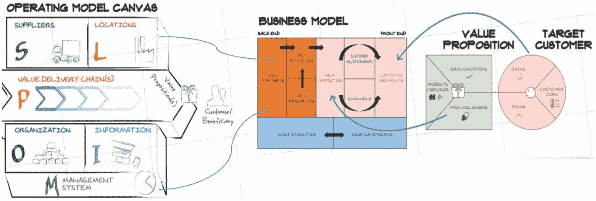
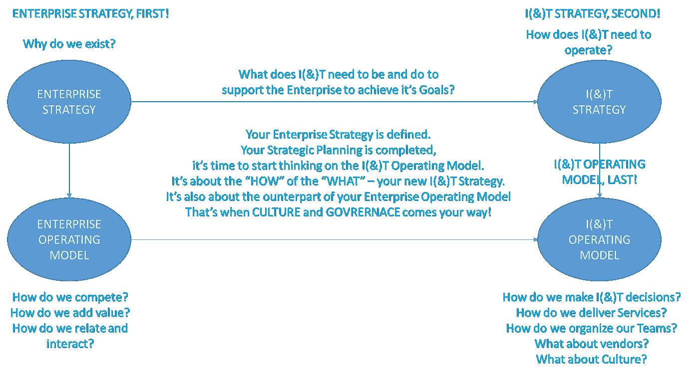
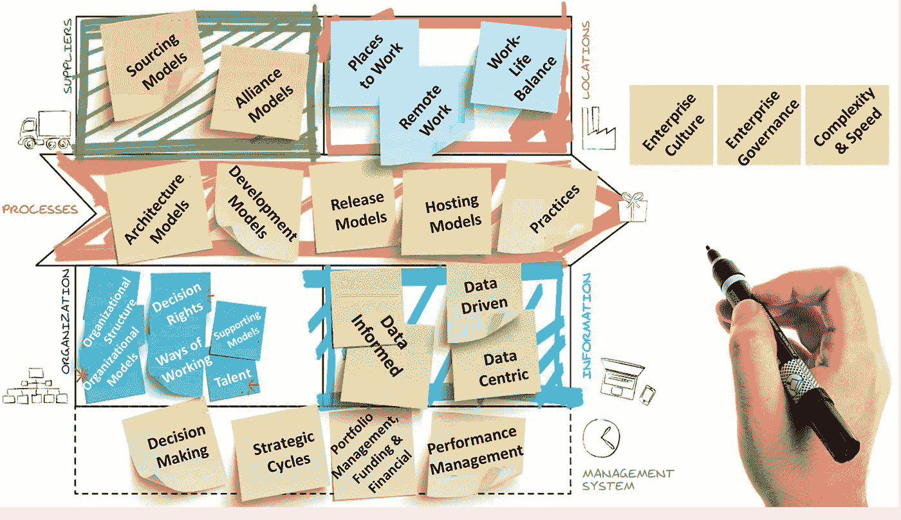
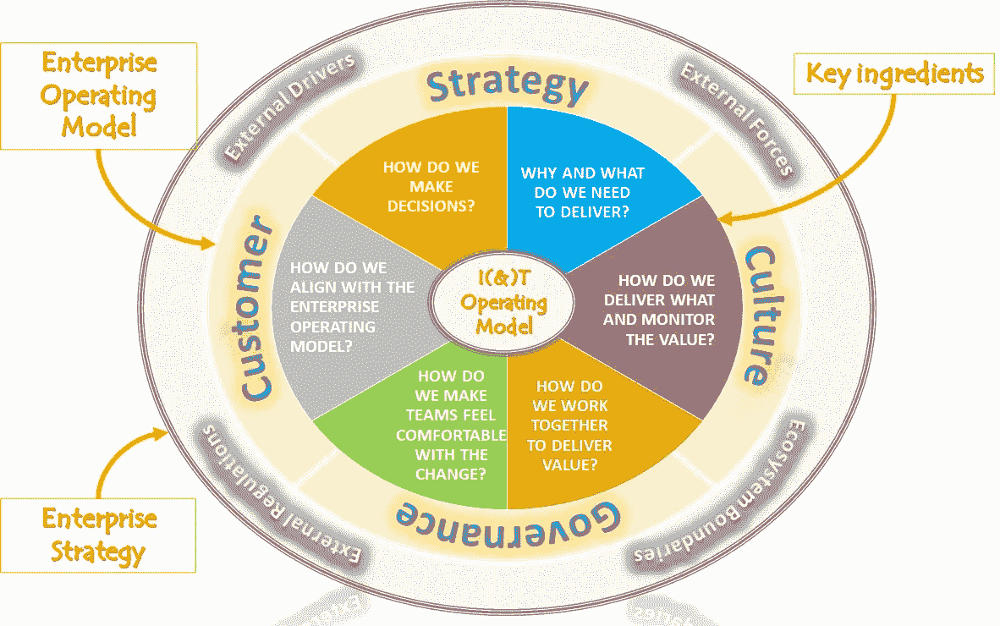

# 你的 it 运营模式准备好数字化了吗？

> 原文：<https://medium.com/geekculture/is-your-i-t-operating-model-ready-for-digital-part-ii-5fd65ddffa30?source=collection_archive---------13----------------------->

企业构建设计运营模式、重塑信息技术和加速数字化转型的关键维度。

Your I(&T) Operating Model is the Backend of your Enterprise Business Model. Image credits [here](https://www.flickr.com/photos/remo-knops/37386896094/in/photostream/)

# “您的 it(&)运营模式准备好数字化了吗”系列的一部分

🔘 [*第一部分*](https://jhadnr68.medium.com/is-your-i-t-operating-model-ready-for-digital-part-i-954971007c22) *:* ***运营模式提炼。***

🔘*第二部分:* ***为什么你的 I( & )T 运营模式应该是任何企业运营模式的中坚力量。***

🔘*第三部分:* ***打造自己的 I( & )T 运营模式菜谱。***

# 开始之前

# 放弃

**本帖为个人中帖**。这里表达的任何观点仅属于作者，并不反映作者曾经或现在隶属的任何公司或组织的任何观点或意见。点击查看完整免责声明[。](https://jhadnr68.medium.com/disclaimer-70803d581009)

# 第二部分:为什么你的 I(&)T 运营模式要成为任何企业运营模式的主干？

# 🤔3|信息技术运营模式的基础

## 使用结构化方法

你知道，激发挑战新运营模式核心能力的因素是强制性的。

对于一个成功的 I( & )T 运营模式，你需要看看配方的关键成分。

你知道构建一个组织的第一步是持续预测并交付业务期望。

> 💡❝:这就是为什么你认为预先分析和理解运营模式设计背后的基本原理是至关重要的。❞

你知道你需要**调整**你的新 **I( & )T 目标运营模式**与你的新**战略**。

你知道你应该明确地定义它。**清晰和完全透明至关重要**，简单不应该是事后的想法。

您将需要**沟通**设计背后的东西——**要做的事情**(交付期望功能的优先级和计划)**企业应该如何做事**，以及如何处理**界限**、**决策制定、**和**权衡。**

你知道那些事情肯定会妨碍你。

> 🔧❝:你知道这对 IT 部门来说是一个相当大的任务。❞

但是你感到舒服，因为你知道

> “透明并不意味着分享每个细节。
> 
> 透明度意味着为我们做出的决策提供背景。"
> 
> **——西蒙·西内克**

**你以后想想如何利用一些战略框架的帮助。你知道这将有助于你为你知道以后需要做的决定设定背景。**

> 🤦❝如果有疑问，请不要。使用结构化的方法总是会产生更好的结果。❞

**你认为使用这样一种结构化的方法是你选择的过程中至关重要的一步。您将需要新的能力来支持您的战略，而这些能力将不再局限于您的 IT 组织的传统界限。**

**你知道你不应该以传统的 IT 组织和价值链活动为中心来设计你的新 IT(&)运营模式。你知道，如果你把设计限制在这些界限之内，执行数字战略是不够的。**

你开始寻找你新的**获胜愿望，从新的**战略**中寻找一些指导原则，并了解**企业将在哪里发挥**和**它将如何赢得**。将这些集群放在你的思维导图上可以更容易地想象出 **I & T 运营模式必须如何相应地改变。****

**你现在已经知道你需要交付哪些新功能**以及你需要实施哪些**新管理系统**。

您会意识到，在这个新的数字世界中，**与信息和技术直接相关的每个职业或角色都完全跨越了企业的传统 IT 界限**。数字素养**现在应该** **成为这两个领域的核心 IT 价值主张和服务提供的一部分——这是一个与过去的传统影子 IT 截然不同的视角。**

所有 IT 服务产品和交付现在都需要数字化。

> 📝❝'As-a-Service.的“通过设计”“自助服务”。❞

然而，你也很清楚:

> 🔎❝从来没有放之四海而皆准的运营模式。运营模式针对旨在应对特定业务环境新挑战的战略进行了优化。始终着眼于尊重的文化。❞

## 设定你的界限

您知道您的业务环境的**边界可能会变化**，并且**限制和约束与您的决策环境非常相关。**

在此阶段，您决定至少考虑:

*   你的**商业模式**
*   你的**企业运营模式**
*   新**企业战略**
*   **人员、流程、信息和技术**
*   新的**价值利益相关者期望从 I( & )T** 支持新企业战略的目标。

> 不要忘记，因为 it(&)运营模式的目标是有效地支持您的新战略，所以需要对其进行监控、审查和改进，以确保您的战略执行能够交付预期的业务成果。

你知道你总是需要**把企业运营模式作为一个整体来考虑**——企业是如何做事的——以充分受益于新的信息技术运营模式。

**你总是提醒我:**

> “要了解一家公司的战略，要看他们实际做了什么，而不是他们说他们会做什么。”
> 
> **——英特尔前 CEO 安迪·格罗夫**

您必须了解如何协调这两种模型，并确定需要更改和调整的内容。

**您还记得，您的企业运营模式为您的新 it(&)运营模式提供了环境，而不是相反。**

**作为领导，你终于记住了:**

> ⌚ ❝:如果你的企业运营模式还没有为数字业务做好准备，这将成为你新的信息技术运营模式的一个制约因素。因为一个有效的模型简单地描述了价值是如何被 Whom❞创造的

**当你闭上眼睛，你可以看到这样一幅图:**

Enterprise and I(&)T Strategy and Operating Models: Better Together!

作为一名领导者，你知道领导力对于变革和战略的成功至关重要，并使企业和我(T47)T 团结一致。

**作为领导者，你相信:**

*   领导者应该准备好领导整个企业所需的变革。
*   领导者应该**支持新方法，以交付新的 it(&)运营模式**。
*   领导者应该通过创造共同愿景来发挥带头作用。
*   领导应提供**目标** I( & )T 运行模式的预期结束状态的**清晰画面。**
*   领导者应**实现有效的计划**和**协调所有维度的所有变更**。
*   领导者应**确保**所有方面的变化都**一致**和**累积**，同时**提高每个成熟度级别**(假设过渡期间混合模式将始终存在)
*   领导者应该专注于**不断发展的 I( & )T 运营模式**
*   领导者应**确保**所设计的 I( & )T 运营模式与**企业战略**和执行所需的**企业成熟度**保持一致。

**作为领导者，你知道企业架构需要处于核心地位。否则，校准将会失败。**

> 💡❝:这就是为什么我认为文化仍然是任何成功战略的基本推动力。这就是为什么我认为需要有一种更好的方式，而不仅仅是试图不断调整文化和战略。❞

# 🤔4|改变的秘诀

**你以为自己快到了。**

**但是你认为大多数企业仍然缺少一样东西——变革的秘诀**。和任何其他战略之旅一样，没有提前理解和建立这样一个配方通常是失败的征兆。

**但是，为什么这样的配方与支持战略之旅如此相关呢？**

你知道你的业务变化很快。在这个快速变化的商业世界中，您的企业需要新的信息技术运营模式。

**你知道这对 IT 行业来说也是如此。而且你知道你的生意现在多了我(& )T.**

那是你新的商业领域。

> "运营模式通常是非结构化遗产的结果，而不是有意构建的结果."
> 
> **——罗兰·比格**

你知道现在是你最后一次拍摄的时候了。

您的选择是**向过时的运营模式(您的传统 IT 运营模式)增加增量**还是构建**符合新战略的适用运营模式**(您的新 IT(&)运营模式。

> 💡❝:你是喜欢像以前一样继续运营——“这是我们一贯的做法”——还是决定改变——因为你相信这会让企业实现其目标？❞

你现在终于被说服了！

不管你最终的决定如何，这都是一个绝佳的时机。

**您需要彻底反思和重新设计 IT 职能，以支持新战略和改变企业。**

文化和治理将随之而来。

你现在已经回答了最后一个问题。

> 💡❝:为了交付新的架构运营模式并最终实现变革，IT 需要推广哪些新的数字管理功能？❞

你用大写加粗字母写下整个问题。你会选择一张大的便利贴，因为你知道你以后会需要用它来帮助和提醒你的最终决定。

你知道你需要很多空间来放置相关的材料。

## 关键成分

**做决定的时刻终于到来了。**

你往后一靠，开始起草一些笔记。

> **I(&)T 运营模式配方的关键成分是什么？**
> 
> **您将如何确保 I( & )T 运营模式与企业运营模式保持一致？**

对于第一个问题，你决定把它移到一个相当大的大写加粗的位置。你突出了所有的字母。他们都对你很重要。

> 💡❝新企业架构运营模式的关键要素是什么？❞

对于最后一个问题，你再次看你面前的白色棋盘。

**你之前很早就知道，你的 I( & )T 运营模式要覆盖你企业商业模式的后端。**

**永远永远！**

Yout I(&T) Operating Model is your enterprise business model’s back end. Image credit from [https://www.flickr.com/photos/remo-knops/37386896094/in/photostream/](https://www.flickr.com/photos/remo-knops/37386896094/in/photostream/)

你翻页，现在开始**画**。绘画给你心灵的自由和自由的思考。

你从之前的笔记页中选择每个单词，然后建立草图设计。

**你认为每个人都很开心，因为已经有了一个新的、公开的、众所周知的企业战略。**

但不是你。

你还记得你曾经几乎确信你的 I( & )T 策略也是设计好的。但现在你知道这不再是真的了。

因为你意识到你才刚刚开始。

你意识到你需要设计如何前进，因为这是你新的信息技术运营模式的核心，以支持你新的信息技术战略。没有它，你永远不会有真正的战略。

这就是你最后得到的——这就是你的草图的样子。

现在你只有一个草图——类似这样。

Key Ingredients of your I(&T) Operating Model. Image credit from [https://www.vanharen.net/wp-content/uploads/sites/29/2017/03/OMC1.jpg.png](https://www.vanharen.net/wp-content/uploads/sites/29/2017/03/OMC1.jpg.png)

那是你用来将关键材料分类的思维方式。

Critical ingredients of your I(&T) Operating Mode. Image credits from [https://implementconsultinggroup.com/media/8819/digital-operating-model_fig01.jpg](https://implementconsultinggroup.com/media/8819/digital-operating-model_fig01.jpg)

我们如何做决定？

1.  战略周期
2.  决策

**我们为什么以及如何交付什么？**

*   投资组合管理
*   融资和财务

我们如何交付？

1.  架构模型
2.  发展模式
3.  发布模型
4.  托管模型
5.  练习

**我们如何共同努力实现目标？**

1.  工作方式
2.  决策权和新角色
3.  支持模型
4.  组织模式
5.  组织结构
6.  采购和联盟模式

我们如何让团队对变化感到舒服？

1.  工作场所
2.  远程工作
3.  工作生活平衡
4.  才能
5.  性能模型

**我们如何与企业运营模式保持一致？**

1.  企业治理
2.  企业文化
3.  复杂性和速度

这就是你在素描中捕捉梦想的方式。名单已经很长了。

但是你喜欢你的画，它看起来很可爱。你会觉得这开始变得有意义了。流动是有意义的，在点与点之间建立了隐藏的联系。

你决定是时候休息一下了。你需要反思。

**你意识到你需要了解每一个维度的内容。**

**从你今天所在的地方画出你明天想去的地方会有所帮助。因为你已经知道在你的旅程中你需要提高哪些能力。**

你想走多远？

**而企业允许你走多远？**

> 💡❝，你很久以前就已经知道，这个世界从来就不是只有“黑与白”的。幸运的是，让它成为 colorful❞取决于你

> 你知道你的道路是艰难的。
> 
> **但那只是因为你的目的比你想象的要大。**
> 
> **—励志名言**

# 在你走之前

如果你想收到我以后的文章，请在 [Medium](https://jhadnr68.medium.com/) 上关注我。如果你喜欢“**上的这个，你的 I( & )T 操作模型准备好数字化了吗？****系列**，我想你也会喜欢它剩下的部分。

你可以在这里给我买杯咖啡来支持它。或者只是分享你的反馈。

**敬请期待！**

*在* [*第一部分*](https://jhadnr68.medium.com/is-your-i-t-operating-model-ready-for-digital-part-i-954971007c22) *中，我已经重点介绍了一个什么样的* ***I( & )T 运营模式*** ***就是*******为什么以及它是如何变化的*** *。**

**在第二部分中，我强调了* ***为什么您的 I( & )T 运营模式应该是任何企业运营模式的支柱*** *以及哪些* ***关键要素*** *您应该用作* ***设计变革*** *的诀窍。**

****最后，在第三部*** *中，我将重点介绍如何挑战你食谱中的* ***食材，并推广你* ***【我】(& )T 运营模式*** *的设计。****