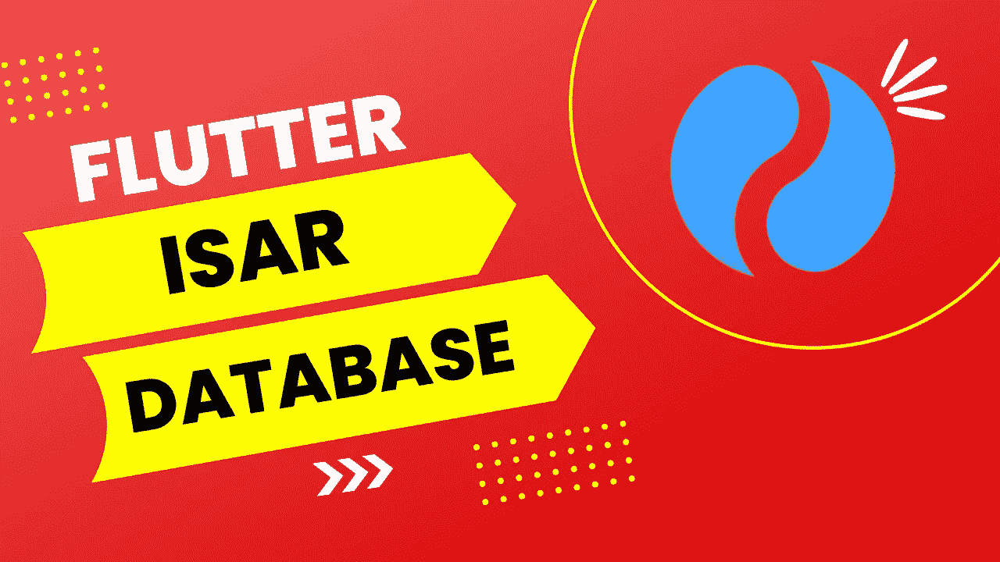
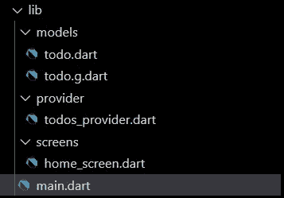
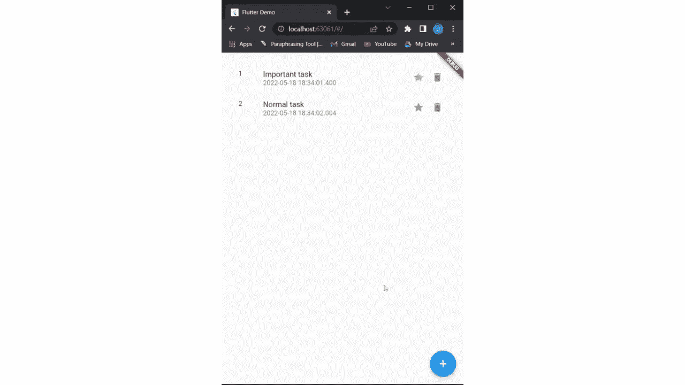

# Isar 数据库:如何使用 Flutter | Todo 应用程序

> 原文：<https://medium.com/geekculture/isar-database-how-to-use-it-with-flutter-todo-app-978a2d7c85dd?source=collection_archive---------1----------------------->



大家好，在这篇文章中，我们将看到如何在 Flutter 中使用 [Isar](https://pub.dev/packages/isar) 数据库。现在，你脑海中闪现的第一个问题是，既然有其他选择，例如[蜂巢](https://pub.dev/packages/hive)，你为什么还要使用这个新数据库。

# 为什么使用 Isar 数据库？

它是高度可伸缩的、快速的和跨平台的。
此外，它非常容易使用，并提供了大量的功能来过滤和查询数据库中的数据。
我们之前使用的是 Hive，但是加载大量数据需要很长时间。但是在转向 Isar 之后，我们现在能够在几毫秒内加载数据。

现在让我们直接进入实现。

# 怎么用？

因此，我们将使用 Isar 构建一个 Todo 应用程序，即使在关闭应用程序后，该应用程序也将保存数据。对于状态管理，我在这里使用了 **Provider** ，但是这不会影响数据库功能。

继续安装这个[链接](https://pub.dev/packages/isar)中提到的依赖项。

## 文件结构…



**models/todo.dart** →该文件包含一个定义 todo 项的类。
**models/todo . g . dart**→此文件由 Isar
**provider/todos _ provider . dart**→此文件包含所有状态管理
**屏幕/home_screen.dart** → UI 实现

## 待办事项模型

在 Isar 中，可以通过将类注释为 **@Collection()** 来定义数据集合。你可以在下面的代码片段中看到相同的内容。
同样，如果您需要一个字段是一个 **id** ，您可以将该字段注释为 **@Id()** 。我使用了 Isar 提供的自动增量器。

## 运行代码生成器…

现在运行这个命令，以便 Isar 可以为您的模型生成模式文件。

```
flutter pub run build_runner build
```

# 会计标准专家组数据库功能

首先，我们需要初始化数据库，为此您需要您想要使用的模式。

```
final isar = await Isar.open(
    schemas: [TodoSchema],
);
```

如果希望将数据库存储在特定位置，也可以传递一个目录路径。

## 获得所有待办事项…

为了在 Isar 中执行任何 CRUD 操作，我们需要一个事务。他们还将多个操作合并为一个单元。

有两种类型的交易可用，
、**。txn** →该交易仅可用于读取数据。
**。writeTxn** →该事务可用于读写。

```
await isar!.txn((isar) async {
    final **todosCollection** = isar.todos;
    **_todos** = await todosCollection.where().findAll();
    notifyListeners();
});
```

如你所见，我们可以使用**。其中()。findAll()** 获取所有数据。您也可以在内部指定任何条件。where()来查询数据。

## 正在添加待办事项…

现在我们将数据添加到数据库中，我们将使用**。writeTxn** 来执行操作。要添加或更新记录，您必须使用**。put()** 函数将返回添加/更新记录的 id。

```
void **addTodo**(Todo todo) async {
    await isar!.writeTxn((isar) async {
        int **id** = await isar.todos**.put**(todo);
    });
    _todos.add(todo);
    notifyListeners();
}
```

> 如果`id`字段不是只读的，Isar 将自动为对象分配新的 id。

## 正在删除待办事项…

要从集合中删除一个条目，您必须调用**。【id 删除】**功能，传递要删除的记录的 id。delete 函数将返回一个布尔值，表明删除成功。

```
void **deleteTodo**(Todo todo) async {
    await isar!.writeTxn((isar) async {
        bool deleted = await isar.todos.**delete**(todo.id);
        if (deleted) _todos.remove(todo);
        notifyListeners();
    });
}
```

## 正在更新待办事项…

这里我们将切换 todo 的 **isImportant** 字段。如果集合中存在该 id，则。put 方法将自动更新记录。

```
void **toggleImp**(int id) async {
    await isar!.writeTxn((isar) async {
        Todo? todo = await isar.todos.get(id);
        todo!.isImportant = !todo.isImportant;
        await isar.todos.**put**(todo);
    });
}
```

## 所有方法的完整代码…

# UI 实现

因为我使用提供者进行状态管理，所以这一部分对您来说可能不同，但是逻辑是相似的。
还有，只是为了教程，我是随机添加 todos 的。

# 这是最终的输出



这一次到此为止。希望你喜欢。

感谢您阅读至此。请务必留下任何建议和评论👏为了这个故事。