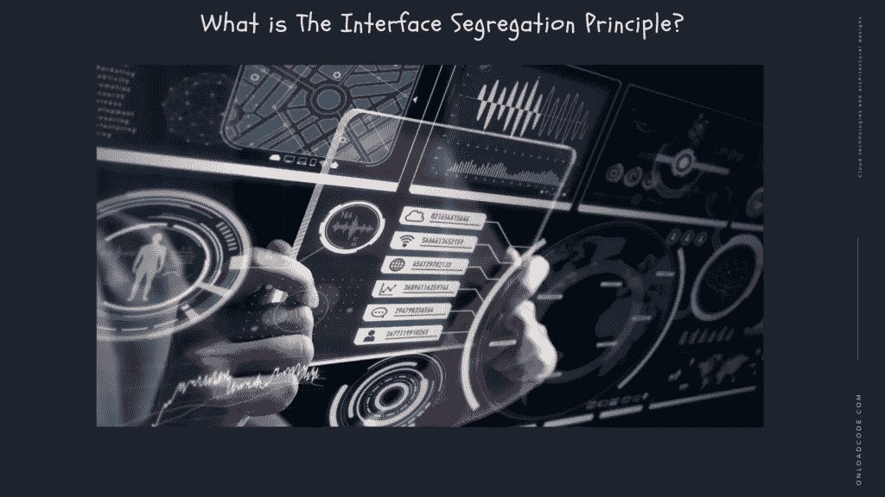
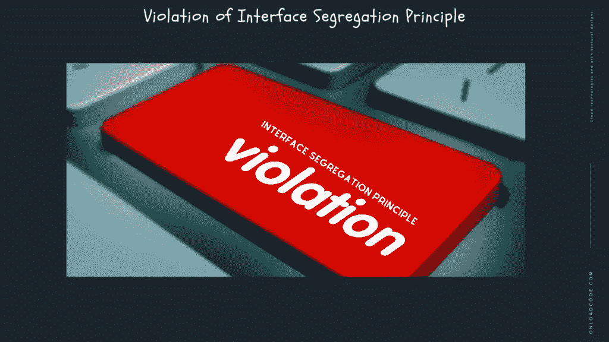
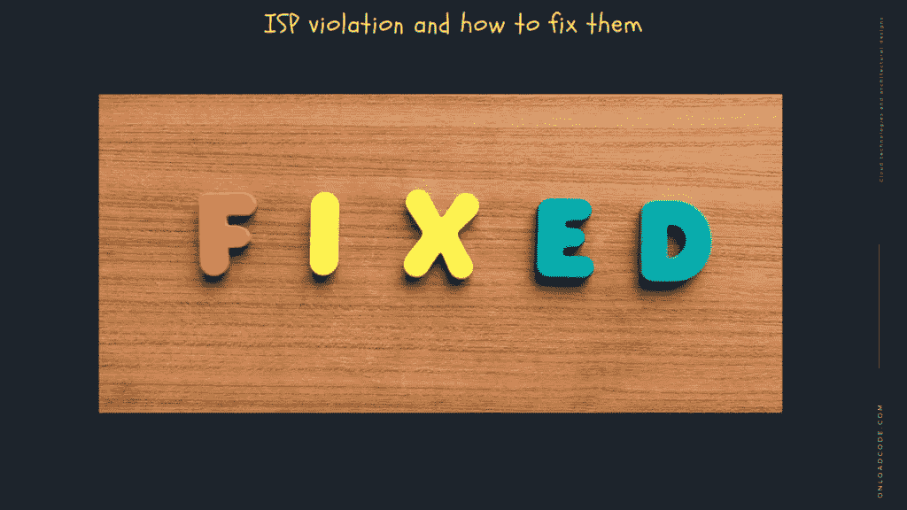

# ISP:接口隔离原则

> 原文：<https://medium.com/geekculture/isp-the-interface-segregation-principle-44f1631ecd?source=collection_archive---------17----------------------->

在本文中，我们讨论的是[设计原则的子主题，](https://onloadcode.com/design-principles/) **ISP:接口隔离原则**。

T 这是 [**系统设计与软件架构**](https://onloadcode.com/category/architecture/) 系列的第 11 篇文章。在本文中，我们讨论的是 [**设计原则**，](https://onloadcode.com/design-principles/) **ISP 的子主题:接口隔离原则。**

# 以前的文章

 [## 系统设计和架构介绍—加载代码

### 本文是系统设计和软件架构系列的第一篇文章。在本文中，我们…

jaya-maduka.medium.com](https://jaya-maduka.medium.com/introduction-to-system-design-and-architecture-onload-code-9cdfb14635e9)  [## 系统设计和架构介绍—加载代码

### 本文是系统设计和软件架构系列的第一篇文章。在本文中，我们…

jaya-maduka.medium.com](https://jaya-maduka.medium.com/introduction-to-system-design-and-architecture-onload-code-9cdfb14635e9) 

# 什么是界面分离原理？

接口隔离原则规定客户端不应该强制运行他们不使用的接口。基于这种方法，许多较小的接口比单个的大接口更好，每个接口服务于一个子模块。

ISP 将非常大的接口分成更小、更专业的接口，以便客户只执行他们感兴趣的方法。

ISP 的目的是方便系统的拆卸和重新激活、修改和重新部署。因为一个系统是在不同的层次上连接的，如果不需要任何额外的改变，就不能在一个地方进行改变。这些副作用可以通过使用接口或抽象类来防止。

ISP 的目的是方便系统的拆卸和重新激活、修改和重新部署。因为一个系统是在不同的层次上连接起来的，如果不需要任何额外的改变，就不可能在一个地方进行改变。这些副作用有能力通过使用接口或抽象类来防止。

## 准确的总结是界面分离原则的关键

找到正确的摘要不仅仅是一门艺术。当然，你必须探索你的领域，经常创建解释网，并提交用户系列。此外，绘制交互图——所有这些都不会引导您进行正确的抽象。错误的抽象比抽象更糟糕，所以不要忘记第三条规则。

当你认为你已经完成了一些抽象，把它们描绘成接口。上面提到的技术使它们成为地面接口。使用这种方法，具体的类只在那些抽象所必需的范围内起作用。所以我们最终满意而归，却不知道界面分离原理的存在。

# 违反界面分离原则

当客户端依赖不使用它的方法时。说明你的抽象是错误的。Martin Fowler 的接口角色示例(它是 ISP 应用程序的自然百科全书)揭示了不正确的初始对象分解。它不需要一个独立的政策来表达它。代码显然不够紧凑。所以不要沉思你的代码是否违背了接口分离的原则，想想你的总结是否正确。

# 重要

在面向对象的设计中，代码简化并创建了抽象层接口，这些接口创建了一个屏障，阻止它与依赖项进行交互。

根据许多签署了软件技术政策声明的软件专家所说。此外，编写设计良好且自我解释的软件与编写工作软件同样重要。使用界面来进一步解释软件的意图通常是一个好主意。

因为一个系统是在多个层次上连接的，所以在一个地方不需要任何额外的改变就不能进行任何改变。这些副作用有能力通过使用接口或抽象类来防止。

# ISP 违规代码以及如何修复它们

无论是单独工作还是在大型团队中工作，它都有助于提前识别代码中的问题。因此，让我们讨论一些可以表明 ISP 侵权贷款的代码顺序。

## 伟大的界面

在大型接口中，操作太多，但是对于大多数对象来说，这些操作并没有被用到。ISP 告诉我们，我们需要一个接口中的大多数或所有方法，而在一个大型接口中，我们通常只需要其中的几个方法。此外，当测试大型接口时，我们需要确定哪些依赖项需要模拟，哪些可能需要庞大的测试设置。

## 未使用的依赖项

ISP 违约的另一个含义是，我们必须给一个系统零或等值的价值。在我们的例子中，我们可以使用 Odercombo()来下一个汉堡订单，绕过 0 作为 fries 参数。这个客户端不需要依赖薯条，所以我们必须有一个单独的界面来订购薯条。

## 特殊的投掷方法

就像在我们的汉堡例子中，如果我们遇到一个非操作性的异常。和未实现的异常或类似的异常，可能感觉像是 ISP 相关的设计问题。这是重新设计这些类的好时机。

# 那么，接口应该总是只有一个方法吗？

应用到 ISP 端也会产生一个称为接口的单模接口。

这个解决方案将解决 ISP 违约的问题。然而，它也可能破坏接口的一致性。因此很难维护分散的代码库。比如在 Java 中，add-on 接口有很多模式，比如 size()和 is Empty()，这两种模式经常一起使用，所以只有一个接口是有意义的。

ISP 是将代码对象缩减到最小执行量，并删除对象正常运行所不需要的依赖项。一般来说，实现这个原则的效果是拥有许多小型的、集中的接口，这些接口只定义实现它们所需的东西。

# 值得吗？

有时候是值得的。这是唯一可靠的原则。一方面，通过积极地遵循这一原则，你可以得到一个更加灵活和可变的代码，我是一个大粉丝，它对现实世界的项目非常有用。

# 结论

ISP 是一个简单明了的原则，通过逐渐添加到客户端不需要的现有接口，可以轻松超越它。ISP 还与其他坚实的原则密切相关。

有许多代码气味可以帮助我们识别和纠正 ISP 违规。然而，我们需要记住，任何原则的过分激进的实现都可能导致代码库中的其他问题。

LSP 教会了我们为什么现实不能被表现为与编程对象的一对一关系。以及子类别如何尊重它们的父母。让我们也考虑一下我们已经知道的其他原则。

ISP 教会我们比我们想象的更尊重我们的客户。尊重他们的需求会让我们的代码更好，让我们程序员的生活更轻松。

感谢您阅读文章 **ISP:接口隔离原则**作为**系统设计和架构**中的重要组成部分。

*原载于 2021 年 4 月 4 日 https://onloadcode.com***。**