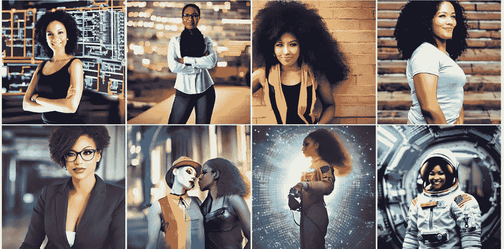

# 是时候讨论人工智能生成的图像中的多样性和包容性了。

> 原文：<https://medium.com/geekculture/it-is-time-to-discuss-diversity-and-inclusion-in-ai-generated-images-799612aab1bd?source=collection_archive---------10----------------------->

A set of diverse and inclusive pictures created by AI — by [Merely AI](https://merelyaiart.shop/diverse-and-inclusive-portraits)

## 对人工智能驱动的新艺术包容性必要性的快速思考。

让我们产生精彩视觉效果的生成式人工智能模型是基于数据学习的，如果数据有偏差，可能会产生严重的影响。