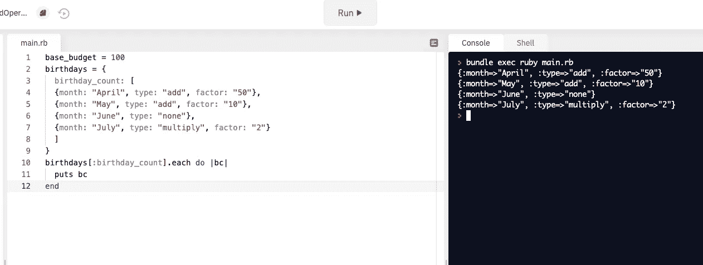
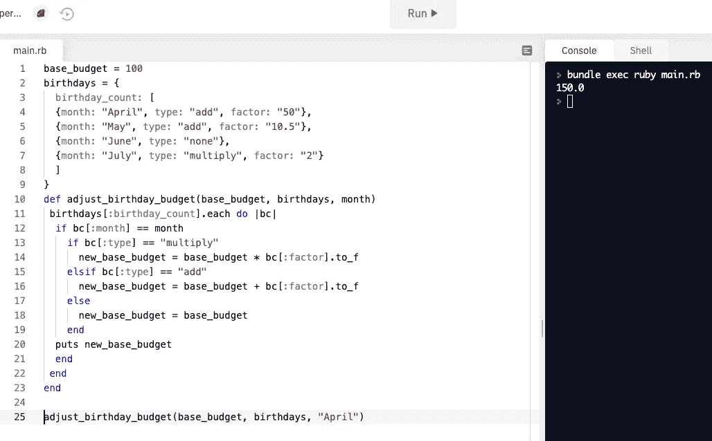

# 遍历一个散列，其中第一个键是散列的数组

> 原文：<https://medium.com/geekculture/iterating-through-a-hash-where-the-first-key-is-an-array-of-hashes-3b17f5071f4?source=collection_archive---------47----------------------->


How it can feel working with hashes

本周早些时候，我参加了一次技术面试，在面试中，我没有在规定的时间内完成编码挑战，但之后花了一些时间来解决它，并最终解决了它。我已经在这篇文章中修改了这个问题，所以它不是呈现的那个问题，但是需要相同的步骤来解决。两位面试官非常棒——他们给人以鼓励和支持，显然也喜欢他们工作的公司。我认为没有什么比员工真正的快乐和反馈更能证明一个公司的文化了。

在处理这个问题时，我面临的挑战是忘记了如何在散列和数组中选择键/值。刚刚完成了一个 API 调用，它要求我遍历散列，我对自己的空白感到沮丧。然而，一切都是学习的经历，只会让我们成为更强的程序员。使用 Ruby 解决了这个问题。

**这是一个场景:**

你正在决定接下来几个月你应该为生日礼物预算多少钱。你有一个基本预算，知道哪些月份的生日比其他月份多。如果某个月有很多生日，你会增加预算。您的列表如下所示:

```
base_budget = 100
birthdays = {
  birthday_count: [
  {month: "April", type: "add", factor: "50"}, 
  {month: "May", type: "add", factor: "10.5"}, 
  {month: "June", type: "none"}, 
  {month: "July", type: "multiply", factor: "2"}
  ]
}
```

基于这些信息，编写一个方法，该方法将接受基本预算、生日列表以及该列表中的月份。根据提供的月份，基本预算将根据类型和系数而变化。例如，对于 7 月份，我们预计基本预算 100 将乘以 2。

**分解问题:**

从目前的情况来看，我们可以得出结论，我们的方法接受三个参数。

```
def adjust_birthday_budget(base_budget, birthdays, month)end
```

我们还知道 birthdays 有一个键:birthday_count，其中有一个我们想要访问的散列数组。让我们一步一步来。首先，让我们确保我们可以访问:生日 _ 计数的内容。我们怎样才能让程序*通读每一项并把它还给我们*？如果你猜测迭代，你是正确的。跳到 [Repl.it](https://www.replit.com) ，复制并粘贴基本预算和生日数据，并尝试以下操作:

```
birthdays[:birthday_count].each do |bc|
   puts bc
end
```

点击“run ”,您应该会看到以下输出:



We have successfully pulled the data from the birthday_count array

该方法的下一部分要求我们访问:birthday_count 数组中每个散列的单个键和值。如果我们能够从生日[:birthday_count]中提取出我们想要的初始信息，那么我们如何着手提取:month、:type 和:factor 键呢？分别尝试以下方法:

```
birthdays[:birthday_count].each do |bc|
   puts bc[:month]
end
# => April, May, June, Julybirthdays[:birthday_count].each do |bc|
   puts bc[:type]
end
#=> add, add, none, multiplybirthdays[:birthday_count].each do |bc|
   puts bc[:factor]
end
#=> 50, 10, , 2
```

呜！我们成功地提取了键的*值*。所以现在的问题是，我们到底该怎么处理这一切？！

让我们重温一下手头的问题。我们希望值为 100 的基本预算根据提交给该方法的相应月份的类型和因素的值而受影响或不受影响。

换句话说，如果月份设置为 4 月，我们希望预算增加 50，因为类型设置为加法。听起来我们需要一个 if/else 语句！

```
if bc[:month] == month 
  if bc[:type] == "multiply"
    new_base_budget = base_budget * bc[:factor].to_f
  elsif bc[:type] == "add"
    new_base_budget = base_budget + bc[:factor].to_f
  else
    new_base_budget = base_budget
  end
puts new_base_budget
end
```

我们在这里说的是，如果 key:month 等于我们传入的参数(base_budget，birthdays，“July”)，并且*如果*那个月的:type 键的值被设置为“multiply”，对基本预算做如下计算。因为我们知道如何访问:factor 的值，所以我们可以通过使用代码“bc[:factor]”来乘以 base_budget。哦等等！因子的值被设置为字符串。我们可以用[。to_i](https://www.rubydoc.info/stdlib/core/String:to_i) 方法将其改为整数。但是，如果这些值中有一个是小数呢？而不是**。to_i** ，我们可以用**。to_f** 。“f”代表 float，表示非整数(即小数)。

接下来，我们写下如果:type 键的值被设置为 addition，我们希望程序做什么的条件。否则，基本预算不会发生任何变化。base_budget 的新逻辑存储在一个变量“new_base_budget”中。这个条件语句结束后，我们返回 new_base_budget 值。让我们把它们放在一起。

```
base_budget = 100
birthdays = {
  birthday_count: [
  {month: "April", type: "add", factor: "50"}, 
  {month: "May", type: "add", factor: "10.5"}, 
  {month: "June", type: "none"}, 
  {month: "July", type: "multiply", factor: "2"}
  ]
}**def** adjust_birthday_budget(base_budget, birthdays, month)
 birthdays[:birthday_count].each **do** |bc|
  **if** bc[:month] == month 
    **if** bc[:type] == "multiply"
      new_base_budget = base_budget * bc[:factor].to_f
    **elsif** bc[:type] == "add"
      new_base_budget = base_budget + bc[:factor].to_f
    **else**
      new_base_budget = base_budget
    **end**
  puts new_base_budget
  **end
 end
end** =>#side note: you don't need the 'puts' but for Repl.it I did have to use it to see the output in the terminal. If there is no 'puts', a *return* is implicitly implied. 
```



Try it out in Repl.it! Play around with the different months and see the results in the terminal.

你知道了，但是，我们还没有完成。问题已经成功解决，但是解决方案是否可以重构？在阅读了 Ruby 的[三元运算符](https://www.rubyguides.com/2019/10/ruby-ternary-operator/)之后，我认为这是可能的。以下是我如何重构上述解决方案:

```
**def** adjust_birthday_budget(base_budget, birthdays, month)
 birthdays[:birthday_count].each **do** |bc|
   bc[:month] == month && bc[:type] == "multiply" **?**
   base_budget *= bc[:factor].to_f **:** base_budget
   bc[:month] == month && bc[:type] == "add" **?**
   base_budget += bc[:factor].to_f **:** base_budget
 **end**
   puts base_budget
**end**adjust_birthday_budget(base_budget, birthdays, "July")
```

这花了我一些时间和精力去解决，所以解释语法可能会在另一篇文章中完成。然而，如果您将它插入 Repl.it，您将看到它与前面的解决方案工作相同。

你有它的朋友！我希望这是有帮助的，并且我总是乐于接受反馈，因为我真的希望这些帖子对其他程序员有帮助和教育意义。对于像我一样的所有有抱负的软件工程师/开发人员，如果你在编码面试中无法解决问题，不要气馁。坚持练习，永远不要停止学习。

感谢阅读~