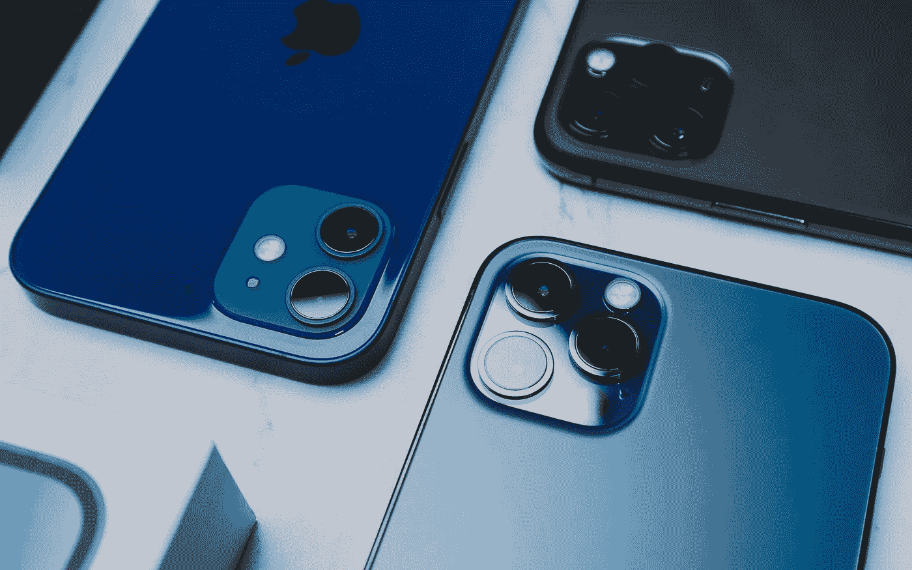

# 现在是 2022 年。苹果已经给所有的 iPhones 都配了 USB-C 接口了。

> 原文：<https://medium.com/geekculture/its-2022-give-all-iphones-a-usb-c-port-already-apple-132265883d72?source=collection_archive---------7----------------------->

## 这可能是我们真正获得它的一年，但它不应该只出现在专业型号上——这就是为什么它很重要

Rumor has it that USB-C may be finally coming to new iPhones but that Apple wants to use it as a selling point for the most expensive models. It really shouldn’t. (Image: Ameen Almayuf, Unsplash)

由于 iPhone 谣言工厂几乎全年都在工作，现在声称关于苹果下一款智能手机的新信息和/或猜测“正在传播”更多是毫无意义的…