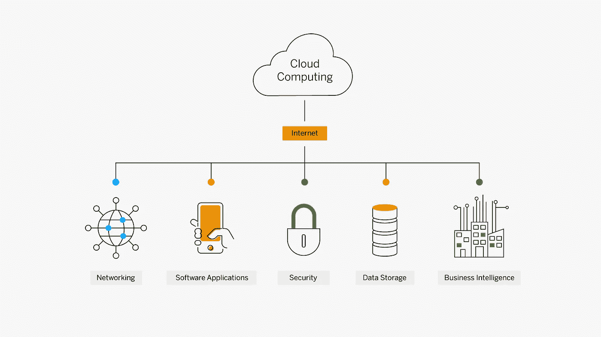

# 互联网上阴云密布——云计算和数字化转型

> 原文：<https://medium.com/geekculture/its-cloudy-over-the-internet-cloud-computing-and-digital-transformation-debfa55dd6c8?source=collection_archive---------53----------------------->

甚至在 20 年前，互联网还处于婴儿期，是懂得如何搜索目录和 FTP 传输文件的技术先锋的游乐场。

后来事情发生了变化，互联网的成熟有许多原因，所有这些原因都支持一个单一的概念进步:我们打破了硬件和软件之间的障碍。我们的视频、电子邮件以及银行账户、社保号码和信用卡的每一个数字都分散在由数百家公司控制的数千台服务器上。

***欢迎来到云计算。*** 我们被广泛的宽带接入、移动设备的日益普及和数以百计的创新抛向了未来，这些创新使得数据中心的建设和运行变得更加容易。对于我们大多数人来说，物理存储很可能在未来几年内过时，而且对我们中的一些人来说已经过时了。我们现在可以在别人的服务器上廉价甚至免费运行密集的计算任务。

商业世界的吸引力始于 2000 年，当时 Salesforce.com 开始托管与客户互动的软件，客户可以将其更名为自己的软件。当然，顾客的个人信息会直接进入 Salesforce 的数据库。从那时起，数百家公司通过利用云计算的潜力，将他们的旧物理产品转变为虚拟服务或发明新的服务。

另一方面，消费者在四年后受到了诱惑，这要归功于谷歌的 Gmail，这是一种免费的在线电子邮件服务，拥有前所未有的存储空间。当然，谷歌是一家企业，他们的推理简单而有效:免费向我们存储你的电子邮件，作为交换，我们的技术将扫描你的文章。免费存储的想法足以让最注重隐私的用户也加入进来。

***Gmail 的无限存储只是一个开始。该程序的开发者还加入了一个有用的新功能。现在，他们可以在任何他们想要或需要的时候推出更新，保证 Gmail 用户同步，而不必访问网站下载和安装更新。同样的原则被扩展并应用到 Google Docs 的协作编辑工具中，它将用户的文档移动到浏览器中，而无需备份到硬盘上。“六年前”——在 Docs 发布之前——“在网上办公甚至都不是一个想法，”谷歌产品经理 Rajen Sheth 回忆道。***

***回到生意场上的事情。*** 许多组织正在将部分或全部技术运营转移到云，以获得它所能提供的各种好处，如灵活性、可扩展性和经济性。

云计算关系应该对大多数组织有效和高效地实现战略目标的能力产生积极影响。最近，德勤(Deloitte)确定:“各行各业的公司都在现代化他们的数据平台，以利用新时代的应用程序和高级分析，同时将他们的数据转移到云。”德勤的同一项研究表明，云和数据现代化高度相关，实际上是相辅相成的。

云允许组织快速采用技术解决方案，根据需要扩大或缩小规模，为高管提供必要的灵活性，以应对市场和经济的变化。

***简单来说，云环境让事情做起来更简单。*** 运行 10 台服务器 1000 小时的价格与运行 1000 台机器 10 小时的价格相同——这种灵活性在大多数公司的服务器机房中都不存在。虚拟化可以解决许多不久前开始困扰 IT 行业的问题。一方面，根据国际数据公司的数据，服务器的运行能力通常只有其能力的十分之一，因为每个关键应用程序都有一个专用的服务器。这是限制漏洞的一种方式，因为真正的灾难防护基本上是负担不起的。

然而，随着组织不断提高其供应商管理关系的成熟度，他们在管理云服务提供商(CSP)方面继续面临挑战。

对于许多组织来说，好消息是，正如他们处理其他业务风险一样，通过在可接受的风险容忍度内管理云活动来理解和有效治理云计算威胁将推动企业价值。

数字化转型需要云计算，并且需要管理与云计算相关的各种企业风险。SphereEx 开发的 Database Plus 或开源版本 Apache ShardingSphere 等中间件解决方案允许企业在其系统和云基础设施之间插入一个层，并获得实质性的好处。

***考虑到巨大的潜在机遇，一些组织已经采用了云优先战略。*** 我们的想法是考虑甚至优先选择基于云的解决方案，而不是传统的内部数据中心策略。

由领先的技术媒体出版商 O'Reilly 对技术专业人员进行的出版物调查显示，“数量惊人的受访者(约 25%)表示，他们的公司计划在明年将所有应用程序迁移到云环境中。这包括 17%来自大型组织(即超过 10，000 名员工)的受访者，他们已经将 100%的应用程序迁移到云(“2020 年云的采用”，O'Reilly)。

利用云计算的数字化转型对于保持竞争优势至关重要，特别是如果我们考虑到当前的技术发展速度比历史上任何时候都要快。在选择云服务提供商时，企业有很多选择。

以下是企业应该考虑投资云计算的主要因素:

**1)财务和 IT 资源**

云计算允许最大限度地减少计算、存储和数据库支出，从而实现更便宜的 IT 环境，可以在不过度供应的情况下进行扩展。移动专用的内部基础设施还可以节省成本和人力资源。IT 员工可以将他们的注意力集中到更高层次的运营和战略计划上，而不是常规的协助。

**2)增加速度&敏捷**

经济高效的按需服务 IT 服务允许用户快速处理业务机会，提高用户生产力和运营效率。

**3)性价比**

希望将风险降至最低并避免危及其基础设施投资的初创公司和更成熟的公司都可以在云计算中找到理想的解决方案。

**4)最小化业务风险**

云计算极大地提高了 IT 安全性和灵活性，这反过来又直接积极地影响可用性、安全性和合规性方面的业务风险:

I .集群的轻松部署保证了更多的性能资源。

二。最大限度地提高可用性，同时降低可靠故障转移服务的影响。

三。自动缩放可防止性能问题。

四。工作负载平衡功能可有效分配流量，并提高弹性和延迟。

**5)高生产率**

中间件解决方案，如 SphereEx 开发的解决方案，或开源项目 Apache ShardingSphere，通过支持您的云计算来减少包含内部 IT 系统的负担和危险。此外，您的 IT 支持人员会为此感谢您，因为从长远来看，他们为您的组织节省了时间和金钱。

# 作者

**Yacine Si Tayeb**

*spherex 国际运营经理*

*Apache ShardingSphere 贡献者*

Yacine 对技术和创新充满热情，他搬到北京攻读工商管理博士学位，并对当地的初创企业和技术领域充满敬畏。到目前为止，他的职业道路是由技术和商业交汇处的机遇塑造的。最近，他对 ShardingSphere 数据库中间件生态系统的开发和开源社区建设产生了浓厚的兴趣。

sharding sphere Github:[https://github.com/apache/shardingsphere](https://github.com/apache/shardingsphere)

推特:[https://twitter.com/ShardingSphere](https://twitter.com/ShardingSphere)

https://bit.ly/3qB2GGc

Yacine 的领英:【https://www.linkedin.com/in/yacinesitayeb/ 

雅辛的推特:[https://twitter.com/RedVega11](https://twitter.com/RedVega11)