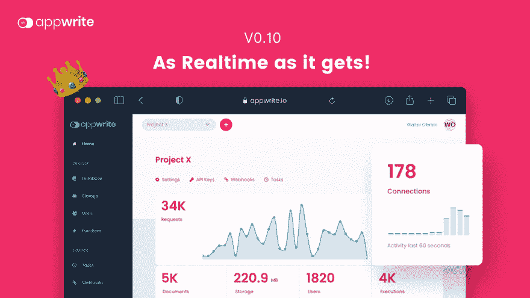
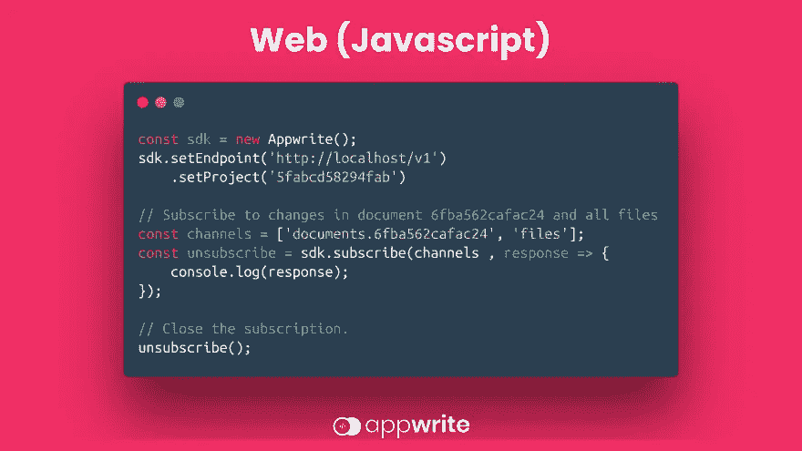
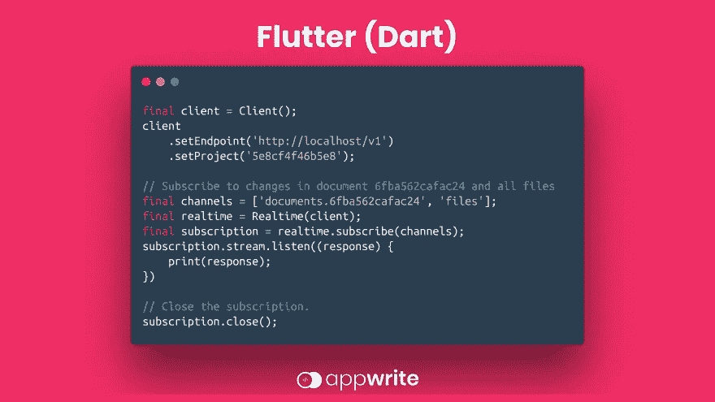
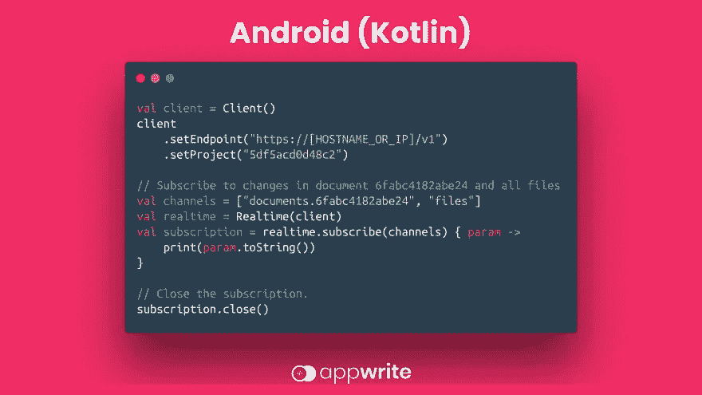
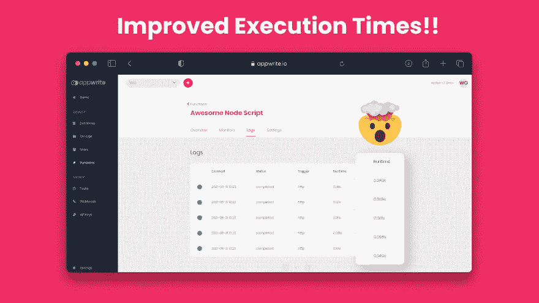
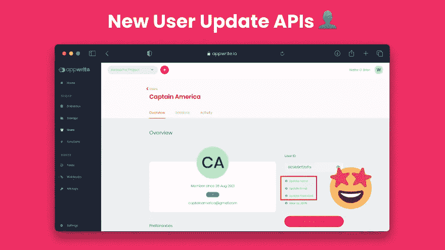
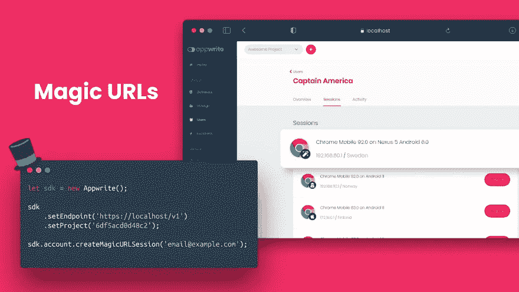

# 它在这里！宣布 Appwrite 0.10 和新的实时 API！

> 原文：<https://medium.com/geekculture/its-here-announcing-appwrite-0-10-and-the-new-realtime-api-c6019231c452?source=collection_archive---------11----------------------->

**经过长时间的期待和我们在 alpha 发布期间从 Appwrite 社区获得的巨大反馈，我们很高兴地宣布正式发布**[**Appwrite 0.10**](https://github.com/appwrite/appwrite/releases)**，包括我们最期待的功能之一:app write 实时 API！🥁**

除了实时 API，Appwrite 0.10 还提供了一些令人兴奋的功能，包括新的 API，Appwrite 云函数 API 的改进性能，以及多个错误修复。

# 🤔什么是 Appwrite 实时 API？

除了现有的 Appwrite REST API 之外，Appwrite 的新实时 API 为您的 Appwrite 服务器引入了一个新的入口点，并允许您订阅您希望跨 Appwrite 项目的任何实时事件。

Realtime API 为您的应用程序带来了强大的 websocket 服务器，以增强数据库 API 和更多功能！您将能够监听任何 Appwrite 服务的实时事件，包括用户、存储、功能等。这样，当创建新文件、用户创建新会话或函数执行完成时，您会得到通知。

此外，新的 Appwrite 客户端 SDK 包括新的支持方法，允许您直接从您的 [Web](https://appwrite.io/docs/getting-started-for-web) 、 [Flutter](https://appwrite.io/docs/getting-started-for-flutter) 或 [Android](https://appwrite.io/docs/getting-started-for-android) 应用程序中`subscribe`任何事件并触发您希望的任何回调(即将推出原生 iOS😉).

新的实时服务器有潜力在一台拥有数百万开放订阅的服务器上支持成千上万的并发连接。这是一个很好的开始，我们会不断努力提高这些数字，提升 Appwrite 的性能🚀到极限！

Realtime API 利用相同的 easy Appwrite [权限机制](https://appwrite.io/docs/permissions)来确保一旦触发相关事件，只有对您的不同资源具有“读取”访问权限的用户才会得到通知。

与我们现有的所有 SDK 一样，Realtime API 的新`subscribe`方法遵循可靠且可预测的 Appwrite 编码风格！这里有一个新的 API 签名的预览图

# 🌎网

# 🦋摆动

# 🤖机器人

要了解更多信息并开始将您的应用与这些整洁的实时功能集成，请阅读我们更新的 Web、Flutter 和 Android 入门教程，或者查看我们的高级文档部分以了解[实时 API](https://appwrite.io/docs/realtime) 。

# ⏲️改进了函数执行时间

作为我们调整 Appwrite 云函数服务的持续努力的一部分，0.10 版本将显著提高执行时间。此外，作为更广泛努力的一部分，我们已经迁移了函数执行 API，以直接与 **Docker TCP API** 交互，而不是与 **Docker CLI** 交互。这一改变为大多数可用运行时带来了**60–120 毫秒的性能提升**！

下一个 Appwrite 版本将包括更多的升级，因为我们计划添加对**同步**和**异步**函数执行的支持，以及更多的性能改进，预计将更显著地提高执行时间。敬请关注😉

# ⚡️推出新的原料药

应 Appwrite 社区许多成员的请求，我们现在添加了三个新的 API 端点，用于使用**用户 API** 和 **Appwrite 控制台**更新您的用户名、电子邮件地址和密码！

使用新的端点，你的项目开发者可以完全自由地管理你的应用程序用户，而不需要使用**账户 API** 或 **JWT 秘密**来处理这种来自服务器 API 的行为。

# 🔐新的认证方法！

在这个版本中，我们引入了一种新的认证方法，我们称之为 **Magic URL！**可以把这想象成一种无密码的认证方法，用户只需通过他们的电子邮件 ID 就可以注册或登录。这里有一个快速预览👀

# 😍还有更多！

我们还没有涵盖所有内容！我们做了更多的 bug 修复和其他微优化，让你的 Appwrite 体验更好！要了解 Appwrite 0.10 的所有细节，请查看 GitHub 上 [changelog 中的所有更改。](https://github.com/appwrite/appwrite/blob/master/CHANGES.md)

你对我们接下来的大创意感兴趣吗，或者对 Appwrite 的未来有什么好主意吗？查看 [RFC 库](https://github.com/appwrite/rfc)了解更多细节。此外，我们的 [awesome-appwrite 资源库](https://github.com/appwrite/awesome-appwrite)随着新的教程、视频和演示不断增长。

如果你刚刚发现 Appwrite 并想开始使用，请查看我们的 Appwrite30 天系列，我们将一步一步地向你解释构建出色的 Appwrite 应用所需的一切。在 [Twitter](https://twitter.com/appwrite_io) 、 [Dev.to](https://dev.to/appwrite) 或任何你能找到你的友好邻居 Appwrite 的地方关注我们。

# 👀下一步是什么？

Appwrite 0.11 离我们不远了，我们保证它会更加令人兴奋🤩！我们将继续改进 Appwrite 的稳定性能、灵活性，并添加令人惊叹的新功能。

你有令人兴奋的新功能的想法吗？打开一个 [Github 讨论](https://github.com/appwrite/appwrite/discussions)，这样你就可以从核心团队、维护者和我们不断增长的社区中获得反馈。

欢迎您加入我们的 [Discord](https://appwrite.io/discord) 来获取关于新 Appwrite 版本的所有最新更新，并直接与 Appwrite 团队聊天。