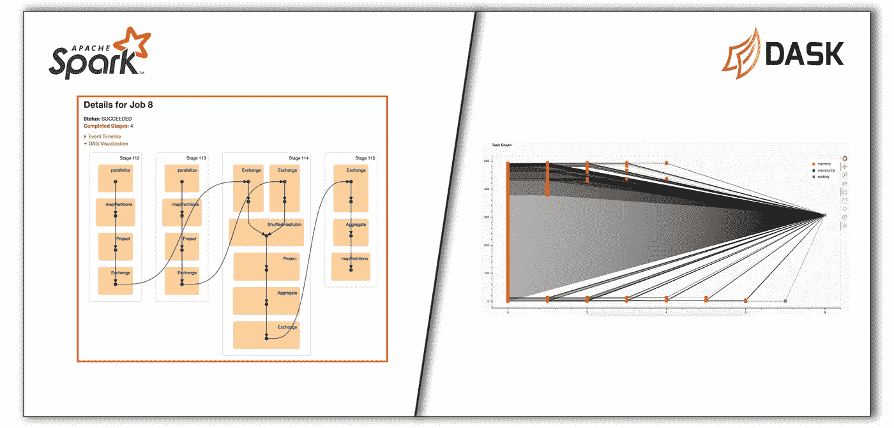
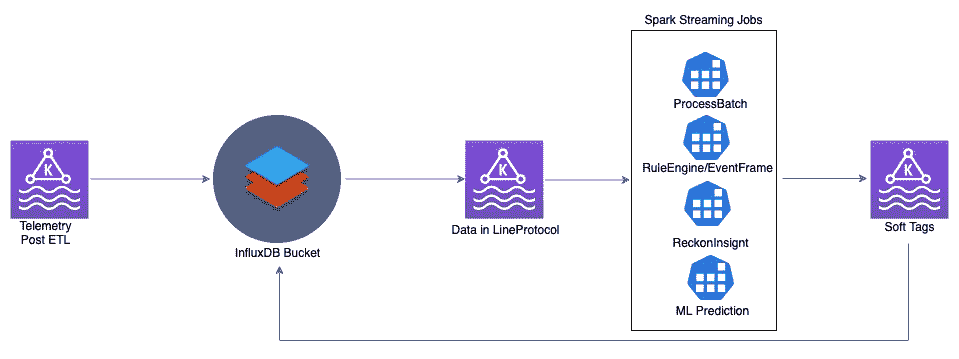
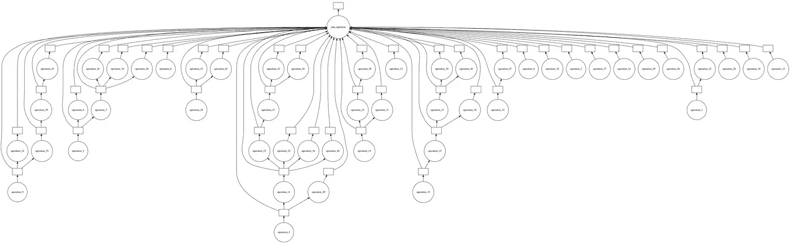
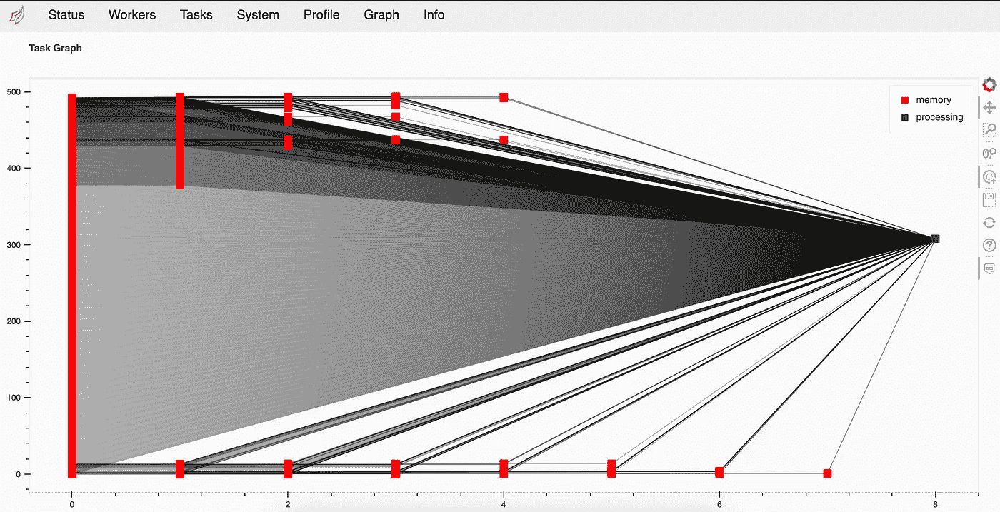

# 是时候抛弃阿帕奇火花，采用达斯克了

> 原文：<https://medium.com/geekculture/its-time-to-ditch-apache-spark-and-love-dask-ad799a2cdf24?source=collection_archive---------6----------------------->

这不是 Apache Spark 和 Dask 之间的比较。但是如果你对此感兴趣的话，Dask 会谦虚地把它包含在他们的官方文档中。这篇博客讲述了我使用这两种框架构建应用程序的经历。

apache spark & dask

## 火花很棒，但是…

在 [Quartic.ai](https://www.quartic.ai/) 我们已经使用 Apache Spark 构建了多个作业，这些作业对不同类型的数据执行入口/出口、ETL、评分模型等操作，这些数据具有流和批处理的性质。如果数据帧和 rdd 分布在集群中的多个节点上，Spark 丰富的 API 集将使您的工作变得容易。但是问题在于构建所需的数据帧，以便我们可以利用 Spark 提供的 API。

dataengineers assemble

我们有来自多个物联网传感器的高频率数据流。现在想象使用 Apache Spark 在这些数据的基础上构建管道来服务成千上万的机器学习模型。这里有一个由康纳尔·梅菲撰写的很好的[博客，解释了关于大规模培训和部署多个模型。这很好，但在实践中，我们不只是为每台设备部署一种型号。每个传感器可以有多个模型，也存在预测被用作其他模型的特征的情况。但是，要为这样的用例生成流数据集而不引入管道偏斜，需要仔细选择分区策略(是否使用 device-id、model-id 或其他什么作为 kafka 主题的分区键)。](https://databricks.com/blog/2020/05/19/manage-and-scale-machine-learning-models-for-iot-devices.html)

## 成功了吗？嗯…

在经历了构建管道来对数据流执行清理、ETL 和反规范化的所有麻烦之后，我们意识到我们不能超越极限。我们要么扩展集群，要么将作业的微批处理间隔增加到 30 秒以上。我们可以在集群中部署的最大型号数量也少得惊人——在 24 个内核和 24 个 kafka 分区上部署 600 个型号。

我们的问题不仅涉及 ML 模型，还涉及用户编写的必须在流数据上执行的定制代码，这些代码可以在多个 ML 模型中用作特性。所以我们的挑战是找到解决这种依赖性的实现。在 Spark 中，这不是一项简单的任务。我们必须创建不同的管道和回环来完成，如果资源已经不足，这不是一个非常有效的解决方案。

ETL pipeline with loopback

## 从小处着眼

我们很清楚，如果我们能够自己构建 DAG，就有可能避免一些重复工作。Spark 在执行作业之前构建 Dag，但是我们找不到任何可以使用的高级 API。我们之前使用了一个名为 [Graphkit](https://github.com/yahoo/graphkit) 的小 python 库来构建应用程序。所以我们再次转向它，忽略了 python 的 GIL 不允许节点并行执行的事实。而 Graphkit 最终成为了我们解决依序解决依赖问题的解决方案。

graphkit graph

它适用于小型应用程序和玩具项目/概念验证，但扩展是一个挑战。

## 见见类固醇上的 Graphkit，Dask

在我们的一次头脑风暴中，[迪内什](/@dineshkumaryelluri09)(我的队友)推荐了达斯克。我一直认为这是为了大规模处理熊猫数据帧，这是 Spark 已经擅长的事情。但我从来不知道他们的其他 API。而 Dask 的[延迟 API](https://docs.dask.org/en/latest/delayed.html) 正是我们所需要的！它不仅允许我们使用低级 API 构建所需的 DAG，还允许 graph 以分布式方式大规模执行。

Dask graph

该 API 功能强大，我们能够通过组合 Graphkit 和 Dask 来快速构建解决方案，以便在同一 24 核上服务数千个模型，同时还能动态解析依赖关系。看到数千个节点在几秒钟内被处理是一件令人高兴的事情。

## 结论

初创公司经常发现自己没有太多时间进行研发。为了满足交付期限，他们不得不使用他们知道会起作用的工具。尽管这涉及到实施变通办法，但解决方案可能不是最好的。对于我们在 Quartic.ai 的人来说，我们总是在寻找改进我们平台的解决方案；我们对 Dask 为我们所做的努力感到高兴。