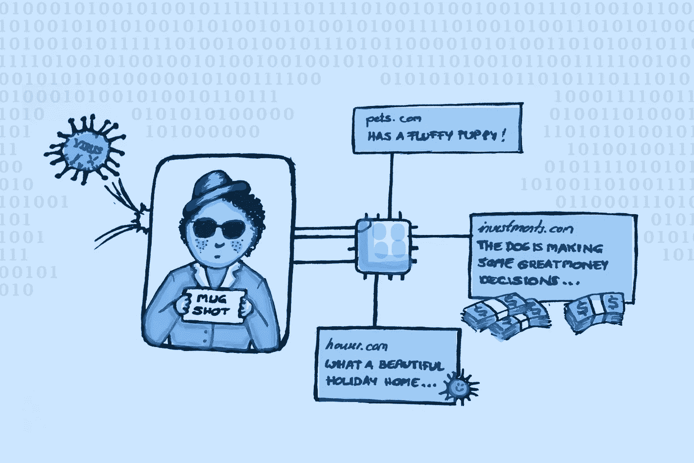
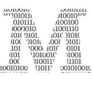

# 是时候谈谈数字身份了

> 原文：<https://medium.com/geekculture/its-time-to-talk-about-digital-identity-5ea6ba9b4321?source=collection_archive---------14----------------------->

## 以及为什么我们还没有数字身份证

What if you had a unique identity across all sites you visit? Image by author

  M   ost 我认识的人都没有大量的在线存在。在少数名字对谷歌有意义的人当中，我看到了一个有趣的现象:他们的在线身份往往与离线身份大相径庭。