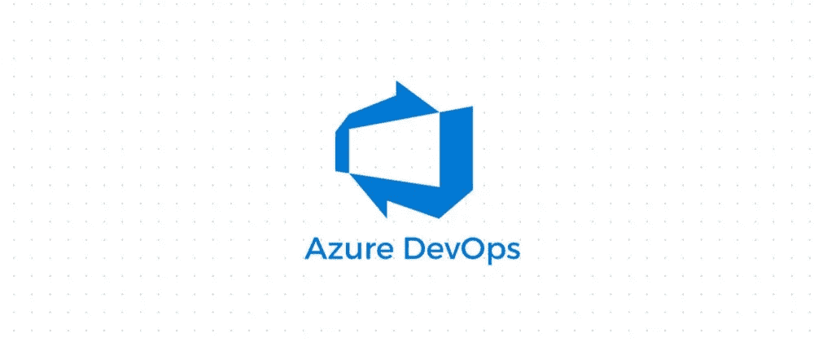
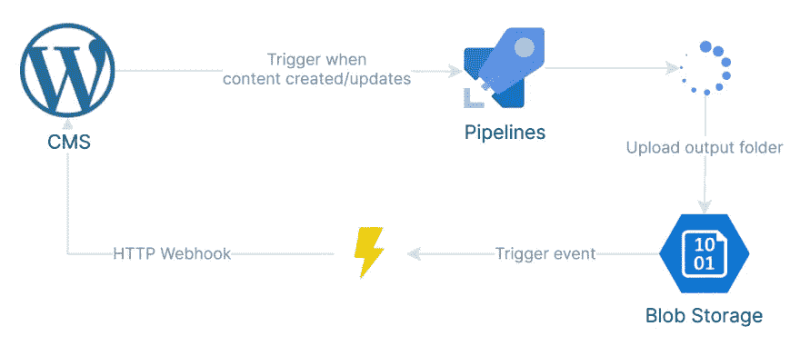

# 使用 Azure DevOps 管道进行 JAMStack 部署

> 原文：<https://medium.com/geekculture/jamstack-deployment-with-azure-devops-pipeline-cfaf5bb89fd?source=collection_archive---------21----------------------->

## 为 Node.js 应用程序到 web 托管服务的静态导出设置 CI\CD 管道。



我经常为有自己服务器的客户做一些自由职业。这些服务器通常是你没有根权限的虚拟主机解决方案。只是 Apache 或 Nginx 运行并指向特定的文件夹，并提供 PHP 文件。经常有足够多的客户在 Wordpress 上运行网站。

在服务器中没有 Node.js 限制了 web 开发人员的能力，而现在我们中的很大一部分人都使用 Node.js 应用程序。我也是，我经常用 JavaScript 框架构建独立的前端应用程序，同时让一个无头 CMS 为站点提供内容。有了这个，我可以经常进行 Jamstack 构建。

由于 Jamstack 要求每次内容改变时都要重新构建网站，所以我需要 Node.js 在服务器上运行。这是不可能的，所以我必须找到一种替代方法来构建前端应用程序，远离服务器。好消息是我可以访问 [Azure](https://azure.microsoft.com/en-us/) ，这意味着我可以使用它的 [DevOps 管道](https://azure.microsoft.com/en-us/services/devops/)，让它为我构建应用程序，并将静态输出部署到 [Blob 存储](https://azure.microsoft.com/en-us/services/storage/blobs/)，然后将事件发送回服务器。然后，服务器会为我获取构建的网站，并提取它进行托管。



The full pipeline

问题是，我不确定是否能让来自 Wordpress 或 Strapi 等平台的外部事件触发构建。幸运的是，它可以，但是让我带你走一遍这个过程。

# 要求

我会向你介绍我做了什么，并提供我阅读的资源(文件)的链接，以完成所有事情。我使用 [Azure CLI](https://docs.microsoft.com/en-us/cli/azure/install-azure-cli) 来创建资源，因为对于本教程来说，它比提供门户截图要快得多，也更干净。

Azure 提供了很多关于他们服务的文档，但是以我的经验来看，微软有一个习惯，就是到处乱放东西，所以你必须知道去哪里找。

您需要以下东西来构建这个管道:

*   Azure 订阅
*   一个代码库，可以与 Azure DevOps 集成
*   Azure DevOps 组织
*   [启用事件网格资源提供者](https://docs.microsoft.com/en-us/azure/event-grid/custom-event-quickstart-portal#enable-event-grid-resource-provider)
*   存储帐户和容器
*   具有端点的 API 可以验证事件订阅，然后在 Blob 存储中创建 Blob 时接收事件。当 Azure 第一次调用端点时，我会让你参考这个[如何自动验证你的订阅的指南](https://docs.microsoft.com/en-us/azure/event-grid/receive-events#endpoint-validation)。

我假设您可以自己设置前四个，也是最后一个，让我们简单地看看如何设置存储帐户和管道。

# 设置存储帐户

我们需要建立一个存储帐户和一个容器来保存我们最终的构建。

1.  使用 Azure CLI 创建存储帐户。

```
az storage account create --name <storage-account-name> --resource-group <resource-group-name>
```

您必须为您的存储帐户以及资源组创建一个唯一的名称。

在 CLI 中从响应 json 中获取`id`属性值(全限定标识符),类似于`/subscriptions/{subscriptionId}/resourceGroups/{resourceGroupName}/providers/Microsoft.Storage/storageAccounts/{storageAccountName}`

2.**创建一个容器**

```
az storage container create --name deployment --account-name <storage-account-name> --public-access blob
```

如果你希望更严格的安全措施，请考虑放下`--public-access`旗，走私人路线。

3.**创建事件订阅**

在创建事件订阅之前，确保您的 API 端点能够订阅接收事件。

现在使用来自存储容器创建响应的`id`来创建事件订阅。

```
az eventgrid event-subscription create --source-resource-id <storage-account-fully-qualified-identifier> --name nodeAppDeployment --endpoint <your-api-endpoint> --included-event-types Microsoft.Storage.BlobCreated Microsoft.Storage.BlobCreate
```

现在，每当一个文件被添加到容器中时，您的 API 应该接收一个包含文件 URL 和其他信息的事件有效负载。

# DevOps

在我们开始设置管道之前，我们首先必须访问 DevOps 门户中的**项目设置**，并设置一个**服务连接**(在管道部分下面。)创建一个新的服务连接，并添加 **Incoming WebHook** 作为连接类型。添加 WebHook 名称和服务连接名称。复制这两个名称，因为我们需要在管道配置中使用它们。

完成后，我们可以创建一个管道。只需在**管道**仪表板上点击**新管道**，并添加您的存储库设置。选择一个基本的 **Node.js** 类型任务，进入管道 YAML 配置页面后，将以下内容复制到那里:

```
# Use our Service Connection WebHook (change)
resources:
  webhooks:
    - webhook: <webhook-name>
      connection: <service-connection-name>

# CI trigger
trigger:
- master

pool:
  vmImage: ubuntu-latest

steps:
# Install Node.js
- task: NodeTool@0
  inputs:
    versionSpec: '14.x'
  displayName: 'Install Node.js'

# Install packages and run build command
- script: |
    npm install
    npm run build
  displayName: 'npm install and build'

# Archive the /out folder
- task: ArchiveFiles@2
  inputs:
    rootFolderOrFile: '$(System.DefaultWorkingDirectory)/out'
    includeRootFolder: false
    archiveType: 'zip'
    archiveFile: '$(Build.ArtifactStagingDirectory)/release.zip'
    replaceExistingArchive: true

# Upload the output zip to blob storage
- task: AzureCLI@2
  inputs:
    azureSubscription: <azure-subscription>
    scriptType: 'bash'
    scriptLocation: 'inlineScript'
    inlineScript: 'az storage blob upload --account-name <storage-account-name> -c <container-name> -f $(Build.ArtifactStagingDirectory)/release.zip -n release.zip'
```

YAML 配置文件是注释的，但是让我在这里指出一些事情。

*   首先**你需要在配置文件中设置你的 webhook 名和连接名**。那是文件中最上面的块。
*   这个例子中正在构建的应用是一个 Next.js 框架应用，所以`npm run build`执行`next build && next export`，这就是为什么输出文件夹是`out`。您很可能需要调整此配置，因此将/out 路径更改为输出文件夹所在的位置。
*   您需要授权 DevOps 使用您的 Azure 订阅，以便您可以在上传任务中使用它。您需要在`azureSubscription`字段中输入您的订阅名称。为了得到你的`azureSubscription`信息，你可以做我所做的，我只是抓取一个类似`Azure file copy`的任务，通过 UI 输入配置，并插入配置文件。从那里我得到了 YAML 文件的正确名称和 ID。*(由于这是一个 linux 代理，我们必须使用 Azure CLI 来上传文件。* `*Azure file copy*` *仅适用于 PowerShell ie。Windows 代理。)*
*   这里我没有考虑任何环境变量。你将不得不自己处理这些。
*   记得填写存储名称和容器名称。

# 从外部服务触发管道

这很简单。您只需向以下 URL 发出发布请求:

```
https://dev.azure.com/<organization-name>/_apis/public/distributedtask/webhooks/<webhook-name>?api-version=6.0-preview
```

`organization-name` 是您的 DevOps 组织名称。这里的问题是，无论是谁发现了这个 URL，都会对您造成伤害，并可能通过 ping 这个 URL 使您的管道持续运行。这就是为什么您可以在之前设置的服务连接中设置一个 **Secret** 和一个 **HTTP Header** (您可能看到了这些字段)。

您可以为发送到此 webhook 地址的有效负载生成 HMAC SHA1 校验和(不确定是否支持其他消息摘要算法)，并将该校验和添加到指定的报头中。这个秘密当然是生成校验和的关键。

Azure 将比较校验和，并阻止任何有效负载为空或校验和不匹配的请求。

# 包扎

本教程没有告诉您如何处理 API 中的存档输出文件。你得自己想办法解决。我所做的只是从存储中复制文件(由 BlobCreated 事件有效负载提供的 url)并将其提取到 Apache 托管的文件夹中。

和往常一样，除了 Azure 和任何类型的管道，还有其他替代方案。你可以使用像 [Vercel](https://vercel.com/) 或 [Netlify](https://www.netlify.com/) 这样的服务来部署和托管你的前端应用，并且你可以跳过构建任何管道。我相信它们都包含某种类型的 webhook 触发机制来启动重建。你也可以在 Azure Storage 中托管静态网站，并为其设置 CDN。这可能比一些非基于云的虚拟机更便宜，并且更具可扩展性。

这种特殊方法的优点是，您不必在服务器上运行 Git 或 Node.js 来获取最新的代码更改或构建应用程序。您可以在一个隔离的容器中获取 repo 和安装包。如果作业失败，不会影响生产中的网站。

您也可以在同一管道中运行您的测试，以确保您没有破坏任何东西。使用 TypeScript 可以让您对编译更有信心。

# 资源

下面是一些资源，帮助我找出需要什么。我最近一直在玩 Azure DevOps，所以那次经历帮助我在一个小时内完成了这件事。

正在安装 Azure CLI:
https://docs . Microsoft . com/en-us/CLI/Azure/install-Azure-CLI

詹斯塔克:
[https://jamstack.org/](https://jamstack.org/)

Azure CLI — az 存储帐户:
[https://docs.microsoft.com/en-us/cli/azure/storage/account?view=azure-cli-latest](https://docs.microsoft.com/en-us/cli/azure/storage/account?view=azure-cli-latest)

azure CLI-az event grid 事件订阅:
[https://docs . Microsoft . com/en-us/CLI/azure/event grid/event-subscription？view=azure-cli-latest](https://docs.microsoft.com/en-us/cli/azure/eventgrid/event-subscription?view=azure-cli-latest)

从 Azure 事件网格向 HTTP 端点接收事件:[https://docs . Microsoft . com/en-us/Azure/Event-Grid/receive-events # endpoint-validation](https://docs.microsoft.com/en-us/azure/event-grid/receive-events#endpoint-validation)

基于 webhook 的通用 YAML 管道触发器:[https://docs . Microsoft . com/en-us/azure/devo PS/release-notes/2020/pipelines/sprint-172-update？wt . MC _ id = DOP-MVP-21138 # generic-web hook-based-triggers-for-YAML-pipelines](https://docs.microsoft.com/en-us/azure/devops/release-notes/2020/pipelines/sprint-172-update?WT.mc_id=DOP-MVP-21138#generic-webhook-based-triggers-for-yaml-pipelines)

启用事件网格资源提供者:
[https://docs . Microsoft . com/en-us/azure/Event-Grid/custom-Event-quick start-portal # enable-Event-Grid-resource-provider](https://docs.microsoft.com/en-us/azure/event-grid/custom-event-quickstart-portal#enable-event-grid-resource-provider)