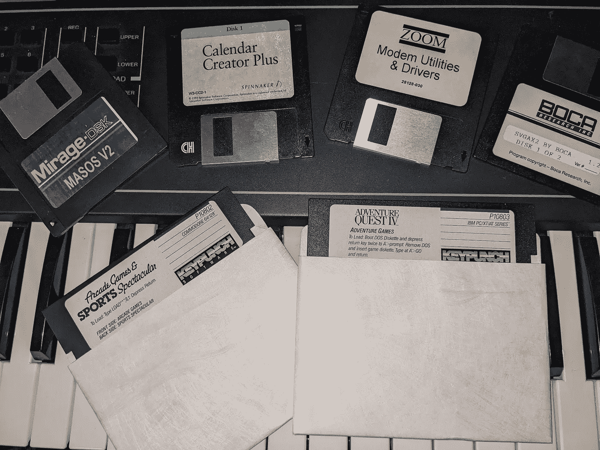

# 软盘历史

> 原文：<https://medium.com/geekculture/japan-declares-war-on-the-floppy-237d897f1c18?source=collection_archive---------20----------------------->

Floppies with classic software

日本向软盘宣战！美国核武器系统使用软驱！在“病毒”之前有“克隆体”，通过软盘传播！轨道上的软盘！软盘上的沃霍尔！研究这个很有趣。软盘的历史跨越了几十年(我今天仍然在我的 Mirage 和老式 PC 中使用它们)和多个行业。个人电脑，合成器和采样器，工业控制系统，艺术，宇宙飞船和核武器。

软盘是最好的可移动存储——比磁带好，因为它们速度快得多，而且能存储更多(磁带容量限制在 660KB 左右)。1983 年，我兑现了童年的人寿保险，为我的雅达利 800 买了一个 5.25 英寸的软驱。这肯定比每次我想工作的时候输入我的程序要好！

# 起初

1970 年。 IBM 造出软盘样机。

[https://www . computer history . org/revolution/memory-storage/8/261/1080](https://www.computerhistory.org/revolution/memory-storage/8/261/1080)

**1975 年。**带 8″软驱的合撒儿 M8 数字合成器。Fairlight CMI 就是以此为基础的！

[https://120years.net/category/date/1970-1980/](https://120years.net/category/date/1970-1980/)

**一九七八年六月。苹果 II 发布时没有软盘——这是个大问题。这个问题是在 1978 年用舒加特制造的 5.25 英寸软盘(磁盘)解决的(查一下这个名字！创立了希捷。)和由史蒂夫·沃兹尼亚克设计的低成本软盘控制器。**

[https://ethw . org/Milestones:Introduction _ of _ the _ Apple _ II _ Computer:_ 1977-1978](https://ethw.org/Milestones:Introduction_of_the_Apple_II_Computer:_1977-1978)

**1981。**索尼发明了 3.5″软盘(OA-D30V)，但容量很低，还有一个手动磁盘卷帘门。由一个财团做得更好，该财团创造了我们今天知道的圆盘，但大小不变。

[https://www.macgeek.org/museum/sony400kdrive/](https://www.macgeek.org/museum/sony400kdrive/)

# 病毒！

**一九八二年。**第一个计算机病毒——麋鹿克隆人。影响 Apple II 的软盘引导扇区病毒。

[https://www . techtarget . com/search security/definition/Elk-Cloner](https://www.techtarget.com/searchsecurity/definition/Elk-Cloner)

一九八三年三月。带有内置软驱的 IBM 个人电脑 XT。你甚至可以得到两个。内置了一个硬盘。

[https://dosdays . co . uk/computers/IBM % 20PC-XT % 20(5160)/IBM 5160 . PHP](https://dosdays.co.uk/computers/IBM%20PC-XT%20(5160)/ibm5160.php)

1986 年。第一个 PC 病毒——脑软盘引导扇区病毒。

[https://USA . Kaspersky . com/resource-center/threats/a-brief-history-of-computer-virus-and-what-the-future-holds](https://usa.kaspersky.com/resource-center/threats/a-brief-history-of-computer-viruses-and-what-the-future-holds)

**1987。**我开始在 Mac SE 上使用包含 Master Tracks Pro MIDI 序列软件的软盘。我开始写歌，这些歌出现在我的第一张卡带专辑《赛博朋克:不夜城 Trax》中。我不得不加上这个！

[https://digitl.bandcamp.com/album/night-city-trax](https://digitl.bandcamp.com/album/night-city-trax)

**一九八九年十二月。第一个勒索软件在软盘上。**

[https://www . vice . com/en/article/NZ pwe 7/the-worlds-first-come-on-a-floppy-disk-in-1989](https://www.vice.com/en/article/nzpwe7/the-worlds-first-ransomware-came-on-a-floppy-disk-in-1989)

**一九九七年。**推出带软盘存储的索尼数码相机(Mavica)。

[https://www . camera labs . com/Sony-mavica-MVC-fd5-retro-review/](https://www.cameralabs.com/sony-mavica-mvc-fd5-retro-review/)

2004 年 12 月。 Omniflop 发布，允许将数百种不同格式的各种设备应用到软盘上。

[http://www.shlock.co.uk/Utils/OmniFlop/OmniFlop.htm](http://www.shlock.co.uk/Utils/OmniFlop/OmniFlop.htm)

# 软盘之死？

一九九八年八月。iMac 发布——第一台放弃软驱的电脑，成为年度最畅销的电脑！

[https://appleinsider . com/articles/18/05/06/20 年前，imac 改变了世界](https://appleinsider.com/articles/18/05/06/20-years-ago-the-imac-changed-the-world)

2006 年。HXC 软盘仿真器项目启动。

[http://hxc2001.free.fr/floppy_drive_emulator/](http://hxc2001.free.fr/floppy_drive_emulator/)

2010 年。索尼宣布他们将停止生产软盘。

[https://www . wired . com/2010/04/Sony-announced-the-death-of-the-floppy-disk/](https://www.wired.com/2010/04/sony-announces-the-death-of-the-floppy-disk/)

**2011。发明了电子管。**

[https://www.youtube.com/watch?v=GTRqxfnnYUQ](https://www.youtube.com/watch?v=GTRqxfnnYUQ)

**2014 年 4 月。在 Amiga 软盘上找到的任何沃霍尔 1985 年以来的作品。**

https://www.bbc.com/news/technology-27141201

**2016 年 9 月。**工控系统用紧凑型闪存替代软盘。

[https://www . process industry informer . com/solid-state-replacement-obsolete-floppy-disk-drives-legacy-industry-process-control-equipment/](https://www.processindustryinformer.com/solid-state-replacement-obsolete-floppy-disk-drives-legacy-industrial-process-control-equipment/)

**2018。**国际空间站上发现的软盘(包括 Windows 95/98 软件)。

[https://www . the verge . com/2018/11/22/18107919/国际空间站软盘发现号 iss](https://www.theverge.com/2018/11/22/18107919/international-space-station-floppy-disks-discovery-iss)

**2019 年 6 月。**美国核力量在战略自动化指挥控制系统中大量使用 8″软盘。从 20 世纪 70 年代开始使用。

[https://taskandpurpose . com/tech-tactics/floppy-disks-nuclear-forces-upgrade/](https://taskandpurpose.com/tech-tactics/floppy-disks-nuclear-forces-upgrade/)

**2022 年 6 月。**flop tron 3.0 推出。

[https://www.youtube.com/watch?v=kCCXRerqaJI](https://www.youtube.com/watch?v=kCCXRerqaJI)

2022 年 8 月。日本向软盘宣战。

[https://www . Bloomberg . com/news/articles/2022-08-31/Japan-s-digital-chief-waves-to-purge-floppy-disks-from-government](https://www.bloomberg.com/news/articles/2022-08-31/japan-s-digital-chief-vows-to-purge-floppy-disks-from-government)

# 通史

[https://en.wikipedia.org/wiki/History_of_the_floppy_disk](https://en.wikipedia.org/wiki/History_of_the_floppy_disk)

早期的采样器有软盘:[https://en . Wikipedia . org/wiki/Sampler _(musical _ instrument)](https://en.wikipedia.org/wiki/Sampler_(musical_instrument))

# 让火一直燃烧

需要软盘吗？有软盘可以回收吗？[https://www.floppydisk.com/](https://www.floppydisk.com/)