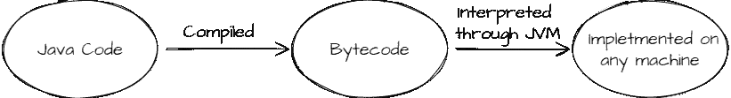

# Java——快速浏览

> 原文：<https://medium.com/geekculture/java-a-quick-tour-1c70d64230fe?source=collection_archive---------10----------------------->


Photo by [Fotis Fotopoulos](https://unsplash.com/@ffstop?utm_source=medium&utm_medium=referral) on [Unsplash](https://unsplash.com?utm_source=medium&utm_medium=referral)

Java 是一种流行的编程语言，主要用于

*   网络应用
*   移动应用
*   桌面应用程序
*   游戏等等..

Java 是由太阳微系统公司在 1995 年开发的。詹姆斯·高斯林被誉为 Java 之父。它以前被称为橡树。

## 为什么是 Java？

Java 是独立于平台的，因此可以在各种平台上工作，如 Windows、Mac、Linux 等。它是安全的、开源的，并且支持 OOPS 概念。

> Java 既是编译的又是解释的



字节码 —用于 JVM 的机器语言

JVM — Java 虚拟机，它是一个基于软件的解释器。它基本上将编译后的二进制字节码转换成特定的机器语言，而不管机器的硬件&软件组件&配置如何。因此，Java 是一种独立于平台的语言

> Java 的 Hello World

```
class Main {
  public static void main(String[] args) {
    System.out.println("Hello World!");
  }
}
```

在 java 中，运行的每段代码都必须在`class`中。根据 pascal 大小写**和**，类名应该总是以大写字母开头。

**public** —它是一个访问说明符。公开意味着它是全球可用的。main 方法需要是公共的，以便由 java 运行时执行

**静态** —这基本上意味着它不需要实例来调用主函数

**void** —返回类型，不返回任何内容。

**main** —每个 java 程序的入口点。

**String[] args** —也称为 java 命令行参数，java main 方法接受字符串数组类型的单个参数。我们可以更改名称 args。

**系统—** 这是一个最终类

**out —** 它是 printstream 类型的实例

**println —** 打印报表，然后将光标移到下一行

## 如何编译 java 程序

`javac a.java`

a.java→a 级(。将为 a.java 中存在的每个类创建类文件)

## 用于输出的命令

`java a`

# Java 中的注释

注释——任何写在双斜线之间的文本或注释都会被 Java 忽略，因此不会被执行

带`//`的单行注释

用`/* ... */`多行注释

# 变量

它们被定义为包含数据的容器

变量可以是各种数据类型，也就是说，它可以保存特定于某个数据类型(比如整数)的数据

int a = 5；//a 只能保存整数值

# 数据类型

它有两种类型

## 1.原语—那些在 java 中预定义的原语

*   字节→取 1 个字节(-128 到 127)，默认值= 0
*   short →取 2 个字节((-2 ⁶)/2 到 2 ⁶/2–1))，缺省值= 0
*   int →取 4 个字节((-2 )/2 到 2/2–1))，默认值= 0
*   long →占用 8 个字节，默认值= 0
*   float →占用 4 个字节，默认值= 0.0f
*   double →占用 8 个字节，默认值= 0.0d
*   char →占用 2 个字节，默认= '\u0000 '
*   布尔→取 1 位(真或假)，默认值=假

## 2.非原语—用户定义的原语

*   线
*   排列
*   班级
*   连接

> 声明变量

```
class Main {
  public static void main(String[] args) {
    **int a = 5;
    float b = 3.23f;
    char c = 'A';
    boolean d = true;
    double e = 93.232;
    byte f = 12;
    short g = 23;
    long h = 27398l;** **String name = "Arash Arora";**
  }
}
```

# 类型转换——将一种原始数据类型转换成另一种

*   **加宽浇铸**——自动完成(从较小的字体到较大的字体尺寸)

字节→短→字符→整数→长→浮点→双精度

*   **缩小造型**——手动完成(大数据类型变小)

double→float→long→int→char→short→byte

## 加宽铸造示例

```
int a = 9;double b = a;
```

## 缩小转换示例

```
double a = 9.423;int b = (int) a;
```

# 运算符—用于对操作数执行运算

x = 100+50；

100，50 →操作数

+ →操作员

> 运算符的类型

*   **算术运算符**

1.  +
2.  -
3.  *
4.  /
5.  %
6.  ++
7.  - -

*   **赋值运算符**

1.  =
2.  +=
3.  -=
4.  *=
5.  /=

*   **比较运算符**

1.  ==
2.  !=
3.  >
4.  <
5.  ≥
6.  ≤

*   **逻辑运算符**

1.  &&
2.  ||
3.  !

*   **按位运算符**

1.  左移→ << → 10<<2 → 10*2² = 40
2.  Right Shift → > > → 10>>2 → 10/2 = 2
3.  > > >→对于负数，它将奇偶校验位(MSB)更改为 0
4.  &，| →检查两个条件，不管第一个条件是否为假

*   **三元运算符**

a>b？甲:乙；//它基本上意味着如果 a>b，那么返回 a，否则返回 b

# 关键字—那些保留的词(预定义)

前任。布尔、整数、断点、字节等。

# 对象—类的实例

通过对象，我们可以访问类变量和方法。它由一个类的状态(存储在字段中)和行为(方法)组成。

> 创建对象

```
class Student {
  ...
}
class Main {
  public static void main(String[] args) {
    Student s = new Student(); //object for class Student
  }
}
```

# 参考文献—

它指向创建的对象，保存着对象在内存中的位置。它是随着对象的产生而产生的。

# 读取用户的输入

我们将使用 java.util 包的 Scanner 模块来接收用户的输入

```
import java.util.Scanner;
class Main {
  public static void main(String[] args) {
    Scanner sc = new Scanner(System.in); /*System.in refers to readm    
                                        what we type from keyboard*/
    int a = sc.nextInt(); //take input from user of type integer
    float b = sc.nextFloat();
    double c = sc.nextDouble();
//  as nextDouble() won't read new line characters thus if use 
//  nextLine() to read a string, it would result into an empty 
//  string  as it will read that new line character, so we would use  //  nextLine() first and then read the string nextLine();
    String s = nextLine();
    boolean d = hasNextInt(); //returns true if the input is integer
```

# 控制语句

## 如果-否则

```
if(condition) {
  statements
} else if(condition2) {
  statements
} else {
 statements
}
```

## 开关盒

```
switch(expression) {
  case value1 : ... 
  break;
  case value2 : ...
  break;
  case value3 : ...
  break;
  default : ...
}
```

## for 循环

```
for (initialization;condition;increment/decrement) {
 ... 
}
```

## while 循环

```
while(condition) {
  ...
}
```

## do while 循环—至少执行 1 次

```
do {
  ... 
} while(condition);
```

## for each —直接访问数组元素

```
for(type var: array) {
  ... 
}
```

# 排列

它是具有连续内存位置的同类元素的集合。它是一种数据结构，我们在其中存储相似数据类型的相同数据。

它具有由用户定义的固定大小。

我们可以在数组中存储任何原始值或对象。

**数组类型**

1.  一维的
2.  多维的

> 数组声明(一维)

```
int[] arr; // declaration
arr = new int[5]; //instantiation 
int[] arr = new int[5]; // declaration and instantiation 
int a[] = {33,3,4,5} // intialization
```

> 数组声明(多维)

```
int[][] arr = new int[3][3]; //3 rows & 3 columns
arr[0][0]=1;
arr[0][1]=2;
...
```

## 交错数组—具有不同列数的数组的数组

```
int values[][] = new int[3][];values[0] = new int[1];values[1] = new int[3];values[2] = new int[2]; for(int i=0;i<values.length;i++) { for(int j=0; j<values[i].length;j++) { values[i][j]=sc.nextInt(); }}
```